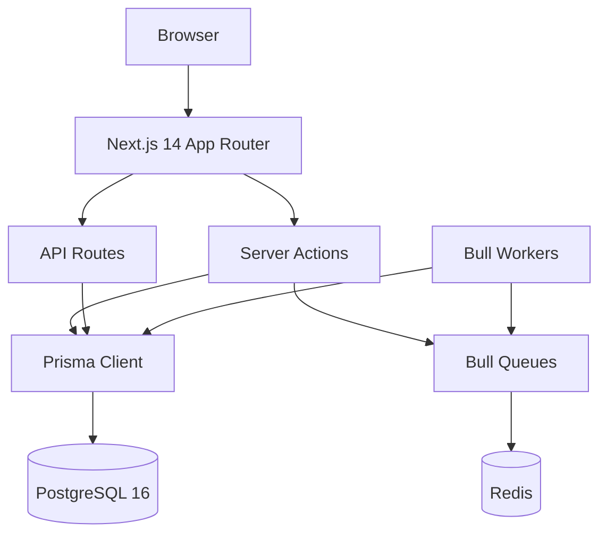
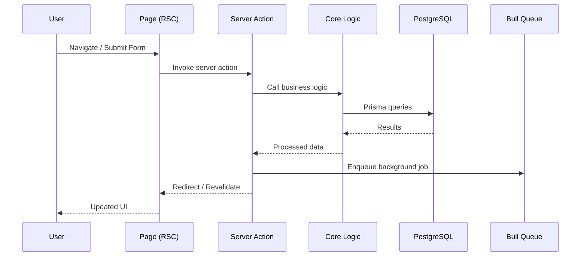
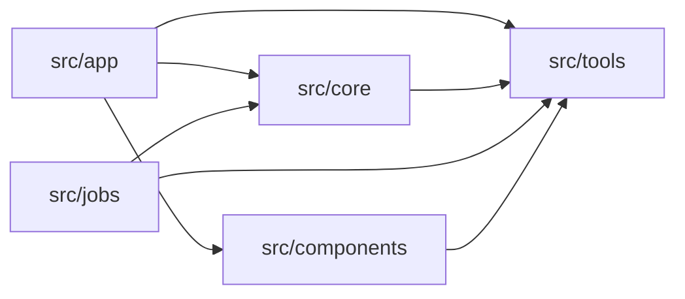

# Architecture Overview

<cite>
**Referenced Files**
- [package.json](file://package.json)
- [prisma/schema.prisma](file://prisma/schema.prisma)
- [docker-compose.yml](file://docker-compose.yml)
- [src/app/layout.tsx](file://src/app/layout.tsx)
- [src/tools/db.ts](file://src/tools/db.ts)
- [src/tools/auth.ts](file://src/tools/auth.ts)
</cite>

## Introduction

MeinGym is a full-stack web application for planning, executing, and tracking strength-training workouts with periodization and automatic load progression. Built on Next.js 14 App Router, it follows a monolithic architecture where all frontend, backend, and background processing live in a single codebase.

## Project Structure

**Sources**: [src/tools/db.ts:1-4](file://src/tools/db.ts#L1-L4) · [src/jobs/queues.ts:1-21](file://src/jobs/queues.ts#L1-L21)

### Directory Layout

| Directory | Responsibility |
|-----------|---------------|
| `src/app/` | Page routes, server actions (`actions.ts`), API endpoints, feature components |
| `src/core/` | Pure business logic: scoring, progression, periods, statistics |
| `src/jobs/` | Bull queue workers for async processing |
| `src/tools/` | Shared utilities: DB client, auth, dates, math |
| `src/components/` | Reusable UI components (Layout, AuthProvider, etc.) |
| `prisma/` | Schema definition and 89 migrations |
| `collector/` | Exercise data collection scripts |

## Core Components

### Request Flow

**Sources**: [src/app/trainings/actions.ts](file://src/app/trainings/actions.ts) · [src/core/exercises.ts:33-143](file://src/core/exercises.ts#L33-L143)

### Module Boundaries

The application is organized into six primary modules:

1. **App Layer** (`src/app/`) — Next.js pages, server actions, API routes, and feature-specific React components. Each route directory is self-contained with its own `actions.ts`, `types.ts`, and `components/`.

2. **Core Logic** (`src/core/`) — Pure TypeScript business logic with no HTTP awareness. Handles scoring normalization, progression strategies, period lifecycle, approach statistics, and muscle engagement tracking.

3. **Background Jobs** (`src/jobs/`) — Three Bull queues (scores, periods, images) backed by Redis. Workers run as a separate process via `pnpm workers`.

4. **Tools** (`src/tools/`) — Shared utilities including the Prisma singleton, authentication helpers, date/math functions, and HTTP fetch wrappers.

5. **Components** (`src/components/`) — Cross-cutting UI components: Layout wrapper with navigation, AuthProvider for session context, approach management, and chart components.

6. **Data Layer** (`prisma/`) — Prisma schema with 30+ models covering users, exercises, trainings, executions, scoring, equipment, and muscles.

## Architecture Overview

### Technology Stack

| Layer | Technology | Version |
|-------|-----------|---------|
| Framework | Next.js (App Router) | 14.x |
| UI Library | React | 18.x |
| CSS Framework | Bootstrap + React-Bootstrap | 5.3.2 |
| Database | PostgreSQL | 16 |
| ORM | Prisma | 5.x |
| Auth | NextAuth.js | 4.x |
| Job Queue | Bull + Redis | 4.12.2 |
| Validation | Zod | 3.x |
| Charts | Recharts | 2.x |
| Testing | node:test + Chai | 5.x |

### Authentication Architecture

NextAuth.js with Prisma adapter provides OAuth via GitHub and Google providers. On user creation, the `createUser` event handler automatically provisions:
- A `UserInfo` record with default settings
- A default `Equipment` set ("Тренажерный зал") with standard rig configurations (barbell, blocks, dumbbell, kettlebell)

**Sources**: [src/tools/auth.ts:18-101](file://src/tools/auth.ts#L18-L101)

### Data Access Pattern

All database access flows through a singleton Prisma Client instance in `src/tools/db.ts`. Server actions and API routes import this singleton directly. Background job processors also use the same instance but call `prisma.$disconnect()` in their `finally` blocks.

**Sources**: [src/tools/db.ts:1-4](file://src/tools/db.ts#L1-L4)

## Dependency Analysis

**Sources**: [package.json:24-51](file://package.json#L24-L51) · [tsconfig.json](file://tsconfig.json)

## Conclusion

MeinGym follows a clean monolithic architecture with clear separation between the presentation layer (App Router), business logic (core), and infrastructure (tools, jobs). The Server Actions pattern eliminates most traditional API routes, while Bull queues handle deferred work. The architecture scales well for a single-user fitness application and maintains testability through the pure core module.
