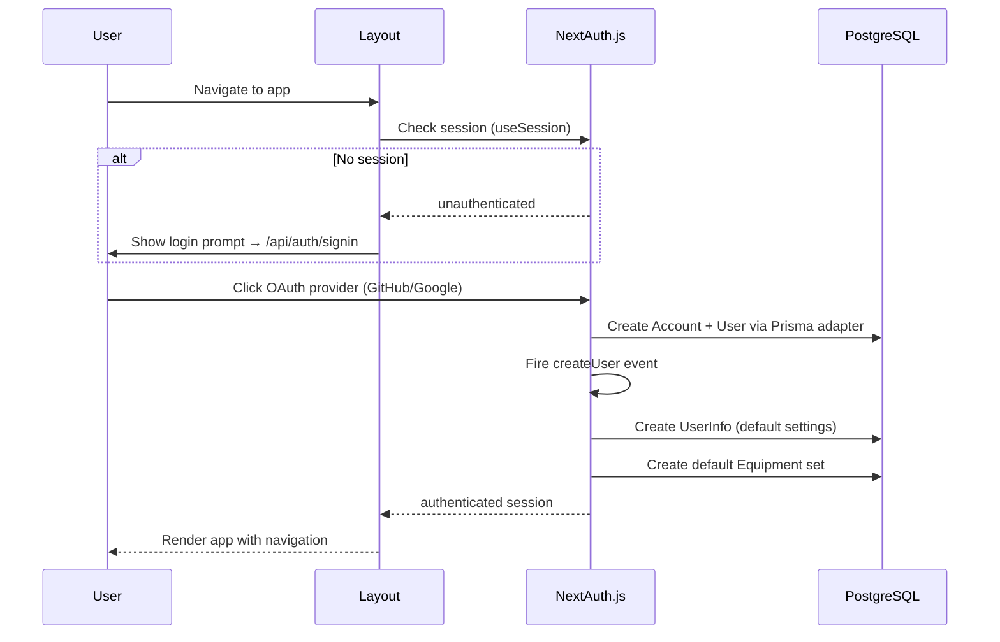

# Authentication and Authorization

<cite>
**Referenced Files**
- [src/tools/auth.ts](file://src/tools/auth.ts)
- [src/app/api/auth/[...nextauth]/route.ts](file://src/app/api/auth/%5B...nextauth%5D/route.ts)
- [src/components/AuthProvider.tsx](file://src/components/AuthProvider.tsx)
- [src/components/Layout.tsx](file://src/components/Layout.tsx)
- [prisma/schema.prisma](file://prisma/schema.prisma)
</cite>

## Introduction

Authentication in MeinGym is handled by NextAuth.js (v4) with the Prisma adapter. It supports OAuth login via GitHub and Google providers. The system uses session-based authentication with server-side session retrieval, and includes automatic user provisioning on first login.

## Authentication Flow



**Sources**: [src/tools/auth.ts:18-101](file://src/tools/auth.ts#L18-L101) · [src/components/Layout.tsx:1-81](file://src/components/Layout.tsx#L1-L81)

## NextAuth.js Configuration

```typescript
// src/tools/auth.ts
export const authOptions = {
  adapter: PrismaAdapter(prisma),
  providers: [
    GitHubProvider({
      clientId: process.env.GITHUB_APP_ID,
      clientSecret: process.env.GITHUB_SECRET,
    }),
    GoogleProvider({
      clientId: process.env.GOOGLE_CLIENT_ID,
      clientSecret: process.env.GOOGLE_CLIENT_SECRET,
      allowDangerousEmailAccountLinking: true,
    }),
  ],
  callbacks: {
    session: async ({ session, user }) => {
      session.user = user;  // Attach full user object to session
      return session;
    },
  },
};
```

### Key Settings

| Setting | Value | Purpose |
|---------|-------|---------|
| Adapter | PrismaAdapter | Stores accounts/sessions in PostgreSQL |
| Google `allowDangerousEmailAccountLinking` | true | Links Google account to existing GitHub account with same email |
| Session callback | Attaches full user | Makes `session.user` available to client components |

**Sources**: [src/tools/auth.ts:18-37](file://src/tools/auth.ts#L18-L37)

## OAuth Providers

### GitHub
- Environment variables: `GITHUB_APP_ID`, `GITHUB_SECRET`
- Standard OAuth flow via GitHub's authorization endpoint

### Google
- Environment variables: `GOOGLE_CLIENT_ID`, `GOOGLE_CLIENT_SECRET`
- `allowDangerousEmailAccountLinking: true` enables linking a Google login to an existing GitHub-registered account with the same email address

**Sources**: [src/tools/auth.ts:20-30](file://src/tools/auth.ts#L20-L30) · [.env.dist](file://.env.dist)

## User Provisioning

The `createUser` event handler fires when a new user signs up via any OAuth provider. It automatically creates:

### 1. UserInfo Record

```typescript
await prisma.userInfo.create({
  data: { userId: user.id }
});
// Defaults: sex=MALE, height=175, purpose=STRENGTH, progression=NONE
```

### 2. Default Equipment Set

A full equipment set named "Тренажерный зал" (Gym) with:

**Rigs:**
| Type | Min Weight | Step | Max Weight |
|------|-----------|------|-----------|
| BARBELL | 10 | 5 | 200 |
| BLOCKS | 5 | 1 | 200 |
| DUMBBELL | 5 | 2.5 | 50 |
| KETTLEBELL | 6 | 2 | 30 |

**Requirements:**
- BENCH, UPBAR, SIMULATOR (all marked as available)

This ensures new users can immediately start creating trainings without manual equipment setup.

**Sources**: [src/tools/auth.ts:38-98](file://src/tools/auth.ts#L38-L98)

## Session Access in Server Code

### Helper Functions

```typescript
// Get full session (works in both API routes and server actions)
export function auth(...args): Promise<Session> {
  return getServerSession(...args, authOptions);
}

// Get current user or redirect to 404
export async function getCurrentUser(): Promise<User | never> {
  const session = await getServerSession(authOptions);
  if (!session) redirect("/404");
  return session?.user as User;
}

// Get just the user ID
export async function getCurrentUserId(): Promise<string | never> {
  return (await getCurrentUser()).id;
}

// Get or create UserInfo
export async function findUserInfo(userId: string): Promise<UserInfo> {
  const info = await prisma.userInfo.findFirst({ where: { userId } });
  if (!info) return prisma.userInfo.create({ data: { userId } });
  return info;
}
```

**Sources**: [src/tools/auth.ts:103-131](file://src/tools/auth.ts#L103-L131)

## Client-Side Auth

### AuthProvider

Wraps the entire app in NextAuth.js `SessionProvider`:

```typescript
// src/components/AuthProvider.tsx
export default function AuthProvider({ children }) {
  return <SessionProvider>{children}</SessionProvider>;
}
```

### Layout Session Guard

The Layout component uses `useSession()` to:
- Show a spinner while session status is `"loading"`
- Render children only when `"authenticated"`
- Show a login link when `"unauthenticated"`

**Sources**: [src/components/AuthProvider.tsx:1-12](file://src/components/AuthProvider.tsx#L1-L12) · [src/components/Layout.tsx:67-77](file://src/components/Layout.tsx#L67-L77)

## Role-Based Access

The `User` model includes a `role` field with the `UserRole` enum:

| Role | Access |
|------|--------|
| `USER` | Standard access to all features |
| `ADMIN` | Additional access to `/admin/jobs` monitoring panel |

Currently, role-based checks are minimal — the admin jobs page is the only admin-restricted area.

**Sources**: [prisma/schema.prisma:14-17](file://prisma/schema.prisma#L14-L17) · [prisma/schema.prisma:27](file://prisma/schema.prisma#L27)

## Data Models

| Model | Purpose |
|-------|---------|
| `User` | Core user: id (cuid), email, name, image, role |
| `Account` | OAuth provider data: provider, tokens, expiry |
| `Session` | Session tokens with expiry |
| `VerificationToken` | Email verification |

The `Account` model stores OAuth tokens including `refresh_token`, `access_token`, `id_token`, and `refresh_token_expires_in` for token refresh.

**Sources**: [prisma/schema.prisma:19-154](file://prisma/schema.prisma#L19-L154)

## Conclusion

The authentication system is straightforward: OAuth login, automatic user provisioning, and session-based access control. The `createUser` event handler is the key customization — it ensures every new user has a complete starting configuration. The Layout component acts as the authentication gate, preventing unauthenticated access to all application features.
