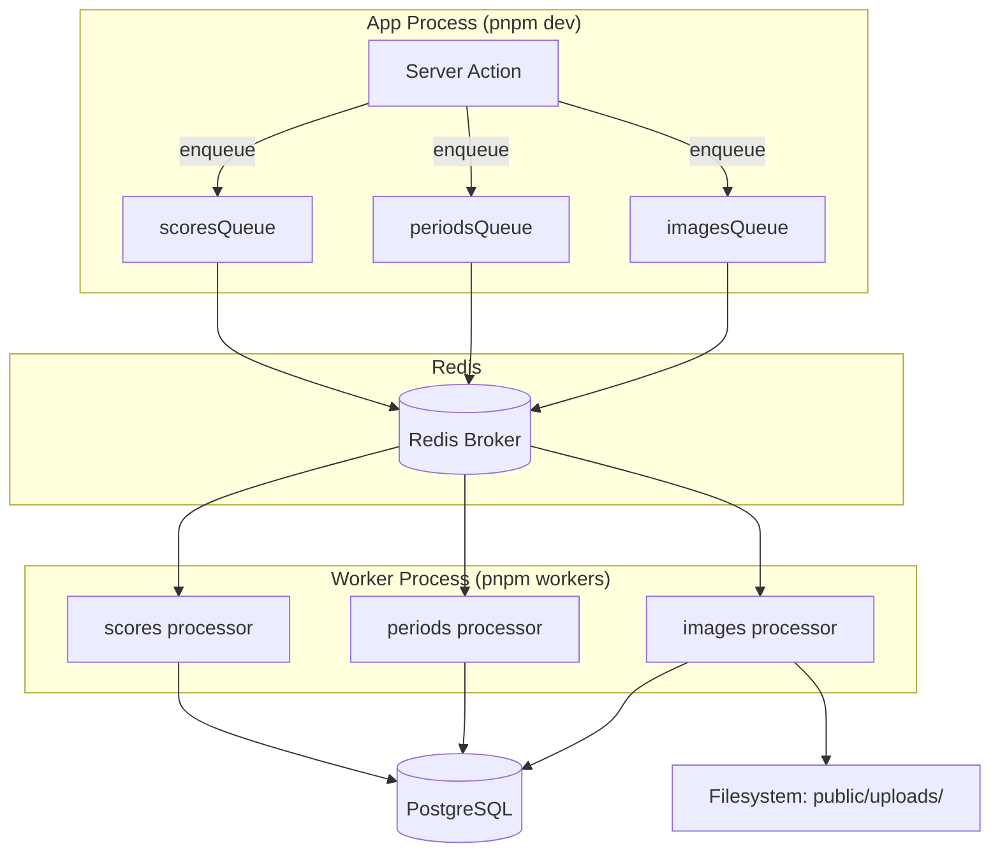

# Background Job System

<cite>
**Referenced Files**
- [src/jobs/config.ts](file://src/jobs/config.ts)
- [src/jobs/queues.ts](file://src/jobs/queues.ts)
- [src/jobs/index.ts](file://src/jobs/index.ts)
- [src/jobs/processors/scores.ts](file://src/jobs/processors/scores.ts)
- [src/jobs/processors/periods.ts](file://src/jobs/processors/periods.ts)
- [src/jobs/processors/images.ts](file://src/jobs/processors/images.ts)
</cite>

## Introduction

The background job system uses Bull queues backed by Redis to handle asynchronous operations: score calculation after training completion, periodic checks for inactive training periods, and cleanup of orphaned uploaded images. Workers run as a separate Node.js process via `pnpm workers`.

## Architecture



**Sources**: [src/jobs/queues.ts:1-21](file://src/jobs/queues.ts#L1-L21) · [src/jobs/index.ts:1-62](file://src/jobs/index.ts#L1-L62)

## Configuration

### Redis Connection

```typescript
// src/jobs/config.ts
export const redisConfig = {
  host: process.env.REDIS_HOST || "localhost",
  port: parseInt(process.env.REDIS_PORT || "6379"),
};
```

### Queue and Job Names

| Queue | Job Name | Constant |
|-------|----------|----------|
| `scores` | `calculate-scores` | `jobNames.scores.calculateScores` |
| `periods` | `check-inactive-periods` | `jobNames.periods.checkInactive` |
| `images` | `cleanup-orphaned-images` | `jobNames.images.cleanupOrphaned` |

### Default Job Options

```typescript
export const defaultJobOptions = {
  attempts: 3,                    // Retry up to 3 times
  backoff: {
    type: "exponential",
    delay: 5000,                  // Start at 5s, double each retry
  },
  removeOnComplete: true,         // Clean up finished jobs
};
```

**Sources**: [src/jobs/config.ts:1-38](file://src/jobs/config.ts#L1-L38)

## Queue Initialization

Each queue is created in `queues.ts` with its processor registered immediately:

```typescript
// src/jobs/queues.ts
export const scoresQueue = new Bull(queueNames.scores, { redis: redisConfig });
scoresQueue.process(jobNames.scores.calculateScores, calculationScoreProcessor);

export const periodsQueue = new Bull(queueNames.periods, { redis: redisConfig });
periodsQueue.process(jobNames.periods.checkInactive, checkInactivePeriodsProcessor);

export const imagesQueue = new Bull(queueNames.images, { redis: redisConfig });
imagesQueue.process(jobNames.images.cleanupOrphaned, cleanupImagesProcessor);
```

**Sources**: [src/jobs/queues.ts:1-21](file://src/jobs/queues.ts#L1-L21)

## Processors

### Scores Processor

**Trigger**: Called when a training is completed (via `scheduleScoreCalculation(trainingId)`)

**Logic**:
1. Fetch all `TrainingExercise` records for the given `trainingId`
2. For each exercise, call `createScore()` from `src/core/scores.ts`
3. Each call normalizes lifted metrics and persists a `TrainingExerciseScore` record
4. Disconnects Prisma in `finally` block

**Job data**: `{ trainingId: number }`

**Sources**: [src/jobs/processors/scores.ts:1-37](file://src/jobs/processors/scores.ts#L1-L37)

### Periods Processor

**Trigger**: Scheduled daily at midnight via cron (`0 0 * * *`)

**Logic**:
1. Find all `TrainingPeriod` records where `isCurrent = true`
2. For each period, check the most recent completed training
3. If the last completed training was more than 7 days ago (or none exists), end the period
4. Ending calls `endCurrentTrainingPeriod()` which sets `isCurrent = false` and `endDate = now`

**Job data**: `{}`

**Sources**: [src/jobs/processors/periods.ts:1-66](file://src/jobs/processors/periods.ts#L1-L66)

### Images Processor

**Trigger**: Scheduled daily at 3 AM via cron (`0 3 * * *`)

**Logic**:
1. Read all filenames from `public/uploads/` directory
2. Query all `ExerciseImage` records from the database
3. Find files on disk that have no corresponding database record (orphans)
4. Delete each orphaned file from the filesystem

**Job data**: `{}`

**Sources**: [src/jobs/processors/images.ts:1-71](file://src/jobs/processors/images.ts#L1-L71)

## Worker Entry Point

The `src/jobs/index.ts` file:
1. Imports all processors (which register themselves on queues)
2. Exports queue instances for use by the app
3. Provides helper functions: `scheduleScoreCalculation()`, `scheduleCheckInactivePeriods()`, `scheduleCleanupOrphanedImages()`
4. Auto-schedules the periodic jobs (periods daily at midnight, images daily at 3 AM)

```typescript
// Auto-scheduled on worker startup:
scheduleCheckInactivePeriods();  // cron: "0 0 * * *"
scheduleCleanupOrphanedImages(); // cron: "0 3 * * *"
```

**Sources**: [src/jobs/index.ts:1-62](file://src/jobs/index.ts#L1-L62)

## Retry Strategy

All jobs use exponential backoff:
- Attempt 1: Immediate
- Attempt 2: After 5 seconds
- Attempt 3: After 10 seconds
- After 3 failures: Job is marked as failed (visible in admin panel at `/admin/jobs`)

## Conclusion

The background job system decouples heavy operations from the request cycle. Score calculation is the most critical job — it runs on every training completion and directly impacts the progress visualization features. The periodic jobs (periods, images) maintain data hygiene without manual intervention. The retry strategy with exponential backoff provides resilience against transient failures.
