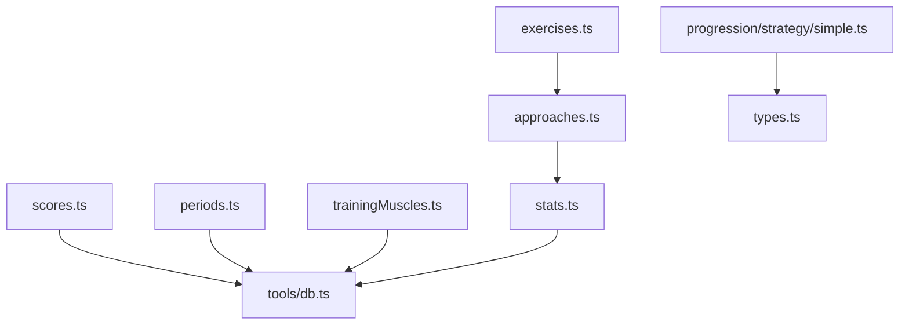
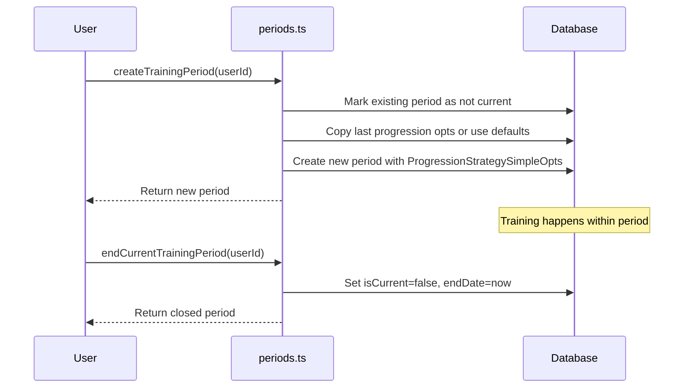

# Core Business Logic

<cite>
**Referenced Files**
- [src/core/scores.ts](file://src/core/scores.ts)
- [src/core/progression/strategy/simple.ts](file://src/core/progression/strategy/simple.ts)
- [src/core/periods.ts](file://src/core/periods.ts)
- [src/core/approaches.ts](file://src/core/approaches.ts)
- [src/core/exercises.ts](file://src/core/exercises.ts)
- [src/core/stats.ts](file://src/core/stats.ts)
- [src/core/trainingMuscles.ts](file://src/core/trainingMuscles.ts)
- [src/core/types.ts](file://src/core/types.ts)
</cite>

## Introduction

The `src/core/` module contains pure business logic for workout management, scoring, and progression. It is deliberately decoupled from HTTP concerns — no request/response handling, no route awareness. This makes it testable in isolation via `node:test` with `pnpm test:core`.

## Module Structure



| File | Responsibility |
|------|---------------|
| `scores.ts` | Log-normalized scoring with purpose-specific coefficients |
| `progression/strategy/simple.ts` | Next-workout set generation for strength/mass/loss |
| `periods.ts` | Training period lifecycle (create, end, query) |
| `approaches.ts` | Approach group creation and statistics aggregation |
| `exercises.ts` | Exercise creation with purpose-specific state resolution |
| `stats.ts` | Set statistics calculation (sum, mean, max) |
| `trainingMuscles.ts` | Per-training muscle engagement computation |
| `trainingTime/` | Training time scoring (base, average, ML strategies) |
| `types.ts` | Shared type definitions |

## Scoring System

See [Scoring and Analytics](Core%20Business%20Logic/Scoring%20and%20Analytics.md) for full details.

The scoring pipeline:
1. **Normalize** — Apply `Math.log()` to each lifted metric (sum, mean, max, countTotal, countMean)
2. **Weight** — Multiply normalized values by purpose-specific coefficients
3. **Sum** — Produce a single score value
4. **Persist** — Store as `TrainingExerciseScore` with coefficients for audit

Coefficients per purpose:

| Metric | STRENGTH | MASS | LOSS |
|--------|----------|------|------|
| liftedMaxNorm | 0.5 | 0.1 | 0.5 |
| liftedSumNorm | 0.5 | 0.25 | 0 |
| liftedMeanNorm | 0 | 0.5 | 0 |
| liftedCountTotalNorm | 0 | 0 | 0.5 |
| liftedCountMeanNorm | -0.5 | 0.25 | 0.5 |

**Sources**: [src/core/scores.ts:53-78](file://src/core/scores.ts#L53-L78)

## Progression Strategies

See [Progression Strategies](Core%20Business%20Logic/Progression%20Strategies.md) for full details.

The `ProgressionStrategySimple` class generates the next workout's planned sets based on executed results:

- **Strength**: Pyramid system — increase reps first, then weight. Prepare sets ramp up to working sets.
- **Mass**: Tree pattern — add 1 rep per set until threshold, then bump weight and drop reps. Optional drop set.
- **Loss**: Volume progression — increase mean reps per set, add sets when max is reached, then bump weight.

All strategies respect `oneDumbbell` (even rep counts) and `bigCount` (scaled thresholds) action flags.

**Sources**: [src/core/progression/strategy/simple.ts:52-267](file://src/core/progression/strategy/simple.ts#L52-L267)

## Period Management

Training periods represent training cycles. The lifecycle:



Key functions:
- `createTrainingPeriod(userId, opts?)` — Closes current period, inherits last progression opts, creates new one
- `endCurrentTrainingPeriod(userId)` — Marks current period as inactive
- `getCurrentTrainingPeriod(userId)` — Returns active period
- `getCurrentTrainingPeriodWithOptions(userId)` — Returns period with progression params
- `getUserTrainingPeriods(userId)` — Lists all periods (newest first)
- `updateProgressionStrategySimpleOpts(id, opts)` — Updates strategy parameters

**Sources**: [src/core/periods.ts:1-191](file://src/core/periods.ts#L1-L191)

## Approach Groups

The `approaches.ts` module manages planned set groups:

- `createApproachGroup(tx, approaches, actionId, userId)` — Creates group with computed statistics
- `linkNewApproachGroupToActionByPurpose(tx, purpose, id, group)` — Links group to ActionMass/Strength/Loss
- `createMassInitial(userId, actionId, rig, bigCount, tx)` — Creates initial mass approaches
- `createStrengthInitial(userId, actionId, strAllowed, tx)` — Creates initial strength approaches
- `createLossInitial(userId, actionId, rig, bigCount, tx)` — Creates initial loss approaches

Statistics are computed by `stats.ts`:
- For `OTHER` rig type, user's body weight is added to the set weight
- Computes: set count, weight sum/mean/max, total reps, mean reps

**Sources**: [src/core/approaches.ts:1-189](file://src/core/approaches.ts#L1-L189) · [src/core/stats.ts:51-82](file://src/core/stats.ts#L51-L82)

## Exercise Creation

`createExercise()` in `exercises.ts` handles adding an exercise to a training:

1. Fetches the Action with its purpose-specific state (ActionMass/Strength/Loss)
2. If no state exists for the chosen purpose, creates initial approaches with defaults
3. Creates a `TrainingExercise` linking to the appropriate `ApproachesGroup`
4. Validates that strength purpose is only used with `strengthAllowed` actions

**Sources**: [src/core/exercises.ts:33-143](file://src/core/exercises.ts#L33-L143)

## Shared Types

```typescript
// src/core/types.ts
type SetsStats = {
  len: number;        // sets count
  weightSum: number;  // total weight lifted
  weightMean: number; // average weight per set
  weightMax: number;  // heaviest set
  countSum: number;   // total reps
  countMean: number;  // average reps per set
};

type SetData = { weight: number; count: number };

type SetDataExecuted = SetData & {
  rating: string;
  cheating: string;
  refusing: string;
  burning: string;
};

type CurrentPurpose = "MASS" | "STRENGTH" | "LOSS";
```

**Sources**: [src/core/types.ts:1-20](file://src/core/types.ts#L1-L20)

## Conclusion

The core module maintains a clean separation between business logic and infrastructure. All functions accept Prisma transaction clients where needed, enabling atomic multi-step operations. The scoring and progression systems are the computational heart of the application, translating raw execution data into actionable training insights.
