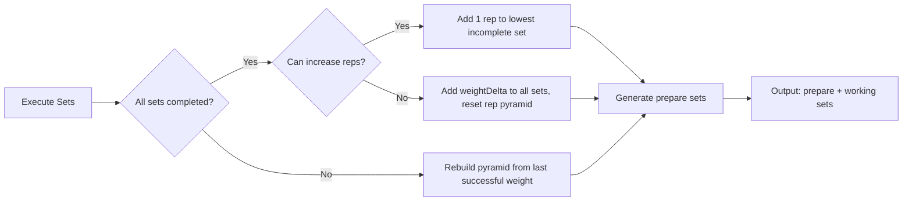
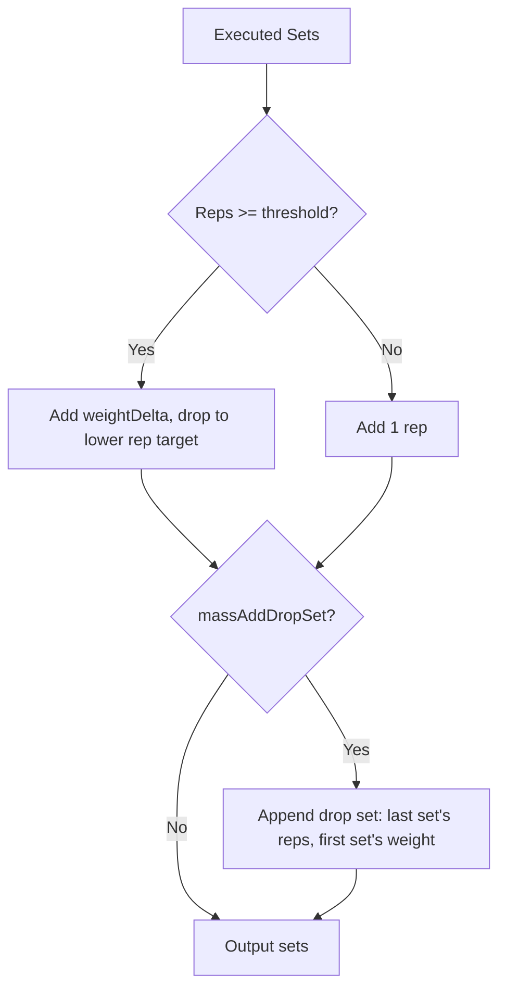
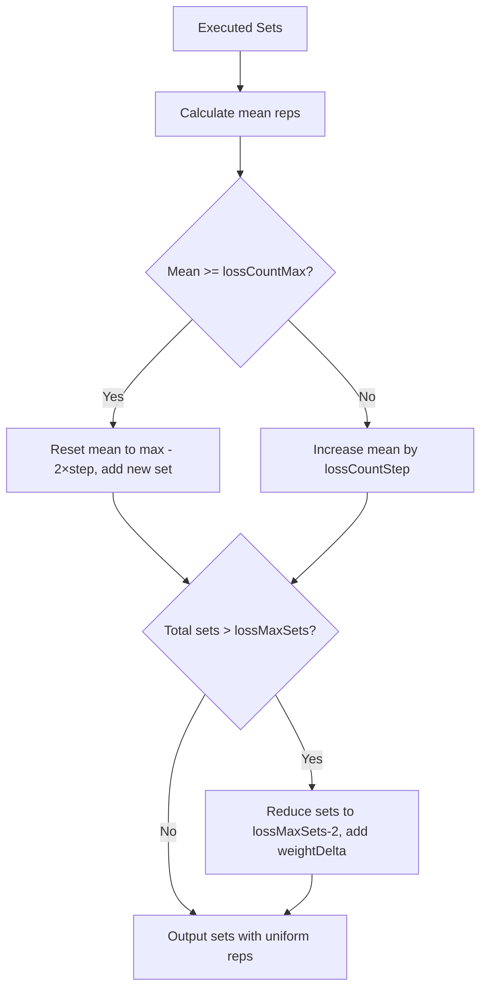

# Progression Strategies

<cite>
**Referenced Files**
- [src/core/progression/strategy/simple.ts](file://src/core/progression/strategy/simple.ts)
- [src/core/progression/strategy/simple.test.ts](file://src/tests/core/progression/strategy/simple.test.ts)
- [prisma/schema.prisma](file://prisma/schema.prisma)
</cite>

## Introduction

The progression system automatically generates the next workout's planned sets based on how the previous workout was executed. The `ProgressionStrategySimple` class implements three purpose-specific methods: `strength()`, `mass()`, and `loss()`. Each takes the planned and executed sets, then returns the next planned sets.

## Configurable Options

The `ProgressionStrategySimpleOptsType` defines per-period parameters:

| Parameter | Default | Purpose |
|-----------|---------|---------|
| `strengthWorkingSetsCount` | 4 | Number of working sets for strength |
| `strengthPrepareSetsCount` | 2 | Number of warm-up/prepare sets |
| `strengthWeightDelta` | 5 | Weight increment for strength (kg) |
| `massSetsCount` | 4 | Number of sets for mass |
| `massAddDropSet` | true | Add a lighter drop set at the end |
| `massBigCountCoef` | 1.8 | Rep threshold multiplier for big-count exercises |
| `massWeightDelta` | 2.5 | Weight increment for mass (kg) |
| `lossCountStep` | 4 | Rep increase per iteration for loss |
| `lossCountMax` | 16 | Maximum reps per set before adding sets |
| `lossWeightDelta` | 1.25 | Weight increment for loss (kg) |
| `lossMaxSets` | 6 | Maximum sets before weight bump |

Options are stored per `TrainingPeriod` and inherited when creating new periods.

**Sources**: [src/core/progression/strategy/simple.ts:23-50](file://src/core/progression/strategy/simple.ts#L23-L50) · [prisma/schema.prisma:601-626](file://prisma/schema.prisma#L601-L626)

## Strength Progression

The strength strategy builds a pyramid of working sets plus prepare sets:

**Working Set Logic** (`_upgradeStrengthWorkingSets`):
1. Take the last N executed sets (where N = `strengthWorkingSetsCount`)
2. If any set was not completed (count=0), rebuild the pyramid from the last successful weight
3. If all completed, try to increase reps first (bottom-up pyramid)
4. If all reps are maxed, add `strengthWeightDelta` to all weights and reset to pyramid

**Prepare Set Logic** (`_upgradeStrengthPrepareSets`):
- Creates `strengthPrepareSetsCount` warm-up sets
- Each set is lighter (weight - 2×delta) with more reps (up to 12)
- Prepares the body for the working sets

**One-dumbbell handling**: Forces even rep counts.

**Sources**: [src/core/progression/strategy/simple.ts:66-158](file://src/core/progression/strategy/simple.ts#L66-L158)

## Mass Progression

The mass strategy uses a tree pattern with progressive overload:

**Rep Thresholds** (normal exercises):

| Set Position | Above Threshold | Drop To |
|-------------|----------------|---------|
| Set 0 | 15 | 14 |
| Set 1 | 13 | 12 |
| Set 2 | 11 | 10 |
| Set 3 | 9 | 8 |
| Set 4 | 7 | 6 |

For `bigCount` exercises, thresholds are multiplied by `massBigCountCoef` (min 30/15).

**Drop Set**: When `massAddDropSet` is true, a final set is appended with the last set's rep count but the first (heaviest) set's weight.

**Sources**: [src/core/progression/strategy/simple.ts:160-223](file://src/core/progression/strategy/simple.ts#L160-L223)

## Loss Progression

The loss strategy prioritizes volume (total reps) over weight:

All sets use the same weight (from the first executed set) and the same rep count (the calculated mean).

**Sources**: [src/core/progression/strategy/simple.ts:225-265](file://src/core/progression/strategy/simple.ts#L225-L265)

## Testing

Progression strategies are tested in `src/tests/core/progression/strategy/simple.test.ts` using `node:test` and Chai assertions. Tests verify:
- Correct set generation for each purpose
- Edge cases (failed sets, max thresholds)
- One-dumbbell even-rep enforcement
- Big-count threshold scaling

**Sources**: [src/tests/core/progression/strategy/simple.test.ts](file://src/tests/core/progression/strategy/simple.test.ts)

## Conclusion

The simple progression strategy provides automatic, purpose-aware load progression. It balances simplicity (configurable numeric options) with domain knowledge (pyramid patterns for strength, tree patterns for mass, volume for loss). Future strategies can extend this pattern by implementing the same `strength()`/`mass()`/`loss()` interface.
