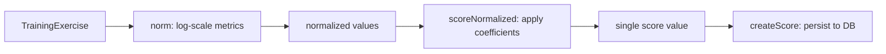

# Scoring and Analytics

<cite>
**Referenced Files**
- [src/core/scores.ts](file://src/core/scores.ts)
- [src/jobs/processors/scores.ts](file://src/jobs/processors/scores.ts)
- [prisma/schema.prisma](file://prisma/schema.prisma)
</cite>

## Introduction

The scoring system translates raw training execution data into normalized, comparable scores. It uses logarithmic normalization followed by purpose-specific weighted coefficients to produce a single score value per completed exercise. Scores are stored in `TrainingExerciseScore` records for historical analysis and progress visualization.

## Scoring Pipeline



**Sources**: [src/core/scores.ts:1-103](file://src/core/scores.ts#L1-L103)

## Step 1: Normalization

The `norm()` function applies `Math.log()` to each lifted metric from a `TrainingExercise`:

```typescript
function normLogFn(val: number): number {
  return val > 0 ? Math.log(val) : 0;
}

// Produces:
{
  liftedMaxNorm: Math.log(liftedMax),      // heaviest set
  liftedSumNorm: Math.log(liftedSum),      // total volume (weight × reps)
  liftedMeanNorm: Math.log(liftedMean),    // average weight per set
  liftedCountTotalNorm: Math.log(liftedCountTotal), // total reps
  liftedCountMeanNorm: Math.log(liftedCountMean),   // average reps per set
}
```

Log normalization ensures that:
- Diminishing returns at higher weights are reflected (100→110 kg matters more than 200→210 kg)
- All metrics are on a comparable scale
- Zero values remain zero

**Sources**: [src/core/scores.ts:24-36](file://src/core/scores.ts#L24-L36)

## Step 2: Purpose-Specific Coefficients

The `ScoreCoefficients` matrix defines how much each normalized metric contributes to the final score:

| Metric | STRENGTH | MASS | LOSS | Rationale |
|--------|----------|------|------|-----------|
| `liftedMaxNorm` | **0.5** | 0.1 | **0.5** | Max weight matters for strength and loss |
| `liftedSumNorm` | **0.5** | 0.25 | 0 | Total volume matters for strength |
| `liftedMeanNorm` | 0 | **0.5** | 0 | Average weight per set matters for mass |
| `liftedCountTotalNorm` | 0 | 0 | **0.5** | Total reps matter for loss |
| `liftedCountMeanNorm` | **-0.5** | 0.25 | **0.5** | Strength penalizes high avg reps; loss rewards them |

Key design decisions:
- **Strength** rewards high max weight and total volume, but **penalizes** high average rep counts (strength = low reps, heavy weight)
- **Mass** rewards moderate weights with moderate reps (bodybuilding pattern)
- **Loss** rewards high rep counts and max weight (cardio/endurance focus)

**Sources**: [src/core/scores.ts:53-78](file://src/core/scores.ts#L53-L78)

## Step 3: Score Calculation

The `scoreNormalized()` function computes the final score:

```typescript
score = sum(normalized[k] * coefficients[k]) for each metric k
```

The result includes both the score value and the coefficients used (stored for audit/debugging).

**Sources**: [src/core/scores.ts:38-51](file://src/core/scores.ts#L38-L51)

## Step 4: Persistence

The `createScore()` function creates a `TrainingExerciseScore` record:

```typescript
// Fields stored:
{
  createdAt: exercise.completedAt || new Date(),
  userId: exercise.Training.userId,
  actionId: exercise.actionId,
  purpose: exercise.purpose,
  liftedSumNorm, liftedMeanNorm, liftedMaxNorm,
  liftedCountTotalNorm, liftedCountMeanNorm,
  trainingExerciseId: exercise.id,
  score: computedScore,
  coefficients: coefficientsUsed
}
```

The `coefficients` field (JSON) preserves which coefficients were applied, enabling historical comparison even if coefficients change in the future.

**Sources**: [src/core/scores.ts:80-102](file://src/core/scores.ts#L80-L102) · [prisma/schema.prisma:559-581](file://prisma/schema.prisma#L559-L581)

## Score Calculation Trigger

Scores are calculated asynchronously via the Bull `scores` queue:

1. When a training is completed, `scheduleScoreCalculation(trainingId)` is called
2. The `calculationScoreProcessor` fetches all exercises for the training
3. For each exercise, `createScore()` is called
4. Results are persisted as `TrainingExerciseScore` records

**Sources**: [src/jobs/processors/scores.ts:1-37](file://src/jobs/processors/scores.ts#L1-L37) · [src/jobs/index.ts:15-23](file://src/jobs/index.ts#L15-L23)

## Preview Score (Pre-Execution Estimation)

The `previewScore()` function in `scores.ts` provides a **pre-execution** estimate of exercise difficulty, using the same scoring pipeline as post-execution scoring but operating on planned approach aggregates instead of actual lifted data.

```typescript
previewScore(purpose, approachGroup): number
// approachGroup: { sum, mean, max, countTotal, countMean }
```

The function reuses `ScoreCoefficients` and the same log-normalization (`normLogFn`) applied to `ApproachesGroup` aggregates:

| Aggregate | Source | Equivalent Post-Execution Metric |
|-----------|--------|----------------------------------|
| `sum` | `ApproachesGroup.sum` | `liftedSum` (total weight × reps) |
| `mean` | `ApproachesGroup.mean` | `liftedMean` (avg weight per set) |
| `max` | `ApproachesGroup.max` | `liftedMax` (heaviest set) |
| `countTotal` | `ApproachesGroup.countTotal` | `liftedCountTotal` (total reps) |
| `countMean` | `ApproachesGroup.countMean` | `liftedCountMean` (avg reps per set) |

Because the same coefficients are used, `previewScore` produces a score directly comparable to post-execution `scoreNormalized()`, enabling the difficulty system to express planned load in the same units as actual performance.

This function is the foundation of the difficulty calculation: `exerciseDifficulty = action.base × previewScore(purpose, approachGroup)`.

**Sources**: [src/core/scores.ts:108-121](file://src/core/scores.ts#L108-L121) · [src/core/difficulty.ts:13-22](file://src/core/difficulty.ts#L13-L22)

## Score Indexing

The `TrainingExerciseScore` table is indexed for efficient historical queries:

```sql
@@index([userId, actionId, purpose, createdAt])
```

This supports the exercise history page which shows score trends over time for a specific action and purpose combination.

**Sources**: [prisma/schema.prisma:580](file://prisma/schema.prisma#L580)

## Conclusion

The scoring system provides two complementary metrics: a **post-execution** score (`scoreNormalized`) capturing actual performance, and a **pre-execution** preview score (`previewScore`) estimating planned difficulty. Both share the same normalization and coefficient pipeline, making them directly comparable. The log normalization handles the non-linear nature of strength progression, while purpose-specific coefficients ensure that improvements are measured against the right goals. The coefficient audit trail in each score record allows future coefficient tuning without losing historical context.
