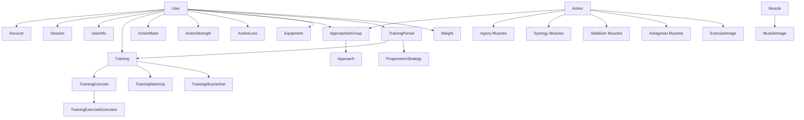

# Data Model

<cite>
**Referenced Files**
- [prisma/schema.prisma](file://prisma/schema.prisma)
</cite>

## Introduction

The data model is defined in `prisma/schema.prisma` using PostgreSQL 16. It covers the full domain of workout tracking across 30+ models organized into five entity groups: authentication, exercise catalog, training lifecycle, progression/scoring, and equipment.

## Entity Relationship Overview



**Sources**: [prisma/schema.prisma:1-728](file://prisma/schema.prisma#L1-L728)

## Entity Groups

### Authentication and Users

| Model | Key Fields | Purpose |
|-------|-----------|---------|
| `User` | id (cuid), email, name, image, role | Core user entity with NextAuth.js integration |
| `Account` | provider, providerAccountId | OAuth provider accounts (GitHub, Google) |
| `Session` | sessionToken, expires | NextAuth.js session management |
| `VerificationToken` | identifier, token, expires | Email verification tokens |
| `UserInfo` | sex, height, purpose, trainingProgression | User profile and training preferences |

The `UserInfo` model stores per-user settings:
- `sex` (MALE/FEMALE) and `height` for body weight calculations
- `purpose` (MASS/STRENGTH/LOSS) as default training goal
- `trainingProgression` (NONE/SIMPLE) for auto-progression selection
- `collectExerciseExecutionFeedback` toggle

### Exercise Catalog

| Model | Key Fields | Purpose |
|-------|-----------|---------|
| `Action` | title, desc, rig, require, search | Exercise definition with full metadata |
| `Muscle` | title, groupId | Individual muscle |
| `MuscleGroup` | title | Muscle group category |
| `MuscleGroupDesc` | text, link | Group descriptions with references |
| `MuscleDesc` | text, link | Muscle descriptions with references |
| `ActionsOnMusclesAgony` | actionId, muscleId | Primary muscle engagement |
| `ActionsOnMusclesSynergy` | actionId, muscleId | Secondary muscle engagement |
| `ActionsOnMusclesStabilizer` | actionId, muscleId | Stabilizing muscle role |
| `ActionsOnMusclesAntagonist` | actionId, muscleId | Antagonist muscle role |
| `ExerciseImage` | filename, path, isMain | Exercise demonstration images |
| `MuscleImage` | filename, path, isMain | Muscle anatomy images |
| `SimilarExercises` | actionId, similarActionId | Self-referential similar exercise pairs |

See [Exercise Catalog](Exercise%20Catalog.md) for detailed Action model documentation.

### Training Lifecycle

| Model | Key Fields | Purpose |
|-------|-----------|---------|
| `Training` | plannedTo, startedAt, completedAt, processedAt, **difficultyScore** | Workout session with lifecycle timestamps and difficulty |
| `TrainingExercise` | purpose, purposeId, liftedSum/Mean/Max, **difficultyScore** | Exercise within a training with difficulty |
| `TrainingExerciseExecution` | plannedWeigth/Count, liftedWeight/Count | Individual set execution with feedback |
| `TrainingWarmUp` | estimatedTimeSec, durationSec, isSkipped | Warm-up tracking |
| `TrainingMuscleStat` | asAgonyCnt, asSynerCnt, asStableCnt | Per-training muscle engagement |
| `TrainingExerciseScore` | score, coefficients | Normalized exercise performance score |
| `TrainingExerciseExecutionDuration` | sequence, seconds | Set timing data |

The `Training` model tracks the full lifecycle:
- `plannedTo` — scheduled date
- `startedAt` — when execution began
- `completedAt` — when all exercises finished
- `processedAt` — when post-processing (scoring) completed

Additional flags: `isCircuit` (circuit training mode), `noFeedback` (skip execution feedback), `noWarmUp` (skip warm-up), `repeatedFromId` (links to original training for repeats), `difficultyScore` (sum of all exercise difficulties, persisted for display and comparison).

### Progression and Scoring

| Model | Key Fields | Purpose |
|-------|-----------|---------|
| `TrainingPeriod` | startDate, endDate, isCurrent | Training cycle with open/close dates |
| `ProgressionStrategySimpleOpts` | strength/mass/loss params | Configurable progression parameters |
| `ApproachesGroup` | count, sum, mean, max, countTotal | Aggregated planned set statistics |
| `Approach` | weight, count, priority, **isBoost** | Individual planned set with optional boost flag |
| `ActionMass` | currentApproachGroupId | User's current mass approaches |
| `ActionStrength` | currentApproachGroupId | User's current strength approaches |
| `ActionLoss` | currentApproachGroupId | User's current loss approaches |

The `ProgressionStrategySimpleOpts` model stores per-period configuration:
- **Strength**: working sets count, prepare sets count, weight delta
- **Mass**: sets count, big count coefficient, weight delta, drop set toggle
- **Loss**: count step, count max, weight delta, max sets

### Difficulty Fields

| Model | Field | Type | Default | Purpose |
|-------|-------|------|---------|--------|
| `Approach` | `isBoost` | Boolean | `false` | Marks approach as a difficulty-boost extra set; excluded from progression |
| `TrainingExercise` | `difficultyScore` | Float | `0` | Pre-execution difficulty = `action.base × previewScore(purpose, approachGroup)` |
| `Training` | `difficultyScore` | Float | `0` | Sum of all exercise difficulty scores in the training |

### Equipment

| Model | Key Fields | Purpose |
|-------|-----------|---------|
| `Equipment` | name, isDefault | Per-user equipment set |
| `EquipmentRequire` | type (UPBAR/BENCH/SIMULATOR/NONE) | Equipment requirements |
| `EquipmentRig` | type, minWeight, step, maxWeight | Rig type with weight constraints |

See [Equipment Management](Equipment%20Management.md) for detailed documentation.

### Analytics

| Model | Key Fields | Purpose |
|-------|-----------|---------|
| `Weight` | value, createdAt | Body weight history entries |
| `TrainingMuscleStat` | asAgonyCnt, asSynerCnt, asStableCnt | Muscle engagement per training |

## Key Design Decisions

### GIN Trigram Index

The `Action.search` field uses PostgreSQL's `pg_trgm` extension with a GIN index for fuzzy exercise search:

```sql
-- Defined in schema.prisma
@@index([search(ops: raw("gin_trgm_ops"))], type: Gin, map: "Action_search_trgm_idx")
```

### Polymorphic Purpose Linking

`TrainingExercise.purposeId` is an integer that references either `ActionMass.id`, `ActionStrength.id`, or `ActionLoss.id` depending on the `purpose` enum value. This is a soft reference — no foreign key constraint enforces it.

### Cascade Delete Strategy

Most child relations use `onDelete: Cascade`:
- Deleting an `Action` removes all related: approaches, scores, images, muscle mappings, training exercises
- Deleting a `Training` removes all: exercises, executions, muscle stats, warm-up, duration records
- Deleting a `User` cascades to everything owned

### Composite IDs

Junction tables use composite primary keys instead of auto-increment:
- `ActionsOnMuscles*` → `@@id([actionId, muscleId])`
- `Account` → `@@id([provider, providerAccountId])`
- `EquipmentRequire` → `@@unique([equipmentId, type])`
- `SimilarExercises` → `@@unique([actionId, similarActionId])`

## Conclusion

The schema balances normalization with performance. The polymorphic purpose pattern avoids a single massive table at the cost of referential integrity. Cascade deletes simplify cleanup but require careful UI guards. The GIN trigram index enables the fuzzy search experience without external search infrastructure.
