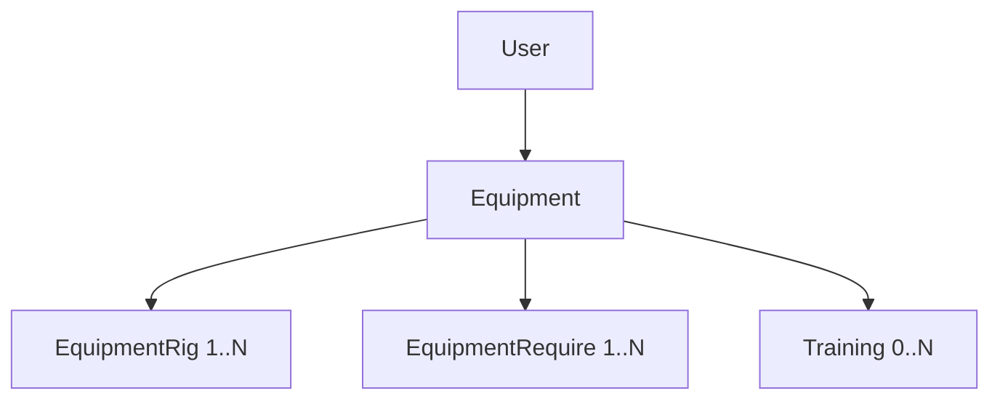

# Equipment Management

<cite>
**Referenced Files**
- [prisma/schema.prisma](file://prisma/schema.prisma)
- [src/tools/auth.ts](file://src/tools/auth.ts)
- [src/app/equipment/](file://src/app/equipment/)
</cite>

## Introduction

The equipment system allows each user to define their available gym equipment. An equipment set specifies which rig types are available (barbell, dumbbell, blocks, kettlebell) with weight ranges, and which equipment requirements are met (bench, pull-up bar, simulator). This data is used to filter exercise availability and constrain weight selection during training execution.

## Data Model

### Equipment



| Model | Key Fields | Purpose |
|-------|-----------|---------|
| `Equipment` | name, isDefault, userId | Per-user equipment set |
| `EquipmentRig` | type, minWeight, step, maxWeight | Rig capabilities |
| `EquipmentRequire` | type | Available equipment types |

**Sources**: [prisma/schema.prisma:46-88](file://prisma/schema.prisma#L46-L88)

### EquipmentRig

Defines the weight constraints for each rig type the user has:

| Field | Type | Purpose |
|-------|------|---------|
| `type` | ActionRig enum | BARBELL, DUMBBELL, BLOCKS, KETTLEBELL |
| `minWeight` | Decimal(5,2) | Minimum available weight (default: 5) |
| `step` | Decimal(4,2) | Weight increment step (default: 2.5) |
| `maxWeight` | Decimal(5,2) | Maximum available weight (default: 200) |

Unique constraint: `@@unique([equipmentId, type])` — one configuration per rig type per equipment set.

### EquipmentRequire

Declares which non-weight equipment is available:

| Value | Meaning |
|-------|---------|
| `UPBAR` | Pull-up bars, parallel bars |
| `BENCH` | Any bench |
| `SIMULATOR` | Any machine/simulator |
| `NONE` | Bodyweight only (no requirement) |

Unique constraint: `@@unique([equipmentId, type])`.

## Default Equipment Provisioning

On user creation, the `createUser` auth event handler automatically creates a default equipment set named "Тренажерный зал" (Gym) with standard configurations:

```typescript
// Rig configurations created for new users:
{ type: BARBELL,     minWeight: 10, step: 5,   maxWeight: 200 }
{ type: BLOCKS,      minWeight: 5,  step: 1,   maxWeight: 200 }
{ type: DUMBBELL,    minWeight: 5,  step: 2.5, maxWeight: 50  }
{ type: KETTLEBELL,  minWeight: 6,  step: 2,   maxWeight: 30  }

// Requirements created:
{ type: BENCH }
{ type: UPBAR }
{ type: SIMULATOR }
```

**Sources**: [src/tools/auth.ts:52-97](file://src/tools/auth.ts#L52-L97)

## Equipment and Training

Each `Training` can optionally link to an `Equipment` via `equipmentId`. This allows:
- Filtering exercises by available equipment during training creation
- Constraining weight inputs to the equipment's min/max/step range
- Supporting users who train at multiple gyms with different equipment

The `isDefault` flag on Equipment marks the primary set. The application enforces at most one default equipment per user at the service layer.

## Cascade Behavior

Deleting an Equipment set cascades to:
- All `EquipmentRig` records
- All `EquipmentRequire` records
- The `equipmentId` on linked Trainings becomes null (optional FK)

**Sources**: [prisma/schema.prisma:46-88](file://prisma/schema.prisma#L46-L88)

## Conclusion

The equipment model provides per-user gym configuration that constrains exercise selection and weight inputs. Default provisioning ensures new users have a reasonable starting configuration without manual setup.
