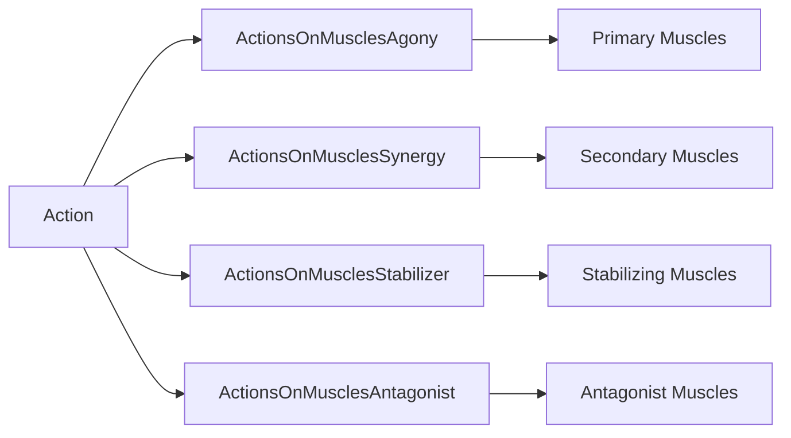

# Exercise Catalog

<cite>
**Referenced Files**
- [prisma/schema.prisma](file://prisma/schema.prisma)
- [src/core/exercises.ts](file://src/core/exercises.ts)
- [src/core/approaches.ts](file://src/core/approaches.ts)
</cite>

## Introduction

The `Action` model is the central entity of the exercise catalog. It represents a physical exercise with its metadata, muscle mappings, equipment requirements, and search capabilities. Each action can have purpose-specific states (mass, strength, loss) with planned approach groups.

## Action Model

| Field | Type | Purpose |
|-------|------|---------|
| `id` | Int (auto) | Primary key |
| `title` | String | Exercise name |
| `desc` | String | Description (plain text or markdown) |
| `alias` | String? | Alternative name |
| `anotherTitles` | String? | Additional title variants |
| `search` | String? (Text) | Full-text search field with GIN trigram index |
| `isMarkDownInDesc` | Boolean | Whether desc contains markdown |
| `strengthAllowed` | Boolean | Whether this exercise supports strength training |
| `bigCount` | Boolean | High-rep exercise (affects mass progression) |
| `allowCheating` | Boolean | Whether cheating feedback is applicable |
| `oneDumbbell` | Boolean | Single-dumbbell exercise (affects rep counts) |
| `rig` | ActionRig | Equipment rig type |
| `require` | ActionRequire | Equipment requirement |

**Sources**: [prisma/schema.prisma:244-286](file://prisma/schema.prisma#L244-L286)

## Rig Types (ActionRig Enum)

| Value | Description | Default Weight Range |
|-------|-------------|---------------------|
| `BARBELL` | Barbell exercises | 10–200 kg, step 5 |
| `DUMBBELL` | Dumbbell exercises | 5–50 kg, step 2.5 |
| `BLOCKS` | Machine blocks/plates | 5–200 kg, step 1 |
| `KETTLEBELL` | Kettlebell exercises | 6–30 kg, step 2 |
| `OTHER` | Bodyweight exercises | Uses body weight from Weight table |

**Sources**: [prisma/schema.prisma:537-543](file://prisma/schema.prisma#L537-L543) · [src/tools/auth.ts:57-85](file://src/tools/auth.ts#L57-L85)

## Equipment Requirements (ActionRequire Enum)

| Value | Description |
|-------|-------------|
| `NONE` | No special equipment needed |
| `UPBAR` | Pull-up bar or parallel bars |
| `BENCH` | Some type of bench |
| `SIMULATOR` | Some type of machine/simulator |

**Sources**: [prisma/schema.prisma:545-550](file://prisma/schema.prisma#L545-L550)

## Muscle Mappings

Each action can be linked to muscles in four roles via junction tables:



- **Agony** — Primary movers (e.g., biceps in a curl)
- **Synergy** — Secondary helpers (e.g., brachialis in a curl)
- **Stabilizer** — Muscles maintaining posture (e.g., core in overhead press)
- **Antagonist** — Opposing muscles being stretched

All junction tables use composite `@@id([actionId, muscleId])` and cascade on action deletion.

**Sources**: [prisma/schema.prisma:204-242](file://prisma/schema.prisma#L204-L242)

## Purpose-Specific States

Each user has three possible purpose states per exercise:

| Model | Purpose | Links to |
|-------|---------|----------|
| `ActionMass` | MASS training | Current ApproachesGroup |
| `ActionStrength` | STRENGTH training | Current ApproachesGroup |
| `ActionLoss` | LOSS training | Current ApproachesGroup |

When a user first adds an exercise to a training with a specific purpose, the initial approach group is created with defaults:

- **Strength default**: 6-set pyramid (40×10, 50×8, 60×6, 70×4, 75×2, 80×1)
- **Mass default**: 4-set descending reps (35×14, 37.5×12, 40×10, 42.5×8)
- **Loss default**: 5-set uniform (10×8 repeated)

For `OTHER` rig type, weight defaults to 0 (bodyweight). For `bigCount` actions, rep counts are doubled.

**Sources**: [src/core/approaches.ts:17-39](file://src/core/approaches.ts#L17-L39) · [src/core/exercises.ts:33-143](file://src/core/exercises.ts#L33-L143)

## Exercise Images

The `ExerciseImage` model stores uploaded demonstration images:
- `filename` — Original filename
- `path` — Filesystem path under `public/uploads/`
- `isMain` — Flag for primary image display
- Uploaded via `/api/images` endpoint (multipart form)
- Orphaned images cleaned up by background job

**Sources**: [prisma/schema.prisma:628-642](file://prisma/schema.prisma#L628-L642)

## Search Capability

The `search` field on Action uses PostgreSQL's `pg_trgm` extension with a GIN index for fuzzy matching:

```sql
@@index([search(ops: raw("gin_trgm_ops"))], type: Gin, map: "Action_search_trgm_idx")
```

This enables the `/api/actions/search` endpoint to find exercises by partial or approximate title matches, supporting both Russian and English text.

**Sources**: [prisma/schema.prisma:285](file://prisma/schema.prisma#L285) · [src/app/api/actions/search/route.ts](file://src/app/api/actions/search/route.ts)

## Similar Exercises

The `SimilarExercises` model creates bidirectional many-to-many relationships between actions, enabling "you might also like" suggestions. Each pair is stored once with `@@unique([actionId, similarActionId])`.

**Sources**: [prisma/schema.prisma:680-693](file://prisma/schema.prisma#L680-L693)

## Conclusion

The Action model is the richest entity in the system, combining exercise metadata, muscle anatomy mappings, equipment constraints, and purpose-specific training states. The four-role muscle mapping provides detailed biomechanical context for each exercise, enabling the training muscle stats feature.
