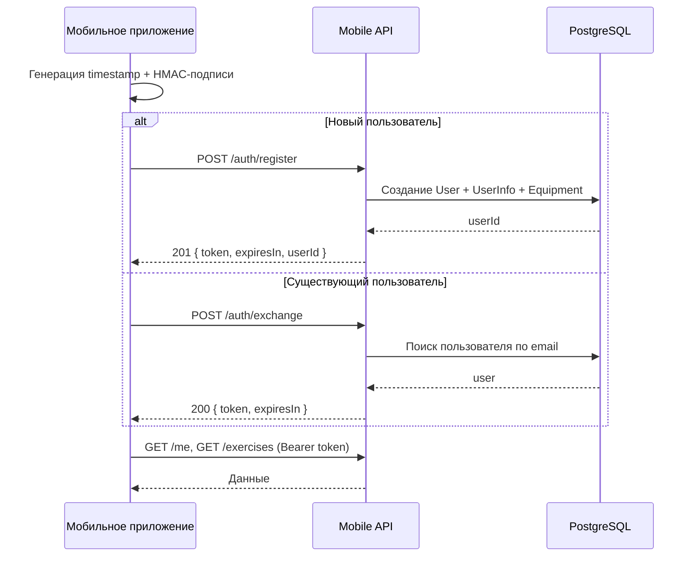
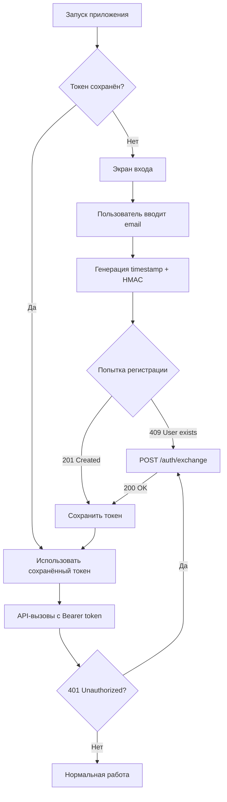

# Mobile API

<cite>
**Referenced Files**
- [src/app/api/mobile/v1/auth/register/route.ts](file://src/app/api/mobile/v1/auth/register/route.ts)
- [src/app/api/mobile/v1/auth/exchange/route.ts](file://src/app/api/mobile/v1/auth/exchange/route.ts)
- [src/app/api/mobile/v1/me/route.ts](file://src/app/api/mobile/v1/me/route.ts)
- [src/app/api/mobile/v1/exercises/route.ts](file://src/app/api/mobile/v1/exercises/route.ts)
- [src/mobile/register.ts](file://src/mobile/register.ts)
- [src/mobile/exchange.ts](file://src/mobile/exchange.ts)
- [src/mobile/exercises.ts](file://src/mobile/exercises.ts)
- [src/mobile/tools/hmac.ts](file://src/mobile/tools/hmac.ts)
- [src/mobile/tools/jwt.ts](file://src/mobile/tools/jwt.ts)
- [src/mobile/tools/user.ts](file://src/mobile/tools/user.ts)
</cite>

## Обзор

MeinGym предоставляет отдельный набор API-эндпоинтов для мобильных клиентов по базовому пути `/api/mobile/v1/`. Аутентификация мобильных клиентов использует обмен HMAC-SHA256 подписи на JWT-токен. Все защищённые эндпоинты требуют заголовок `Authorization: Bearer <token>`.

Мобильный код изолирован в каталоге `src/mobile/` и следует многоуровневой архитектуре: HTTP-маршруты (`src/app/api/mobile/`) → бизнес-логика (`src/mobile/`) → утилиты (`src/mobile/tools/`).

**Sources**: [src/app/api/mobile/v1/](file://src/app/api/mobile/v1/) · [src/mobile/](file://src/mobile/)

## Поток аутентификации



### Регистрация (новый пользователь)

Эндпоинт регистрации защищён дополнительным app-токеном, чтобы предотвратить спам и несанкционированные регистрации. Токен передаётся в заголовке `X-App-Token` или в поле `appToken` тела запроса (заголовок имеет приоритет). Этот токен предоставляется разработчикам мобильного приложения отдельно и не является общим секретом HMAC.

```
POST /api/mobile/v1/auth/register
Content-Type: application/json
X-App-Token: <app_token>

{
  "email": "user@example.com",
  "timestamp": 1752422400,
  "signature": "hmac_sha256_hex_string",
  "name": "John",
  "appToken": "<app_token>"
}
```

Проверка app-токена выполняется до любой другой валидации. Если заголовок `X-App-Token` или поле `appToken` отсутствуют или не совпадают с `MOBILE_APP_TOKEN`, сервер возвращает `403` с ошибкой `INVALID_APP_TOKEN`.

**Ответ 201:**

```json
{
  "token": "eyJhbG...",
  "expiresIn": 3600,
  "userId": "clx..."
}
```

При регистрации создаётся полный набор записей пользователя: `User`, `UserInfo` (с настройками по умолчанию) и `Equipment` («Тренажерный зал» с базовым набором оборудования) — всё в одной Prisma-транзакции, что повторяет логику веб-регистрации через NextAuth.

**Sources**: [src/app/api/mobile/v1/auth/register/route.ts:1-36](file://src/app/api/mobile/v1/auth/register/route.ts#L1-L36) · [src/mobile/register.ts:6-31](file://src/mobile/register.ts#L6-L31) · [src/mobile/tools/user.ts:38-80](file://src/mobile/tools/user.ts#L38-L80)

#### Пример с curl

```bash
curl -X POST https://example.com/api/mobile/v1/auth/register \
  -H "Content-Type: application/json" \
  -H "X-App-Token: <app_token>" \
  -d '{
    "email": "user@example.com",
    "timestamp": 1752422400,
    "signature": "a1b2c3d4e5f6...",
    "name": "John"
  }'
```

### Обмен токена (существующий пользователь)

```
POST /api/mobile/v1/auth/exchange
Content-Type: application/json

{
  "email": "user@example.com",
  "timestamp": 1752422400,
  "signature": "hmac_sha256_hex_string"
}
```

**Ответ 200:**

```json
{
  "token": "eyJhbG...",
  "expiresIn": 3600
}
```

**Sources**: [src/app/api/mobile/v1/auth/exchange/route.ts:1-32](file://src/app/api/mobile/v1/auth/exchange/route.ts#L1-L32) · [src/mobile/exchange.ts:12-33](file://src/mobile/exchange.ts#L12-L33)

#### Пример с curl

```bash
curl -X POST https://example.com/api/mobile/v1/auth/exchange \
  -H "Content-Type: application/json" \
  -d '{
    "email": "user@example.com",
    "timestamp": 1752422400,
    "signature": "a1b2c3d4e5f6..."
  }'
```

### Генерация подписи

Подпись HMAC-SHA256 гарантирует подлинность запроса без передачи пароля. Алгоритм:

| Параметр | Значение |
|----------|----------|
| Каноническая строка | `${email}:${timestamp}` (email в нижнем регистре, без пробелов по краям) |
| Алгоритм | HMAC-SHA256 |
| Ключ | `MOBILE_HMAC_SECRET` (общий секрет) |
| Формат вывода | hex-строка |
| Окно времени | ±300 секунд (5 минут) от серверного времени |

Пример генерации на Node.js:

```typescript
import crypto from "crypto";

const email = "user@example.com".trim().toLowerCase();
const timestamp = Math.floor(Date.now() / 1000);
const canonicalString = `${email}:${timestamp}`;
const signature = crypto
  .createHmac("sha256", process.env.MOBILE_HMAC_SECRET)
  .update(canonicalString)
  .digest("hex");
```

Пример генерации на Python:

```python
import hmac, hashlib, time

email = "user@example.com".strip().lower()
timestamp = int(time.time())
canonical_string = f"{email}:{timestamp}"
signature = hmac.new(
    MOBILE_HMAC_SECRET.encode(),
    canonical_string.encode(),
    hashlib.sha256
).hexdigest()
```

Серверная проверка использует `crypto.timingSafeEqual` для защиты от атак по времени.

**Sources**: [src/mobile/tools/hmac.ts:1-29](file://src/mobile/tools/hmac.ts#L1-L29)

### Конфигурация JWT

JWT-токены подписываются алгоритмом HS256 с помощью библиотеки `jose`. Настройки через переменные окружения:

| Переменная | По умолчанию | Назначение |
|------------|-------------|------------|
| `MOBILE_JWT_SECRET` | — (обязательно) | Секрет для подписи JWT |
| `MOBILE_JWT_EXPIRES_IN_SECONDS` | `3600` (1 час) | Время жизни токена |
| `MOBILE_HMAC_SECRET` | — (обязательно) | Общий секрет для HMAC-подписи |
| `MOBILE_TIMESTAMP_WINDOW_SECONDS` | `300` (5 минут) | Допустимое окно временной метки |
| `MOBILE_APP_TOKEN` | — (обязательно) | App-токен для защиты эндпоинта регистрации от спама; передаётся мобильным клиентам разработчиками отдельно |

**Sources**: [src/mobile/tools/jwt.ts:1-31](file://src/mobile/tools/jwt.ts#L1-L31) · [src/mobile/tools/hmac.ts:3-11](file://src/mobile/tools/hmac.ts#L3-L11)

## Профиль пользователя

```
GET /api/mobile/v1/me
Authorization: Bearer <token>
```

**Ответ 200:**

```json
{
  "id": "clx...",
  "email": "user@example.com",
  "name": "John",
  "role": "USER",
  "image": null
}
```

#### Пример с curl

```bash
curl https://example.com/api/mobile/v1/me \
  -H "Authorization: Bearer eyJhbG..."
```

**Sources**: [src/app/api/mobile/v1/me/route.ts:1-28](file://src/app/api/mobile/v1/me/route.ts#L1-L28) · [src/mobile/tools/user.ts:31-36](file://src/mobile/tools/user.ts#L31-L36)

## Список упражнений (пагинация)

```
GET /api/mobile/v1/exercises
Authorization: Bearer <token>
```

**Ответ 200:**

```json
{
  "data": [
    {
      "id": 1,
      "title": "Жим лежа",
      "desc": "Базовое упражнение...",
      "alias": null,
      "anotherTitles": null,
      "isMarkDownInDesc": false,
      "strengthAllowed": true,
      "bigCount": false,
      "allowCheating": false,
      "oneDumbbell": false,
      "base": 2.5,
      "rig": "BARBELL",
      "require": "BENCH",
      "createdAt": "2024-01-14T13:58:45.000Z",
      "updatedAt": "2024-01-14T13:58:45.000Z",
      "muscles": {
        "agonists": [1, 5],
        "synergists": [12, 14],
        "stabilizers": [20],
        "antagonists": [8]
      },
      "similarActionIds": [3, 7],
      "mainImage": "/uploads/1780077226088_bench_press.gif"
    }
  ],
  "nextCursor": 20
}
```

### Параметры пагинации

| Запрос | Описание |
|--------|----------|
| `GET /api/mobile/v1/exercises` | Первая страница (с id > 0) |
| `GET /api/mobile/v1/exercises?cursor=20` | Следующая страница (с id > 20) |

- Размер страницы: 20 упражнений
- Курсор `nextCursor` содержит `id` последнего элемента текущей страницы
- Когда `nextCursor` равен `null` — больше нет страниц
- Сортировка: по возрастанию `id`

#### Пример с curl

```bash
# Первая страница
curl https://example.com/api/mobile/v1/exercises \
  -H "Authorization: Bearer eyJhbG..."

# Следующая страница
curl "https://example.com/api/mobile/v1/exercises?cursor=20" \
  -H "Authorization: Bearer eyJhbG..."
```

**Sources**: [src/app/api/mobile/v1/exercises/route.ts:1-32](file://src/app/api/mobile/v1/exercises/route.ts#L1-L32) · [src/mobile/exercises.ts:31-83](file://src/mobile/exercises.ts#L31-L83)

## Типичный поток работы мобильного приложения



Пошаговое описание:

1. **Запуск приложения** — проверить наличие сохранённого JWT-токена
2. **Нет токена** — показать экран регистрации/входа
3. **Ввод email** — приложение генерирует `timestamp` (текущее Unix-время в секундах) и HMAC-SHA256 подпись
4. **Регистрация или обмен** — вызвать `/auth/register` (новый пользователь) или `/auth/exchange` (существующий). Если регистрация возвращает 409 (пользователь существует), переключиться на обмен
5. **Сохранение токена** — сохранить JWT в Keychain (iOS) или Keystore (Android)
6. **API-вызовы** — использовать токен в заголовке `Authorization: Bearer <token>` для всех последующих запросов
7. **Истечение токена** — при получении ответа 401 повторить поток обмена (`/auth/exchange`) для получения нового токена

## Ошибки

Все ошибки возвращаются в формате `{ "error": "<code>" }`.

| HTTP-статус | Код ошибки | Описание |
|-------------|-----------|----------|
| 400 | — | Неверное тело запроса, отсутствуют обязательные поля |
| 401 | `INVALID_SIGNATURE` | Неверная HMAC-подпись |
| 401 | `TIMESTAMP_EXPIRED` | Временная метка вне допустимого окна (±5 минут) |
| 401 | `USER_NOT_FOUND` | Пользователь не найден (при обмене токена) |
| 401 | — | Неверный или истекший JWT, отсутствует заголовок Authorization |
| 403 | `INVALID_APP_TOKEN` | Отсутствует или неверный app-токен регистрации (заголовок `X-App-Token` или поле `appToken`) |
| 404 | — | Ресурс не найден |
| 409 | `USER_ALREADY_EXISTS` | Пользователь уже существует (при регистрации) |
| 500 | — | Внутренняя ошибка сервера |

Пример ответа с ошибкой:

```json
{
  "error": "USER_ALREADY_EXISTS"
}
```

**Sources**: [src/app/api/mobile/v1/auth/register/route.ts:25-34](file://src/app/api/mobile/v1/auth/register/route.ts#L25-L34) · [src/app/api/mobile/v1/auth/exchange/route.ts:21-31](file://src/app/api/mobile/v1/auth/exchange/route.ts#L21-L31) · [src/mobile/exchange.ts:5-9](file://src/mobile/exchange.ts#L5-L9)

## Заключение

Мобильный API предоставляет автономный канал аутентификации и доступа к данным, независимый от веб-аутентификации NextAuth. HMAC-SHA256 обмен подписи на JWT обеспечивает безопасную аутентификацию без паролей, а регистрация создаёт полную конфигурацию пользователя в одной транзакции. Все защищённые эндпоинты используют единый механизм проверки Bearer-токенов через `jose`, что упрощает добавление новых мобильных маршрутов.
