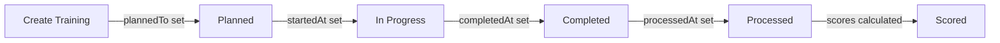
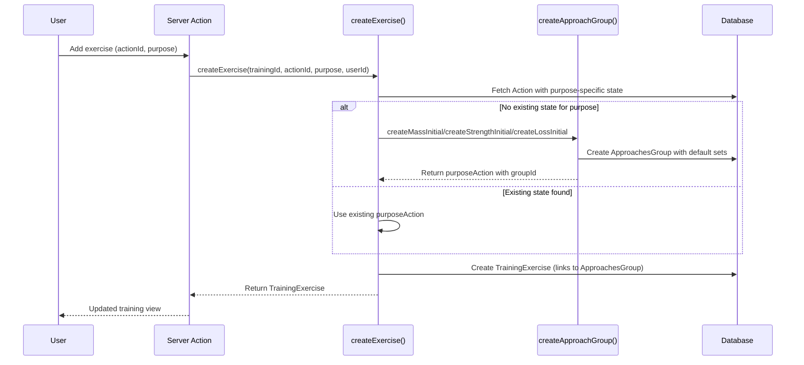

# Training Execution Flow

<cite>
**Referenced Files**
- [prisma/schema.prisma](file://prisma/schema.prisma)
- [src/core/exercises.ts](file://src/core/exercises.ts)
- [src/core/approaches.ts](file://src/core/approaches.ts)
- [src/core/scores.ts](file://src/core/scores.ts)
- [src/app/trainings/](file://src/app/trainings/)
- [src/jobs/index.ts](file://src/jobs/index.ts)
</cite>

## Introduction

A training session follows a structured lifecycle from creation through execution to post-processing. This document traces the end-to-end flow, covering how trainings are planned, exercises are added, sets are executed with detailed feedback, warm-up is tracked, and scores are calculated.

## Training Lifecycle

| State | Trigger | Timestamp |
|-------|---------|-----------|
| Planned | User creates training with target date | `plannedTo` |
| In Progress | User begins execution | `startedAt` |
| Completed | All exercises finished | `completedAt` |
| Processed | Background processing done | `processedAt` |
| Scored | Score calculation jobs finish | (async) |

**Sources**: [prisma/schema.prisma:378-420](file://prisma/schema.prisma#L378-L420)

## Step 1: Training Creation

1. User selects a date (`plannedTo`) and optionally a training period
2. Training record is created with `createdAt` and `plannedTo`
3. Optional settings: `isCircuit`, `noFeedback`, `noWarmUp`, `equipmentId`

**Sources**: [src/app/trainings/components/TrainingCreateForm.tsx](file://src/app/trainings/components/TrainingCreateForm.tsx)

## Step 2: Adding Exercises

For each exercise added to a training:

Key behavior:
- If the user hasn't set up approaches for the chosen purpose, defaults are created
- Strength exercises are validated against `action.strengthAllowed`
- Exercise priority determines display order

**Sources**: [src/core/exercises.ts:33-143](file://src/core/exercises.ts#L33-L143)

## Step 3: Warm-Up

If `noWarmUp` is false, a `TrainingWarmUp` record is created:

| Field | Purpose |
|-------|---------|
| `estimatedTimeSec` | Expected warm-up duration (default: 300s) |
| `startedAt` | When warm-up began |
| `completedAt` | When warm-up ended |
| `durationSec` | Actual warm-up duration |
| `isSkipped` | Whether user skipped warm-up |

**Sources**: [prisma/schema.prisma:715-727](file://prisma/schema.prisma#L715-L727)

## Step 4: Set Execution

For each approach (planned set) in an exercise, the user records:

### Planned vs Actual

| Planned Field | Execution Field | Description |
|--------------|----------------|-------------|
| `weight` (from Approach) | `plannedWeigth` | Target weight |
| `count` (from Approach) | `plannedCount` | Target reps |
| — | `liftedWeight` | Actual weight lifted |
| — | `liftedCount` | Actual reps completed |

### Execution Feedback

Each `TrainingExerciseExecution` captures detailed qualitative feedback:

| Field | Type | Values | Purpose |
|-------|------|--------|---------|
| `rating` | ExecutionRating | EASY, OK, TENSION, HARD | Perceived difficulty |
| `technique` | ExecutionTechnique | OK, FLAW | Technique quality |
| `cheating` | ExecutionCheating | NO, PART, FULL | Cheating level |
| `refusing` | ExecutionRefusing | NO, SOON, YES | Did the user refuse/quit |
| `burning` | ExecutionBurning | NO, YES | Muscle burn sensation |
| `useBelt` | Boolean | true/false | Lifting belt usage |
| `extraCount` | Int | 0+ | Additional reps beyond planned |
| `techniqueUpgrade` | Boolean | true/false | Self-assessed technique improvement |

Note: `TENSION_OK` and `TENSION_FLAW` are deprecated rating values.

**Sources**: [prisma/schema.prisma:466-500](file://prisma/schema.prisma#L466-L500) · [prisma/schema.prisma:502-535](file://prisma/schema.prisma#L502-L535)

## Step 5: Exercise Completion

When an exercise is completed:
1. `TrainingExercise.startedAt` and `completedAt` are set
2. `TrainingExercise.isPassed` is marked true
3. Lifted aggregates are computed: `liftedSum`, `liftedMean`, `liftedMax`, `liftedCountTotal`, `liftedCountMean`
4. Exercise-level `rating` and `comment` are saved

Execution completion is handled via API routes:
- `POST /api/trainings/exercise/execution/complete` — Mark a set as complete
- `POST /api/trainings/exercise/execution/uncomplete` — Revert completion

## Step 6: Training Completion

When all exercises are done:
1. `Training.completedAt` is set
2. Time score is calculated (`timeScoreInMins`, `timeScoreInSecs`)
3. Muscle stats are computed via `trainingMuscles.ts`
4. Score calculation job is enqueued: `scheduleScoreCalculation(trainingId)`
5. If progression is enabled, next approaches are generated

## Step 7: Post-Processing

The `scores` background job:
1. Fetches all exercises for the completed training
2. For each exercise, calls `createScore()` from `src/core/scores.ts`
3. Persists `TrainingExerciseScore` records
4. Sets `Training.processedAt`

**Sources**: [src/jobs/processors/scores.ts:1-37](file://src/jobs/processors/scores.ts#L1-L37) · [src/jobs/index.ts:15-23](file://src/jobs/index.ts#L15-L23)

## Training Repeat

The `repeatedFromId` field links a training to its original, enabling:
- "Repeat last training" functionality
- Comparing performance across repeated workouts
- Tracking workout consistency

**Sources**: [prisma/schema.prisma:395-397](file://prisma/schema.prisma#L395-L397)

## Execution Duration Tracking

The `TrainingExerciseExecutionDuration` model records per-set timing:
- `sequence` — Order of the duration record
- `seconds` — Duration in seconds
- Linked to Training, TrainingExercise, and Execution

This enables time-based analytics and the training execution time chart.

**Sources**: [prisma/schema.prisma:695-713](file://prisma/schema.prisma#L695-L713)

## Conclusion

The training execution flow transforms a planned workout into rich, structured data. The multi-layered feedback model (rating, technique, cheating, refusing, burning) captures qualitative aspects that raw weight/rep numbers miss. Background score calculation ensures the UI stays responsive while analytics are computed asynchronously.
