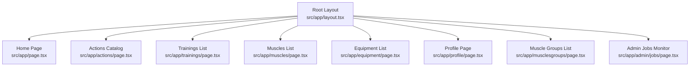
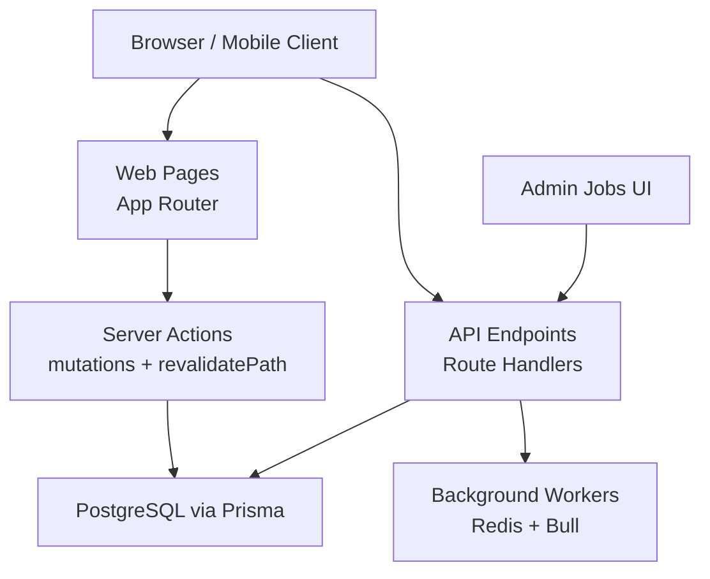
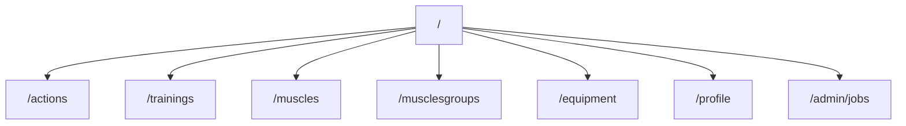
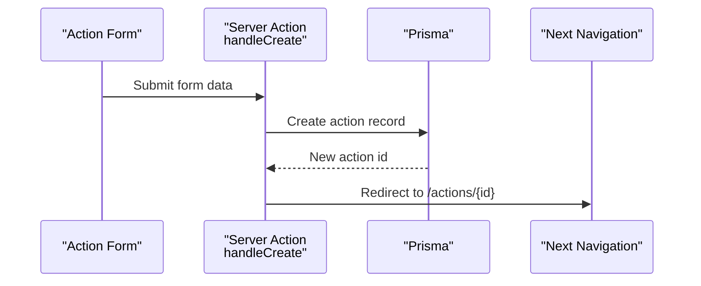
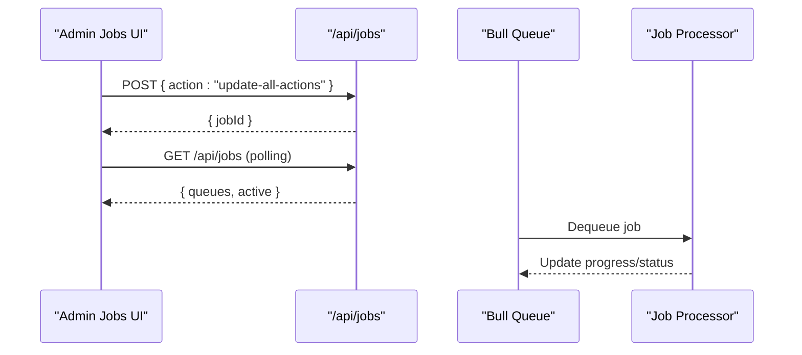
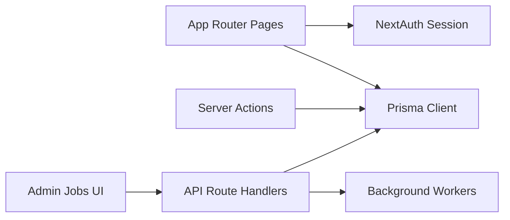

# App Pages and Routes

<cite>
**Referenced Files in This Document**
- [layout.tsx](file://src/app/layout.tsx)
- [page.tsx](file://src/app/page.tsx)
- [actions_page.tsx](file://src/app/actions/page.tsx)
- [trainings_page.tsx](file://src/app/trainings/page.tsx)
- [muscles_page.tsx](file://src/app/muscles/page.tsx)
- [equipment_page.tsx](file://src/app/equipment/page.tsx)
- [profile_page.tsx](file://src/app/profile/page.tsx)
- [musclesgroups_page.tsx](file://src/app/musclesgroups/page.tsx)
- [admin_jobs_page.tsx](file://src/app/admin/jobs/page.tsx)
- [nextauth_route.ts](file://src/app/api/auth/[...nextauth]/route.ts)
- [api_actions_scores_route.ts](file://src/app/api/actions/scores/route.ts)
- [api_actions_search_route.ts](file://src/app/api/actions/search/route.ts)
- [api_exercises_similar_route.ts](file://src/app/api/exercises/similar/route.ts)
- [api_images_route.ts](file://src/app/api/images/route.ts)
- [api_jobs_route.ts](file://src/app/api/jobs/route.ts)
- [api_mobile_auth_exchange_route.ts](file://src/app/api/mobile/v1/auth/exchange/route.ts)
- [api_mobile_auth_register_route.ts](file://src/app/api/mobile/v1/auth/register/route.ts)
- [api_mobile_exercises_route.ts](file://src/app/api/mobile/v1/exercises/route.ts)
- [api_mobile_me_route.ts](file://src/app/api/mobile/v1/me/route.ts)
- [api_muscle_images_route.ts](file://src/app/api/muscle-images/route.ts)
- [api_training_execution_complete_route.ts](file://src/app/api/trainings/exercise/execution/complete/route.ts)
- [api_training_execution_uncomplete_route.ts](file://src/app/api/trainings/exercise/execution/uncomplete/route.ts)
- [actions_server_actions.ts](file://src/app/actions/actions.ts)
- [profile_server_actions.ts](file://src/app/profile/actions.ts)
</cite>

## Table of Contents
1. Introduction
2. Project Structure
3. Core Components
4. Architecture Overview
5. Detailed Component Analysis
6. Dependency Analysis
7. Performance Considerations
8. Troubleshooting Guide
9. Conclusion

## Introduction
This document provides a complete route map for the application, covering all page routes, server actions, and API endpoints. It is organized to help both technical and non-technical readers understand how navigation, data mutations, and external integrations are structured across the Next.js 14 App Router application.

## Project Structure
The application uses the Next.js App Router with file-based routing under src/app. Each directory corresponds to a URL path segment. Server Actions are co-located in actions.ts files within each route directory. API endpoints are defined under src/app/api as Route Handlers.

**Diagram sources**
- [layout.tsx](file://src/app/layout.tsx)
- [page.tsx](file://src/app/page.tsx)
- [actions_page.tsx](file://src/app/actions/page.tsx)
- [trainings_page.tsx](file://src/app/trainings/page.tsx)
- [muscles_page.tsx](file://src/app/muscles/page.tsx)
- [equipment_page.tsx](file://src/app/equipment/page.tsx)
- [profile_page.tsx](file://src/app/profile/page.tsx)
- [musclesgroups_page.tsx](file://src/app/musclesgroups/page.tsx)
- [admin_jobs_page.tsx](file://src/app/admin/jobs/page.tsx)

**Section sources**
- [layout.tsx](file://src/app/layout.tsx)

## Core Components
- Authentication: NextAuth.js handler at /api/auth/[...nextauth] manages login, logout, and session state.
- Data persistence: Prisma ORM used throughout pages and server actions to read/write PostgreSQL data.
- Background jobs: Admin UI polls /api/jobs to monitor queues; workers process jobs asynchronously.

Key entry points:
- Root layout wraps every page with authentication provider and global styles.
- Home page shows today’s planned trainings and weight tracking widgets.
- Feature pages (actions, trainings, muscles, equipment, profile, muscle groups) provide listing and management interfaces.

**Section sources**
- [nextauth_route.ts](file://src/app/api/auth/[...nextauth]/route.ts)
- [page.tsx](file://src/app/page.tsx)

## Architecture Overview
The app follows a layered architecture:
- Presentation layer: Next.js App Router pages render UI and fetch data server-side.
- Business logic layer: Server Actions encapsulate mutations and revalidation.
- API layer: Route handlers expose REST endpoints for web and mobile clients.
- Data layer: Prisma interacts with PostgreSQL; Redis + Bull powers background job processing.

[No sources needed since this diagram shows conceptual workflow, not actual code structure]

## Detailed Component Analysis

### Page Routes Map
- / — Home page showing today’s planned trainings and weight panel/chart.
- /actions — Exercise catalog with filtering by muscle group and strength allowance.
- /trainings — Monthly training list with search and muscle group filters.
- /muscles — Muscle list with sorting controls.
- /musclesgroups — Muscle groups list.
- /equipment — User-specific equipment sets list.
- /profile — User profile, progression options, period manager, and sign-out link.
- /admin/jobs — Background job monitoring dashboard.

**Section sources**
- [page.tsx](file://src/app/page.tsx)
- [actions_page.tsx](file://src/app/actions/page.tsx)
- [trainings_page.tsx](file://src/app/trainings/page.tsx)
- [muscles_page.tsx](file://src/app/muscles/page.tsx)
- [musclesgroups_page.tsx](file://src/app/musclesgroups/page.tsx)
- [equipment_page.tsx](file://src/app/equipment/page.tsx)
- [profile_page.tsx](file://src/app/profile/page.tsx)
- [admin_jobs_page.tsx](file://src/app/admin/jobs/page.tsx)

### Server Actions Map
- /actions/actions.ts
  - handleCreate(data): Creates a new exercise action and redirects to its detail page.
  - handleUpdate(id, data): Updates an existing action, recalculates base difficulty, updates relationships, and revalidates the action detail page.
- /profile/actions.ts
  - handleProfileUpdate(data): Updates user info fields and revalidates the profile page.

**Diagram sources**
- [actions_server_actions.ts](file://src/app/actions/actions.ts)

**Section sources**
- [actions_server_actions.ts](file://src/app/actions/actions.ts)
- [profile_server_actions.ts](file://src/app/profile/actions.ts)

### API Endpoints Map
- Authentication
  - GET/POST /api/auth/[...nextauth] — NextAuth.js handler for OAuth sessions.
- Actions and Exercises
  - GET /api/actions/scores — Retrieve action scores.
  - GET /api/actions/search — Search exercises.
  - GET /api/exercises/similar — Fetch similar exercises.
- Images
  - POST /api/images — Upload or manage images.
  - GET /api/muscle-images — Retrieve muscle images.
- Background Jobs
  - GET /api/jobs — Get queue status and active jobs.
  - POST /api/jobs — Schedule background jobs (e.g., update-all-actions).
- Mobile API v1
  - POST /api/mobile/v1/auth/register — Register a mobile device/user.
  - POST /api/mobile/v1/auth/exchange — Exchange credentials for tokens.
  - GET /api/mobile/v1/exercises — Fetch exercises for mobile.
  - GET /api/mobile/v1/me — Get current mobile user context.
- Training Execution
  - POST /api/trainings/exercise/execution/complete — Mark execution complete.
  - POST /api/trainings/exercise/execution/uncomplete — Mark execution uncomplete.

**Diagram sources**
- [api_jobs_route.ts](file://src/app/api/jobs/route.ts)
- [admin_jobs_page.tsx](file://src/app/admin/jobs/page.tsx)

**Section sources**
- [nextauth_route.ts](file://src/app/api/auth/[...nextauth]/route.ts)
- [api_actions_scores_route.ts](file://src/app/api/actions/scores/route.ts)
- [api_actions_search_route.ts](file://src/app/api/actions/search/route.ts)
- [api_exercises_similar_route.ts](file://src/app/api/exercises/similar/route.ts)
- [api_images_route.ts](file://src/app/api/images/route.ts)
- [api_jobs_route.ts](file://src/app/api/jobs/route.ts)
- [api_mobile_auth_register_route.ts](file://src/app/api/mobile/v1/auth/register/route.ts)
- [api_mobile_auth_exchange_route.ts](file://src/app/api/mobile/v1/auth/exchange/route.ts)
- [api_mobile_exercises_route.ts](file://src/app/api/mobile/v1/exercises/route.ts)
- [api_mobile_me_route.ts](file://src/app/api/mobile/v1/me/route.ts)
- [api_muscle_images_route.ts](file://src/app/api/muscle-images/route.ts)
- [api_training_execution_complete_route.ts](file://src/app/api/trainings/exercise/execution/complete/route.ts)
- [api_training_execution_uncomplete_route.ts](file://src/app/api/trainings/exercise/execution/uncomplete/route.ts)

## Dependency Analysis
- Pages depend on Prisma for data fetching and on NextAuth for session handling.
- Server Actions perform mutations and trigger revalidation to keep UI consistent.
- API endpoints may interact with background workers for long-running tasks.
- The admin jobs page depends on /api/jobs for real-time queue visibility.

**Diagram sources**
- [page.tsx](file://src/app/page.tsx)
- [actions_server_actions.ts](file://src/app/actions/actions.ts)
- [api_jobs_route.ts](file://src/app/api/jobs/route.ts)
- [admin_jobs_page.tsx](file://src/app/admin/jobs/page.tsx)

**Section sources**
- [page.tsx](file://src/app/page.tsx)
- [actions_server_actions.ts](file://src/app/actions/actions.ts)
- [api_jobs_route.ts](file://src/app/api/jobs/route.ts)
- [admin_jobs_page.tsx](file://src/app/admin/jobs/page.tsx)

## Performance Considerations
- Prefer server-side data fetching in pages to reduce client payload and leverage caching.
- Use revalidatePath in server actions to invalidate only affected routes after mutations.
- For heavy operations (e.g., bulk updates), enqueue background jobs and provide progress via polling.
- Index frequently queried fields in Prisma schema migrations to optimize database performance.

[No sources needed since this section provides general guidance]

## Troubleshooting Guide
- Authentication issues: Verify NextAuth configuration and ensure session cookies are set correctly. Check /api/auth/[...nextauth] logs.
- Job scheduling failures: Confirm Redis connectivity and worker processes are running. Inspect /api/jobs responses for error details.
- Image uploads: Ensure upload storage paths exist and permissions are correct. Validate request payloads for required fields.
- Training execution endpoints: Validate user session and ownership checks before marking executions complete/uncomplete.

**Section sources**
- [nextauth_route.ts](file://src/app/api/auth/[...nextauth]/route.ts)
- [api_jobs_route.ts](file://src/app/api/jobs/route.ts)
- [api_images_route.ts](file://src/app/api/images/route.ts)
- [api_training_execution_complete_route.ts](file://src/app/api/trainings/exercise/execution/complete/route.ts)
- [api_training_execution_uncomplete_route.ts](file://src/app/api/trainings/exercise/execution/uncomplete/route.ts)

## Conclusion
This route map consolidates all page routes, server actions, and API endpoints into a single reference. It clarifies how the application organizes presentation, business logic, and integration points, enabling developers to navigate, extend, and troubleshoot the system effectively.