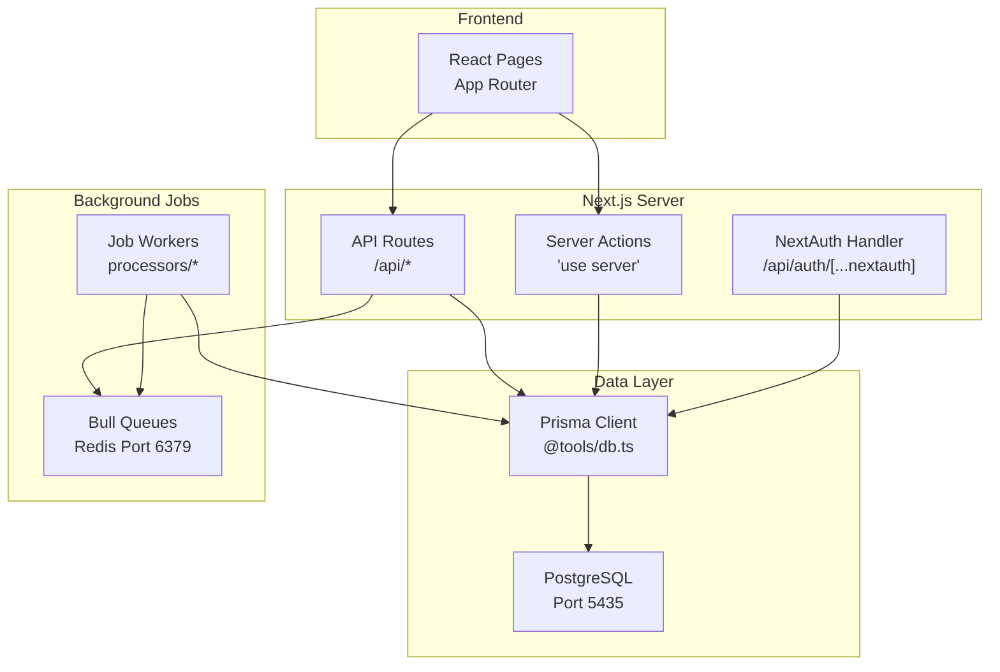
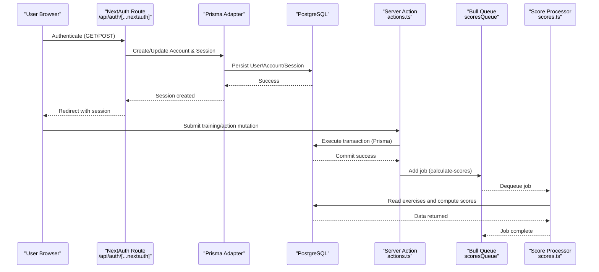
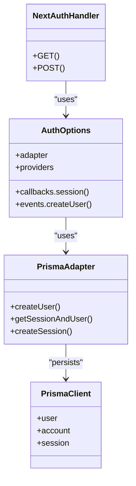
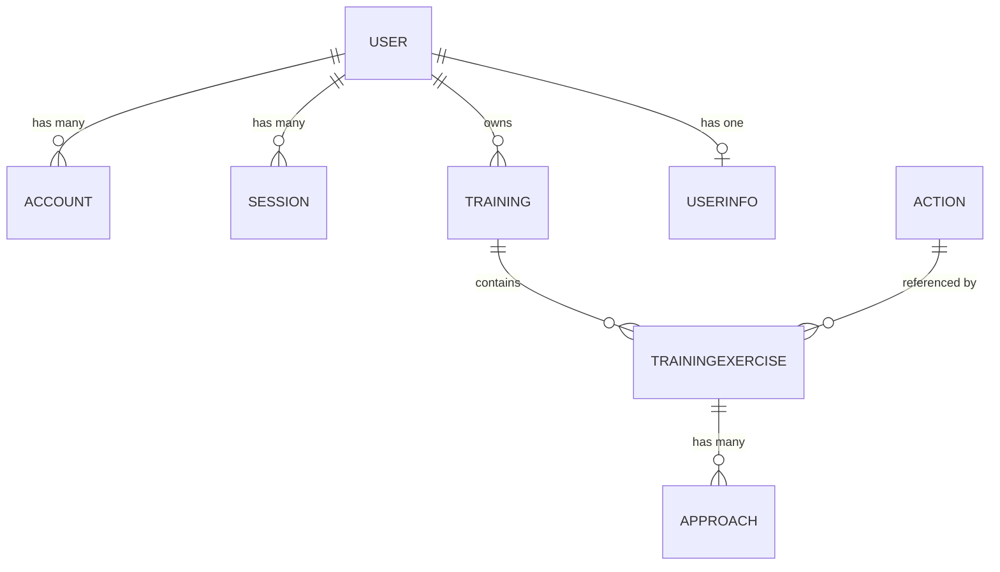
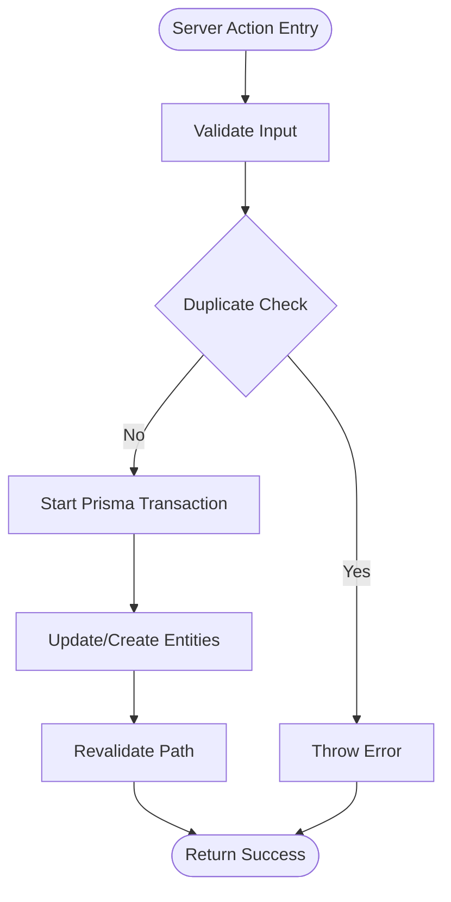
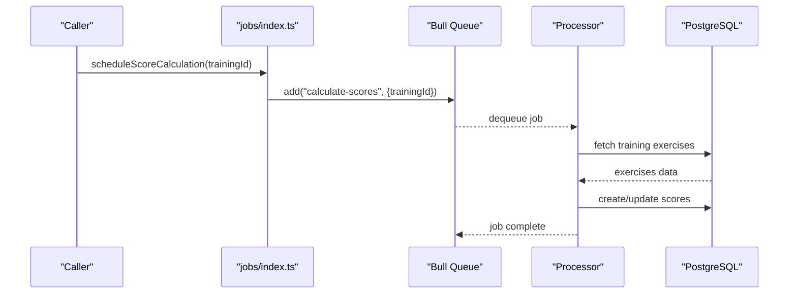
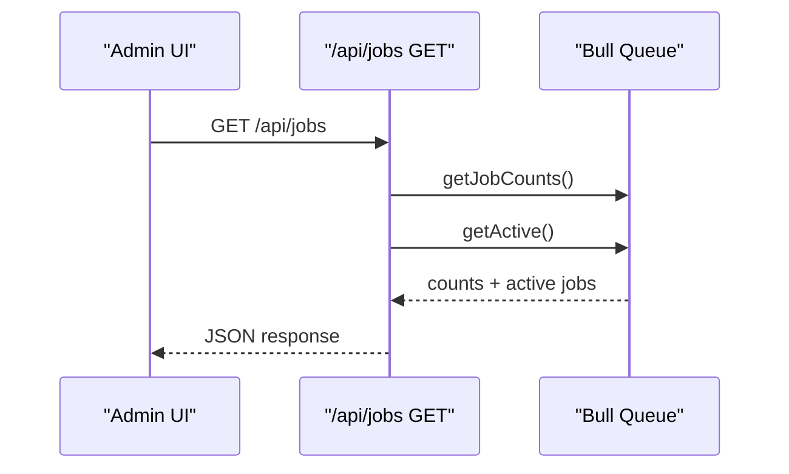
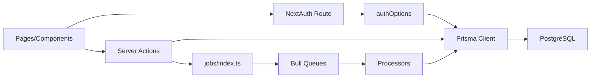

# Architecture Overview

<cite>
**Referenced Files in This Document**
- [layout.tsx](file://src/app/layout.tsx)
- [AuthProvider.tsx](file://src/components/AuthProvider.tsx)
- [route.ts](file://src/app/api/auth/[...nextauth]/route.ts)
- [auth.ts](file://src/tools/auth.ts)
- [db.ts](file://src/tools/db.ts)
- [schema.prisma](file://prisma/schema.prisma)
- [docker-compose.yml](file://docker-compose.yml)
- [index.ts](file://src/jobs/index.ts)
- [queues.ts](file://src/jobs/queues.ts)
- [config.ts](file://src/jobs/config.ts)
- [scores.ts](file://src/jobs/processors/scores.ts)
- [actions.ts](file://src/app/actions/actions.ts)
- [route.ts](file://src/app/api/jobs/route.ts)
</cite>

## Table of Contents
1. [Introduction](#introduction)
2. [Project Structure](#project-structure)
3. [Core Components](#core-components)
4. [Architecture Overview](#architecture-overview)
5. [Detailed Component Analysis](#detailed-component-analysis)
6. [Dependency Analysis](#dependency-analysis)
7. [Performance Considerations](#performance-considerations)
8. [Troubleshooting Guide](#troubleshooting-guide)
9. [Conclusion](#conclusion)

## Introduction
This document provides a high-level system architecture for the Next.js 14 App Router application, showing how authentication (NextAuth), Prisma (PostgreSQL), and Bull queues (Redis) integrate to serve user requests, persist data, and process background jobs. It focuses on the monolithic structure with clear module boundaries: UI routes and server actions, API endpoints, database access via Prisma, and asynchronous job processing through Bull.

## Project Structure
The application follows a feature-based layout under src/app with co-located server actions, API routes, and page components. Authentication is configured as an API route using NextAuth with Prisma adapter. Background jobs are managed by Bull with Redis, exposed via helpers and monitored through an admin API.

**Diagram sources**
- [layout.tsx:1-33](file://src/app/layout.tsx#L1-L33)
- [AuthProvider.tsx:1-12](file://src/components/AuthProvider.tsx#L1-L12)
- [route.ts:1-7](file://src/app/api/auth/[...nextauth]/route.ts#L1-L7)
- [auth.ts:1-50](file://src/tools/auth.ts#L1-L50)
- [db.ts:1-4](file://src/tools/db.ts#L1-L4)
- [index.ts:1-62](file://src/jobs/index.ts#L1-L62)
- [queues.ts:1-21](file://src/jobs/queues.ts#L1-L21)
- [config.ts:1-38](file://src/jobs/config.ts#L1-L38)
- [scores.ts:1-37](file://src/jobs/processors/scores.ts#L1-L37)
- [route.ts:1-51](file://src/app/api/jobs/route.ts#L1-L51)

**Section sources**
- [layout.tsx:1-33](file://src/app/layout.tsx#L1-L33)
- [AuthProvider.tsx:1-12](file://src/components/AuthProvider.tsx#L1-L12)
- [route.ts:1-7](file://src/app/api/auth/[...nextauth]/route.ts#L1-L7)
- [auth.ts:1-50](file://src/tools/auth.ts#L1-L50)
- [db.ts:1-4](file://src/tools/db.ts#L1-L4)
- [schema.prisma:1-744](file://prisma/schema.prisma#L1-L744)
- [docker-compose.yml:1-30](file://docker-compose.yml#L1-L30)
- [index.ts:1-62](file://src/jobs/index.ts#L1-L62)
- [queues.ts:1-21](file://src/jobs/queues.ts#L1-L21)
- [config.ts:1-38](file://src/jobs/config.ts#L1-L38)
- [scores.ts:1-37](file://src/jobs/processors/scores.ts#L1-L37)
- [route.ts:1-51](file://src/app/api/jobs/route.ts#L1-L51)

## Core Components
- Next.js App Router pages and server actions handle UI rendering and server-side mutations.
- NextAuth API route configures providers and uses Prisma adapter for sessions/accounts.
- Prisma client instance centralizes database connectivity.
- Bull queues manage background tasks such as score calculation, period checks, and image cleanup.
- Admin API exposes queue statistics and active jobs for monitoring.

Key integration points:
- Authentication flows through NextAuth handler into Prisma models for accounts, sessions, and users.
- Server actions perform transactions and revalidation after updates.
- Background workers consume jobs from Redis and update scores or perform maintenance tasks.

**Section sources**
- [route.ts:1-7](file://src/app/api/auth/[...nextauth]/route.ts#L1-L7)
- [auth.ts:1-50](file://src/tools/auth.ts#L1-L50)
- [db.ts:1-4](file://src/tools/db.ts#L1-L4)
- [index.ts:1-62](file://src/jobs/index.ts#L1-L62)
- [queues.ts:1-21](file://src/jobs/queues.ts#L1-L21)
- [config.ts:1-38](file://src/jobs/config.ts#L1-L38)
- [scores.ts:1-37](file://src/jobs/processors/scores.ts#L1-L37)
- [route.ts:1-51](file://src/app/api/jobs/route.ts#L1-L51)

## Architecture Overview
The system integrates four main layers:
- Presentation layer: React pages and components wrapped with AuthProvider.
- Application layer: NextAuth API route and server actions.
- Data layer: Prisma client interacting with PostgreSQL.
- Background processing layer: Bull queues backed by Redis with processors executing scheduled and ad-hoc jobs.

**Diagram sources**
- [route.ts:1-7](file://src/app/api/auth/[...nextauth]/route.ts#L1-L7)
- [auth.ts:1-50](file://src/tools/auth.ts#L1-L50)
- [db.ts:1-4](file://src/tools/db.ts#L1-L4)
- [actions.ts:1-199](file://src/app/actions/actions.ts#L1-L199)
- [index.ts:1-62](file://src/jobs/index.ts#L1-L62)
- [queues.ts:1-21](file://src/jobs/queues.ts#L1-L21)
- [scores.ts:1-37](file://src/jobs/processors/scores.ts#L1-L37)

## Detailed Component Analysis

### Authentication Integration (NextAuth + Prisma)
NextAuth is mounted at /api/auth/[...nextauth] and configured with GitHub and Google providers. The Prisma adapter persists accounts, sessions, and verification tokens. A custom event initializes UserInfo for new users.

**Diagram sources**
- [route.ts:1-7](file://src/app/api/auth/[...nextauth]/route.ts#L1-L7)
- [auth.ts:1-50](file://src/tools/auth.ts#L1-L50)
- [db.ts:1-4](file://src/tools/db.ts#L1-L4)

**Section sources**
- [route.ts:1-7](file://src/app/api/auth/[...nextauth]/route.ts#L1-L7)
- [auth.ts:1-50](file://src/tools/auth.ts#L1-L50)
- [db.ts:1-4](file://src/tools/db.ts#L1-L4)

### Database Access (Prisma + PostgreSQL)
Prisma client is instantiated centrally and used across server actions and processors. The schema defines core entities like User, Training, TrainingExercise, Approach, and related relations. Migrations evolve the schema over time.

**Diagram sources**
- [schema.prisma:1-744](file://prisma/schema.prisma#L1-L744)

**Section sources**
- [db.ts:1-4](file://src/tools/db.ts#L1-L4)
- [schema.prisma:1-744](file://prisma/schema.prisma#L1-L744)

### Server Actions and Data Flow
Server actions encapsulate business logic for creating/updating entities, performing transactions, and triggering background jobs. They use Prisma for persistence and Next.js cache revalidation.

**Diagram sources**
- [actions.ts:1-199](file://src/app/actions/actions.ts#L1-L199)

**Section sources**
- [actions.ts:1-199](file://src/app/actions/actions.ts#L1-L199)

### Background Jobs (Bull + Redis)
Bull queues manage asynchronous tasks. Helpers schedule jobs; processors execute them against the database. An admin API endpoint exposes queue stats and active jobs.

**Diagram sources**
- [index.ts:1-62](file://src/jobs/index.ts#L1-L62)
- [queues.ts:1-21](file://src/jobs/queues.ts#L1-L21)
- [config.ts:1-38](file://src/jobs/config.ts#L1-L38)
- [scores.ts:1-37](file://src/jobs/processors/scores.ts#L1-L37)

**Section sources**
- [index.ts:1-62](file://src/jobs/index.ts#L1-L62)
- [queues.ts:1-21](file://src/jobs/queues.ts#L1-L21)
- [config.ts:1-38](file://src/jobs/config.ts#L1-L38)
- [scores.ts:1-37](file://src/jobs/processors/scores.ts#L1-L37)
- [route.ts:1-51](file://src/app/api/jobs/route.ts#L1-L51)

### Monitoring API for Jobs
An API route returns queue counts and active jobs, enabling admin dashboards and operational visibility.

**Diagram sources**
- [route.ts:1-51](file://src/app/api/jobs/route.ts#L1-L51)

**Section sources**
- [route.ts:1-51](file://src/app/api/jobs/route.ts#L1-L51)

## Dependency Analysis
The following diagram shows key dependencies between modules:

**Diagram sources**
- [layout.tsx:1-33](file://src/app/layout.tsx#L1-L33)
- [AuthProvider.tsx:1-12](file://src/components/AuthProvider.tsx#L1-L12)
- [route.ts:1-7](file://src/app/api/auth/[...nextauth]/route.ts#L1-L7)
- [auth.ts:1-50](file://src/tools/auth.ts#L1-L50)
- [db.ts:1-4](file://src/tools/db.ts#L1-L4)
- [index.ts:1-62](file://src/jobs/index.ts#L1-L62)
- [queues.ts:1-21](file://src/jobs/queues.ts#L1-L21)
- [scores.ts:1-37](file://src/jobs/processors/scores.ts#L1-L37)

**Section sources**
- [layout.tsx:1-33](file://src/app/layout.tsx#L1-L33)
- [AuthProvider.tsx:1-12](file://src/components/AuthProvider.tsx#L1-L12)
- [route.ts:1-7](file://src/app/api/auth/[...nextauth]/route.ts#L1-L7)
- [auth.ts:1-50](file://src/tools/auth.ts#L1-L50)
- [db.ts:1-4](file://src/tools/db.ts#L1-L4)
- [index.ts:1-62](file://src/jobs/index.ts#L1-L62)
- [queues.ts:1-21](file://src/jobs/queues.ts#L1-L21)
- [scores.ts:1-37](file://src/jobs/processors/scores.ts#L1-L37)

## Performance Considerations
- Use Prisma transactions for multi-step writes to ensure consistency and reduce round-trips.
- Offload heavy computations (e.g., score calculations) to background jobs to keep request latency low.
- Configure retry and backoff policies for resilient job processing.
- Leverage Next.js caching and revalidation to minimize redundant server work.
- Ensure Redis and PostgreSQL connections are properly sized and monitored.

[No sources needed since this section provides general guidance]

## Troubleshooting Guide
- Authentication failures: Verify provider credentials and check NextAuth logs; ensure Prisma adapter can connect to the database.
- Job processing errors: Inspect worker logs and stack traces via the admin API; confirm Redis connectivity and queue health.
- Database issues: Validate connection strings and migrations; monitor Prisma query performance.
- Revalidation problems: Confirm that server actions call revalidatePath after mutations.

**Section sources**
- [route.ts:1-51](file://src/app/api/jobs/route.ts#L1-L51)
- [scores.ts:1-37](file://src/jobs/processors/scores.ts#L1-L37)
- [actions.ts:1-199](file://src/app/actions/actions.ts#L1-L199)

## Conclusion
The application combines Next.js App Router, NextAuth, Prisma, and Bull to deliver a cohesive workout planning and tracking platform. Requests flow through authenticated routes and server actions, persisting data via Prisma while offloading intensive tasks to background jobs. The modular design supports scalability and maintainability, with clear boundaries between UI, API, data, and processing layers.

[No sources needed since this section summarizes without analyzing specific files]