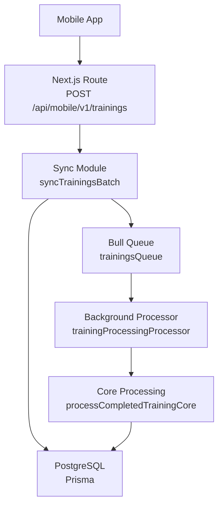
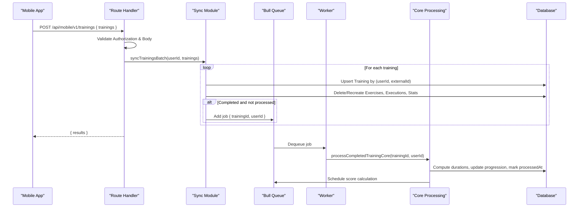
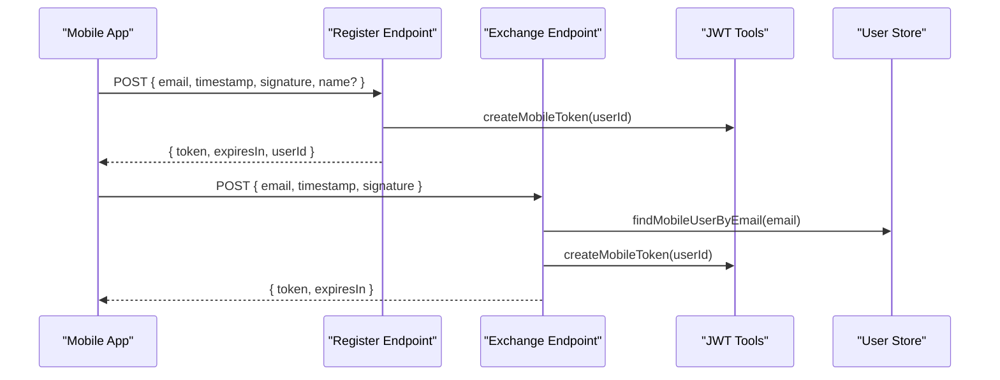
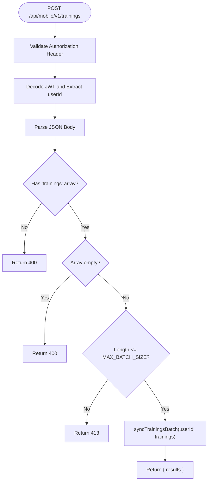
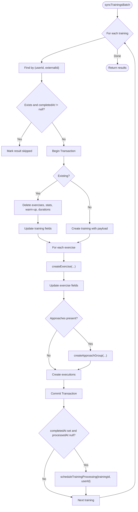
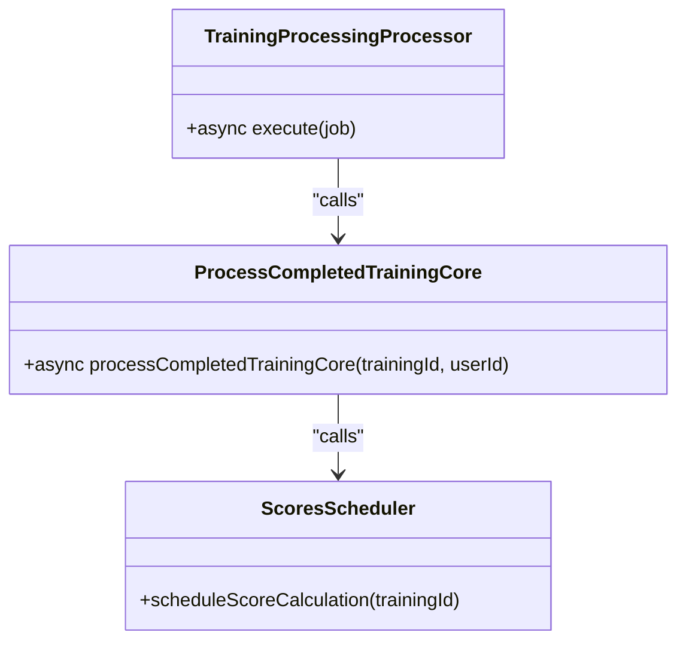
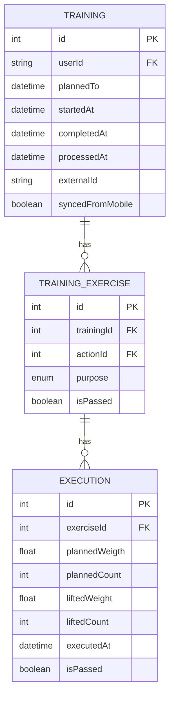
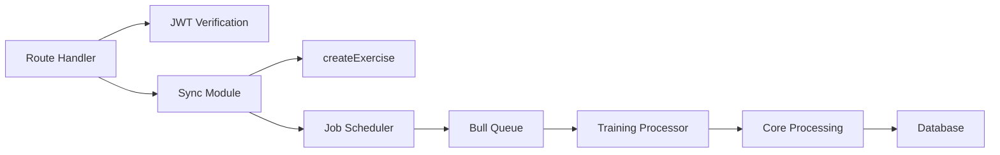

# Mobile API System

<cite>
**Referenced Files in This Document**
- [route.ts](file://src/app/api/mobile/v1/trainings/route.ts)
- [syncTrainings.ts](file://src/mobile/syncTrainings.ts)
- [trainingProcessing.ts](file://src/core/trainingProcessing.ts)
- [config.ts](file://src/jobs/config.ts)
- [queues.ts](file://src/jobs/queues.ts)
- [index.ts](file://src/jobs/index.ts)
- [trainings.ts processor](file://src/jobs/processors/trainings.ts)
- [exercises.ts](file://src/core/exercises.ts)
- [schema.prisma](file://prisma/schema.prisma)
- [jwt.ts](file://src/mobile/tools/jwt.ts)
- [exchange.ts](file://src/mobile/exchange.ts)
- [register.ts](file://src/mobile/register.ts)
- [mobile-trainings-api.md](file://docs/mobile-trainings-api.md)
</cite>

## Table of Contents
1. [Introduction](#introduction)
2. [Project Structure](#project-structure)
3. [Core Components](#core-components)
4. [Architecture Overview](#architecture-overview)
5. [Detailed Component Analysis](#detailed-component-analysis)
6. [Dependency Analysis](#dependency-analysis)
7. [Performance Considerations](#performance-considerations)
8. [Troubleshooting Guide](#troubleshooting-guide)
9. [Conclusion](#conclusion)
10. [Appendices](#appendices)

## Introduction
This document describes the Mobile API System for syncing completed trainings from a mobile app to the server. It covers authentication, batch sync endpoints, background processing via Redis and Bull, data models, and end-to-end flows. The system is built on Next.js 14 App Router with PostgreSQL (Prisma ORM) and Redis-backed job queues.

## Project Structure
The mobile API surface resides under src/app/api/mobile/v1. The POST /api/mobile/v1/trainings endpoint accepts a batch of trainings, upserts them by (userId, externalId), skips already-completed trainings, recreates child records when updating, and enqueues background processing for progression and scoring.

**Diagram sources**
- [route.ts:60-102](file://src/app/api/mobile/v1/trainings/route.ts#L60-L102)
- [syncTrainings.ts:66-237](file://src/mobile/syncTrainings.ts#L66-L237)
- [queues.ts:23-26](file://src/jobs/queues.ts#L23-L26)
- [trainings.ts processor:10-28](file://src/jobs/processors/trainings.ts#L10-L28)
- [trainingProcessing.ts:30-185](file://src/core/trainingProcessing.ts#L30-L185)

**Section sources**
- [route.ts:1-103](file://src/app/api/mobile/v1/trainings/route.ts#L1-L103)
- [mobile-trainings-api.md:237-422](file://docs/mobile-trainings-api.md#L237-L422)

## Core Components
- Authentication: JWT-based mobile auth with HMAC-signed exchange and registration endpoints.
- Batch sync: POST /api/mobile/v1/trainings validates input, enforces batch limits, and delegates to sync module.
- Sync module: Upserts Training by (userId, externalId), deletes and recreates children as needed, maps DTO fields to Prisma schema, and schedules background processing if applicable.
- Background processing: Bull queue processes completed trainings to compute durations, apply progression strategies, link new approach groups, and schedule score calculations.
- Data model: Training includes externalId and syncedFromMobile; compound unique constraint ensures idempotent upserts per user.

**Section sources**
- [jwt.ts:1-32](file://src/mobile/tools/jwt.ts#L1-L32)
- [exchange.ts:1-34](file://src/mobile/exchange.ts#L1-L34)
- [register.ts:1-32](file://src/mobile/register.ts#L1-L32)
- [route.ts:60-102](file://src/app/api/mobile/v1/trainings/route.ts#L60-L102)
- [syncTrainings.ts:8-64](file://src/mobile/syncTrainings.ts#L8-L64)
- [schema.prisma:391-440](file://prisma/schema.prisma#L391-L440)

## Architecture Overview
The flow begins with client authentication via email + HMAC signature to obtain a short-lived JWT. The mobile app then sends a batch of trainings to the POST endpoint. Each training is validated and upserted within a transaction. If a training is newly completed and not yet processed, a job is queued. A background worker executes core processing to compute execution durations, update progression, and schedule scoring.

**Diagram sources**
- [route.ts:60-102](file://src/app/api/mobile/v1/trainings/route.ts#L60-L102)
- [syncTrainings.ts:66-237](file://src/mobile/syncTrainings.ts#L66-L237)
- [index.ts:64-73](file://src/jobs/index.ts#L64-L73)
- [trainings.ts processor:10-28](file://src/jobs/processors/trainings.ts#L10-L28)
- [trainingProcessing.ts:30-185](file://src/core/trainingProcessing.ts#L30-L185)

## Detailed Component Analysis

### Authentication Flow
- Registration: POST /api/mobile/v1/auth/register validates timestamp and signature, creates a mobile user, and returns a JWT token with expiration.
- Exchange: POST /api/mobile/v1/auth/exchange validates timestamp and signature, finds the user, and returns a JWT token.
- Token verification: All protected endpoints verify the Bearer token using HS256 and extract userId.

**Diagram sources**
- [register.ts:6-31](file://src/mobile/register.ts#L6-L31)
- [exchange.ts:12-33](file://src/mobile/exchange.ts#L12-L33)
- [jwt.ts:13-31](file://src/mobile/tools/jwt.ts#L13-L31)

**Section sources**
- [register.ts:1-32](file://src/mobile/register.ts#L1-L32)
- [exchange.ts:1-34](file://src/mobile/exchange.ts#L1-L34)
- [jwt.ts:1-32](file://src/mobile/tools/jwt.ts#L1-L32)

### Trainings Sync Endpoint
- Validates Authorization header and decodes JWT to get userId.
- Validates request body: must contain non-empty trainings array; enforces MAX_BATCH_SIZE.
- Calls syncTrainingsBatch to process each training sequentially.
- Returns per-training results indicating created, updated, skipped, or error status.

**Diagram sources**
- [route.ts:60-102](file://src/app/api/mobile/v1/trainings/route.ts#L60-L102)
- [syncTrainings.ts:64-69](file://src/mobile/syncTrainings.ts#L64-L69)

**Section sources**
- [route.ts:60-102](file://src/app/api/mobile/v1/trainings/route.ts#L60-L102)
- [mobile-trainings-api.md:237-422](file://docs/mobile-trainings-api.md#L237-L422)

### Sync Module Logic
- Input DTOs define expected fields for Training, Exercise, Approach, and Execution payloads.
- For each training:
  - Lookup by (userId, externalId).
  - Skip if existing and completedAt is set.
  - Upsert within a transaction:
    - Update path: delete child records (exercises, muscle stats, warm-up, execution durations), then update training fields and mark syncedFromMobile.
    - Create path: create training with payload fields and syncedFromMobile.
  - For each exercise:
    - Reuse createExercise to handle purpose-action lookup/creation and approach group linking.
    - Update exercise fields (isPassed, rating, comment, startedAt, completedAt).
    - If approaches provided, create an approach group and link it to the exercise.
    - Create executions in bulk, mapping plannedWeight to DB field plannedWeigth.
- After transaction, if training is completed and not processed, schedule background processing.

**Diagram sources**
- [syncTrainings.ts:66-237](file://src/mobile/syncTrainings.ts#L66-L237)
- [exercises.ts:43-152](file://src/core/exercises.ts#L43-L152)

**Section sources**
- [syncTrainings.ts:8-237](file://src/mobile/syncTrainings.ts#L8-L237)
- [exercises.ts:43-152](file://src/core/exercises.ts#L43-L152)

### Background Processing
- Queue configuration adds a trainings queue and job name for processing completed trainings.
- Processor receives job data { trainingId, userId }, calls core processing, and logs outcomes.
- Core processing:
  - Loads training with related exercises, executions, and period options.
  - Ensures training is completed and not already processed.
  - Computes execution durations based on executedAt timestamps relative to training.startedAt.
  - Applies progression strategy per exercise purpose (MASS/STRENGTH/LOSS), creating new approach groups and linking them.
  - Schedules score calculation and marks processedAt.

**Diagram sources**
- [trainings.ts processor:10-28](file://src/jobs/processors/trainings.ts#L10-L28)
- [trainingProcessing.ts:30-185](file://src/core/trainingProcessing.ts#L30-L185)
- [index.ts:15-24](file://src/jobs/index.ts#L15-L24)

**Section sources**
- [config.ts:9-42](file://src/jobs/config.ts#L9-L42)
- [queues.ts:23-26](file://src/jobs/queues.ts#L23-L26)
- [trainings.ts processor:1-29](file://src/jobs/processors/trainings.ts#L1-L29)
- [trainingProcessing.ts:1-186](file://src/core/trainingProcessing.ts#L1-L186)
- [index.ts:64-73](file://src/jobs/index.ts#L64-L73)

### Data Model Highlights
- Training model includes externalId and syncedFromMobile, with a compound unique constraint on (userId, externalId) to support idempotent upserts.
- Exercise and execution fields map cleanly to mobile payloads, including handling of enums and optional fields.
- Duration tracking uses TrainingExerciseExecutionDuration entries computed during processing.

**Diagram sources**
- [schema.prisma:391-440](file://prisma/schema.prisma#L391-L440)
- [schema.prisma:442-522](file://prisma/schema.prisma#L442-L522)

**Section sources**
- [schema.prisma:391-522](file://prisma/schema.prisma#L391-L522)

## Dependency Analysis
- Route depends on JWT verification and sync module.
- Sync module depends on core exercise creation and approach group utilities, plus job scheduling.
- Job system depends on queue configuration and processors that call core processing.
- Core processing depends on database queries and progression strategy modules.

**Diagram sources**
- [route.ts:1-103](file://src/app/api/mobile/v1/trainings/route.ts#L1-L103)
- [syncTrainings.ts:1-237](file://src/mobile/syncTrainings.ts#L1-L237)
- [jobs config:9-42](file://src/jobs/config.ts#L9-L42)
- [jobs index:1-74](file://src/jobs/index.ts#L1-L74)
- [trainingProcessing.ts:1-186](file://src/core/trainingProcessing.ts#L1-L186)

**Section sources**
- [route.ts:1-103](file://src/app/api/mobile/v1/trainings/route.ts#L1-L103)
- [syncTrainings.ts:1-237](file://src/mobile/syncTrainings.ts#L1-L237)
- [config.ts:1-42](file://src/jobs/config.ts#L1-L42)
- [index.ts:1-74](file://src/jobs/index.ts#L1-L74)
- [trainingProcessing.ts:1-186](file://src/core/trainingProcessing.ts#L1-L186)

## Performance Considerations
- Batch size limit prevents excessive payloads; enforce at the route level.
- Use transactions to ensure atomicity of upserts and child record recreation.
- Background processing avoids blocking the HTTP response; jobs are retried with exponential backoff.
- Duration computation is optimized by querying only passed=false executions with executedAt set and sorting by time.
- Progression strategy updates are scoped per exercise and purpose to minimize unnecessary work.

[No sources needed since this section provides general guidance]

## Troubleshooting Guide
- Authentication errors:
  - Missing or invalid Authorization header returns 401.
  - Invalid or expired JWT returns 401.
- Validation errors:
  - Missing trainings array returns 400.
  - Empty trainings array returns 400.
  - Exceeding MAX_BATCH_SIZE returns 413.
- Sync errors:
  - Per-training errors return status "error" with message; other trainings continue processing.
  - Already completed trainings are skipped with reason "already_completed".
- Background processing:
  - Ensure Redis and Bull workers are running; check logs for job failures.
  - Verify processedAt guard prevents reprocessing completed trainings.

**Section sources**
- [route.ts:6-57](file://src/app/api/mobile/v1/trainings/route.ts#L6-L57)
- [route.ts:60-102](file://src/app/api/mobile/v1/trainings/route.ts#L60-L102)
- [syncTrainings.ts:72-237](file://src/mobile/syncTrainings.ts#L72-L237)
- [trainingProcessing.ts:55-59](file://src/core/trainingProcessing.ts#L55-L59)

## Conclusion
The Mobile API System provides a robust, secure, and scalable mechanism for syncing completed trainings from mobile devices. It leverages JWT authentication, batch processing, transactional upserts, and background job processing to maintain data integrity and performance. The design reuses existing core logic for exercise creation and progression, minimizing duplication and risk.

[No sources needed since this section summarizes without analyzing specific files]

## Appendices
- API documentation for mobile trainings and weights endpoints is available in docs/mobile-trainings-api.md.
- Tests for mobile routes and auth are located under src/tests/mobile and src/tests/mobile-auth.

**Section sources**
- [mobile-trainings-api.md:1-585](file://docs/mobile-trainings-api.md#L1-L585)