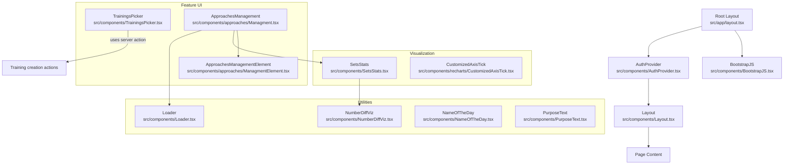
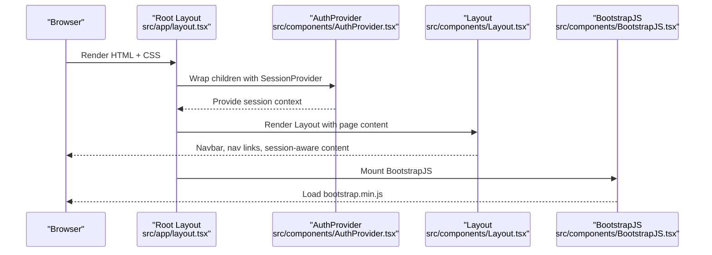
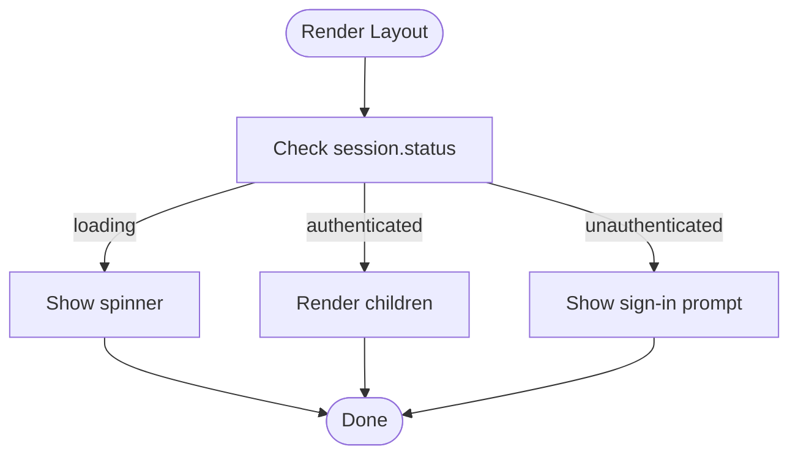
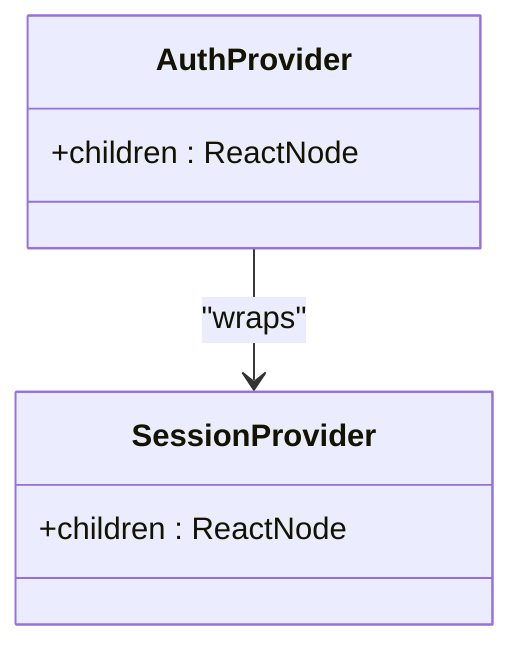
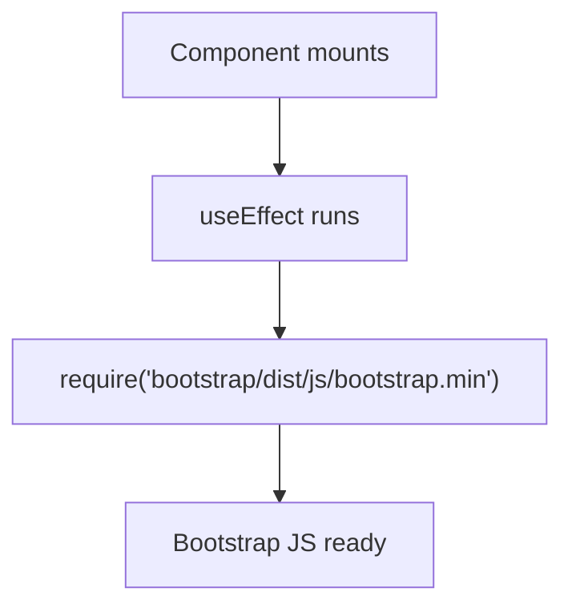
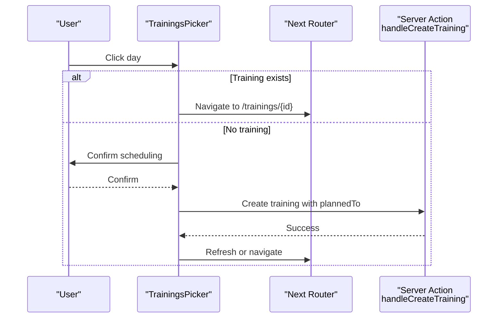
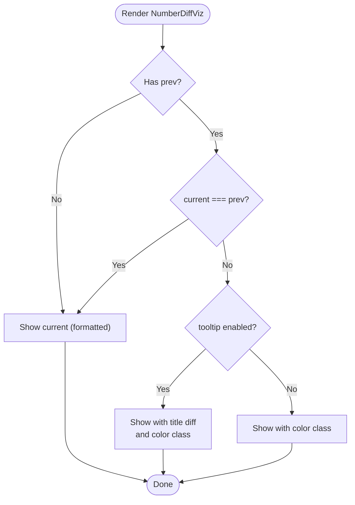
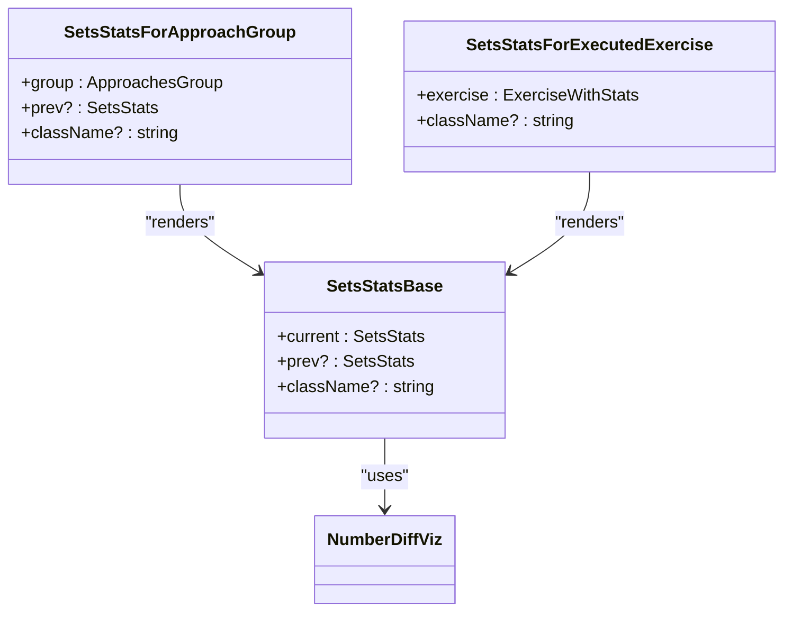
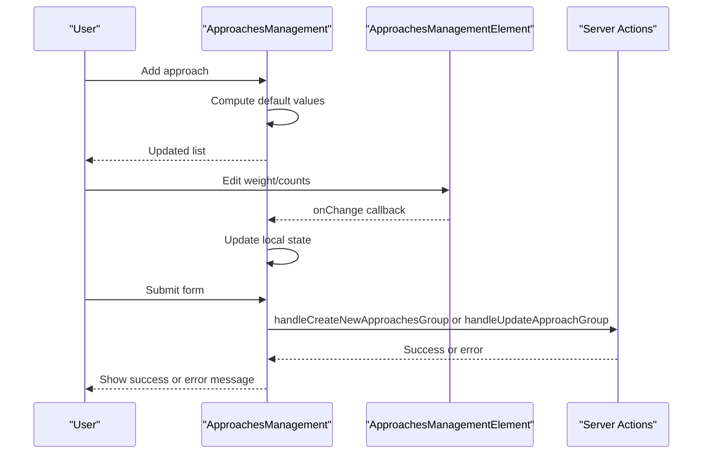
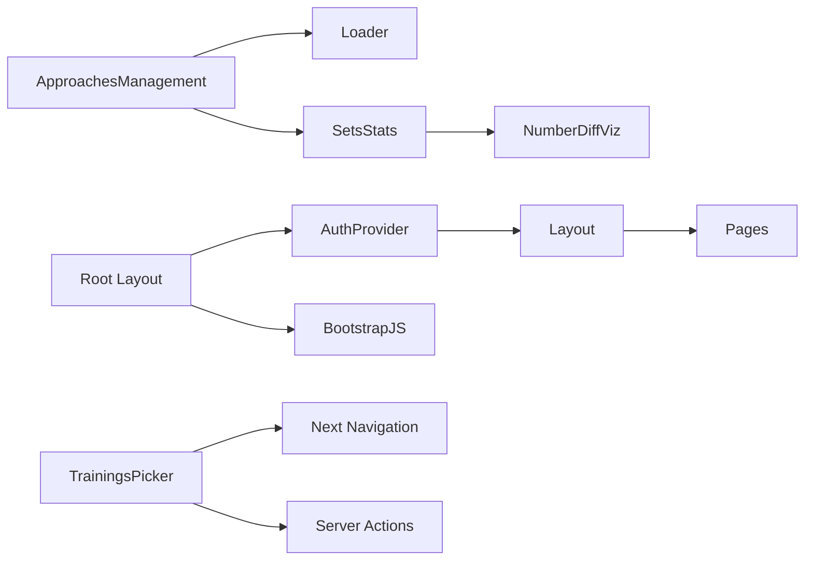

# Shared Components

<cite>
**Referenced Files in This Document**
- [Layout.tsx](file://src/components/Layout.tsx)
- [AuthProvider.tsx](file://src/components/AuthProvider.tsx)
- [BootstrapJS.tsx](file://src/components/BootstrapJS.tsx)
- [Loader.tsx](file://src/components/Loader.tsx)
- [TrainingsPicker.tsx](file://src/components/TrainingsPicker.tsx)
- [NameOfTheDay.tsx](file://src/components/NameOfTheDay.tsx)
- [NumberDiffViz.tsx](file://src/components/NumberDiffViz.tsx)
- [PurposeText.tsx](file://src/components/PurposeText.tsx)
- [SetsStats.tsx](file://src/components/SetsStats.tsx)
- [CustomizedAxisTick.tsx](file://src/components/recharts/CustomizedAxisTick.tsx)
- [Managment.tsx](file://src/components/approaches/Managment.tsx)
- [ManagmentElement.tsx](file://src/components/approaches/ManagmentElement.tsx)
- [layout.tsx](file://src/app/layout.tsx)
</cite>

## Table of Contents
1. [Introduction](#introduction)
2. [Project Structure](#project-structure)
3. [Core Components](#core-components)
4. [Architecture Overview](#architecture-overview)
5. [Detailed Component Analysis](#detailed-component-analysis)
6. [Dependency Analysis](#dependency-analysis)
7. [Performance Considerations](#performance-considerations)
8. [Troubleshooting Guide](#troubleshooting-guide)
9. [Conclusion](#conclusion)

## Introduction
This document describes the reusable UI components located under src/components/. It focuses on the application shell and shared UI patterns: Layout wrapper, AuthProvider context, Bootstrap JS loader, approaches management components, recharts customization, and common UI utilities such as Loader and TrainingsPicker. The goal is to explain how these components compose the user interface, integrate with authentication, and provide consistent behavior across pages.

## Project Structure
The shared components are organized by feature and utility:
- Application shell: Layout, AuthProvider, BootstrapJS
- Data visualization helpers: NumberDiffViz, SetsStats, CustomizedAxisTick
- Date and text helpers: NameOfTheDay, PurposeText
- Feature-specific UI: TrainingsPicker, Approaches Management (Managment, ManagmentElement)
- Common UI primitives: Loader

**Diagram sources**
- [layout.tsx:17-32](file://src/app/layout.tsx#L17-L32)
- [AuthProvider.tsx:9-11](file://src/components/AuthProvider.tsx#L9-L11)
- [Layout.tsx:11-80](file://src/components/Layout.tsx#L11-L80)
- [BootstrapJS.tsx:5-9](file://src/components/BootstrapJS.tsx#L5-L9)
- [Loader.tsx:1-4](file://src/components/Loader.tsx#L1-L4)
- [NumberDiffViz.tsx:9-39](file://src/components/NumberDiffViz.tsx#L9-L39)
- [NameOfTheDay.tsx:23-42](file://src/components/NameOfTheDay.tsx#L23-L42)
- [PurposeText.tsx:14-30](file://src/components/PurposeText.tsx#L14-L30)
- [SetsStats.tsx:29-109](file://src/components/SetsStats.tsx#L29-L109)
- [CustomizedAxisTick.tsx:4-21](file://src/components/recharts/CustomizedAxisTick.tsx#L4-L21)
- [TrainingsPicker.tsx:21-112](file://src/components/TrainingsPicker.tsx#L21-L112)
- [Managment.tsx:37-162](file://src/components/approaches/Managment.tsx#L37-L162)
- [ManagmentElement.tsx:13-80](file://src/components/approaches/ManagmentElement.tsx#L13-L80)

**Section sources**
- [layout.tsx:1-33](file://src/app/layout.tsx#L1-L33)

## Core Components
- Layout: Client component that renders a responsive navbar, shows navigation links, displays version badge, and conditionally renders content based on NextAuth session state. It also provides a loading spinner while session initializes and prompts unauthenticated users to sign in.
- AuthProvider: Wraps the app with NextAuth’s SessionProvider to expose session data via useSession throughout the client tree.
- BootstrapJS: Ensures Bootstrap JavaScript is loaded after mount for interactive Bootstrap features.
- Loader: Minimal placeholder used during async operations or when data is not yet available.
- TrainingsPicker: Calendar picker for selecting or scheduling trainings; integrates with Next.js navigation and server actions to create new training entries.
- NameOfTheDay and PurposeText: Small presentational components for localized day names and purpose labels with optional capitalization and brackets.
- NumberDiffViz: Visualizes numeric differences between current and previous values with color coding and optional tooltips.
- SetsStats: Displays aggregated set statistics for approach groups or executed exercises, leveraging NumberDiffViz for trend indication.
- CustomizedAxisTick: Recharts axis tick renderer for rotated labels.
- Approaches Management: A form-driven UI to manage exercise sets (approaches), including adding/removing rows, persisting changes via server actions, and showing live stats.

**Section sources**
- [Layout.tsx:11-80](file://src/components/Layout.tsx#L11-L80)
- [AuthProvider.tsx:9-11](file://src/components/AuthProvider.tsx#L9-L11)
- [BootstrapJS.tsx:5-9](file://src/components/BootstrapJS.tsx#L5-L9)
- [Loader.tsx:1-4](file://src/components/Loader.tsx#L1-L4)
- [TrainingsPicker.tsx:21-112](file://src/components/TrainingsPicker.tsx#L21-L112)
- [NameOfTheDay.tsx:23-42](file://src/components/NameOfTheDay.tsx#L23-L42)
- [PurposeText.tsx:14-30](file://src/components/PurposeText.tsx#L14-L30)
- [NumberDiffViz.tsx:9-39](file://src/components/NumberDiffViz.tsx#L9-L39)
- [SetsStats.tsx:29-109](file://src/components/SetsStats.tsx#L29-L109)
- [CustomizedAxisTick.tsx:4-21](file://src/components/recharts/CustomizedAxisTick.tsx#L4-L21)
- [Managment.tsx:37-162](file://src/components/approaches/Managment.tsx#L37-L162)
- [ManagmentElement.tsx:13-80](file://src/components/approaches/ManagmentElement.tsx#L13-L80)

## Architecture Overview
At runtime, the root layout composes the global providers and shell:
- AuthProvider wraps the entire app to enable session access.
- Layout renders the top-level navigation and guards content visibility based on session status.
- BootstrapJS loads Bootstrap scripts after hydration.

**Diagram sources**
- [layout.tsx:17-32](file://src/app/layout.tsx#L17-L32)
- [AuthProvider.tsx:9-11](file://src/components/AuthProvider.tsx#L9-L11)
- [Layout.tsx:11-80](file://src/components/Layout.tsx#L11-L80)
- [BootstrapJS.tsx:5-9](file://src/components/BootstrapJS.tsx#L5-L9)

## Detailed Component Analysis

### Layout
- Responsibilities:
  - Renders a responsive Bootstrap navbar with brand, version badge, and navigation links.
  - Uses NextAuth’s useSession to determine rendering:
    - Loading state shows a spinner.
    - Authenticated state renders children.
    - Unauthenticated state prompts sign-in.
- Props:
  - children: ReactNode rendered inside the container.
- Integration:
  - Consumed by the root layout to wrap all page content.

**Diagram sources**
- [Layout.tsx:11-80](file://src/components/Layout.tsx#L11-L80)

**Section sources**
- [Layout.tsx:11-80](file://src/components/Layout.tsx#L11-L80)

### AuthProvider
- Responsibilities:
  - Provides NextAuth session context to the client tree via SessionProvider.
- Usage:
  - Wrapped around Layout in the root layout to make session data available globally.

**Diagram sources**
- [AuthProvider.tsx:9-11](file://src/components/AuthProvider.tsx#L9-L11)

**Section sources**
- [AuthProvider.tsx:9-11](file://src/components/AuthProvider.tsx#L9-L11)

### BootstrapJS
- Responsibilities:
  - Loads Bootstrap JavaScript once after mount to enable interactive components (e.g., dropdowns, modals).
- Implementation note:
  - Uses useEffect to require the Bootstrap bundle at runtime.

**Diagram sources**
- [BootstrapJS.tsx:5-9](file://src/components/BootstrapJS.tsx#L5-L9)

**Section sources**
- [BootstrapJS.tsx:5-9](file://src/components/BootstrapJS.tsx#L5-L9)

### Loader
- Responsibilities:
  - Simple visual indicator used while data is loading or unavailable.
- Usage:
  - Embedded within components like ApproachesManagement to show a minimal loading state.

**Section sources**
- [Loader.tsx:1-4](file://src/components/Loader.tsx#L1-L4)

### TrainingsPicker
- Responsibilities:
  - Renders a calendar view of trainings with modifiers for planned/completed states.
  - Allows navigating months via URL search params and creating new trainings on empty days.
- Key behaviors:
  - Derives current month from URL query parameters.
  - Builds modifier sets and a date-to-training map for quick lookups.
  - On click:
    - If a training exists, navigates to its detail page.
    - Otherwise, prompts confirmation and creates a new training via a server action.
  - Uses Next.js transitions to avoid blocking UI during navigation.
- Dependencies:
  - react-day-picker for calendar UI.
  - moment for date formatting.
  - Next.js navigation hooks and server actions for persistence.

**Diagram sources**
- [TrainingsPicker.tsx:21-112](file://src/components/TrainingsPicker.tsx#L21-L112)

**Section sources**
- [TrainingsPicker.tsx:21-112](file://src/components/TrainingsPicker.tsx#L21-L112)

### NameOfTheDay
- Responsibilities:
  - Displays the day name in Russian with optional first-letter capitalization and brackets.
- Props:
  - date: Date object.
  - firstUp?: boolean to capitalize first letter.
  - brackets?: boolean to wrap text in parentheses.

**Section sources**
- [NameOfTheDay.tsx:23-42](file://src/components/NameOfTheDay.tsx#L23-L42)

### PurposeText
- Responsibilities:
  - Displays localized purpose text based on an enum value.
- Props:
  - purpose: CurrentPurpose enum.
  - firstUp?, brackets?: same styling options as NameOfTheDay.

**Section sources**
- [PurposeText.tsx:14-30](file://src/components/PurposeText.tsx#L14-L30)

### NumberDiffViz
- Responsibilities:
  - Shows a number with optional comparison to a previous value.
  - Highlights improvements (green) or regressions (yellow) and optionally shows difference in tooltip.
- Props:
  - current: number.
  - prev?: number.
  - toFixed?: boolean to format decimals.
  - tooltip?: boolean to show diff in title attribute.

**Diagram sources**
- [NumberDiffViz.tsx:9-39](file://src/components/NumberDiffViz.tsx#L9-L39)

**Section sources**
- [NumberDiffViz.tsx:9-39](file://src/components/NumberDiffViz.tsx#L9-L39)

### SetsStats
- Responsibilities:
  - Presents aggregated statistics for sets (weight sum/mean/max, count sum/mean) with optional comparison to previous stats.
  - Provides specialized renderers for approach groups and executed exercises.
- Components:
  - SetsStatsBase: core list rendering using NumberDiffViz.
  - SetsStatsForApproachGroup: maps group metrics to base stats.
  - SetsStatsForExecutedExercise: compares current execution vs previous group stats.

**Diagram sources**
- [SetsStats.tsx:29-109](file://src/components/SetsStats.tsx#L29-L109)
- [NumberDiffViz.tsx:9-39](file://src/components/NumberDiffViz.tsx#L9-L39)

**Section sources**
- [SetsStats.tsx:29-109](file://src/components/SetsStats.tsx#L29-L109)

### CustomizedAxisTick
- Responsibilities:
  - Customizes Recharts axis ticks to rotate labels for better readability.
- Usage:
  - Passed as a custom tick renderer to chart axes.

**Section sources**
- [CustomizedAxisTick.tsx:4-21](file://src/components/recharts/CustomizedAxisTick.tsx#L4-L21)

### Approaches Management
- Responsibilities:
  - Manages a list of approach entries (count, weight, priority, isBoost).
  - Supports adding new entries with sensible defaults derived from the last entry.
  - Removes entries by priority.
  - Submits changes via server actions for create/update flows.
  - Displays aggregated stats using SetsStatsForApproachGroup.
- State and UX:
  - Local state mirrors approach data; updates trigger re-renders.
  - Error handling surfaces messages in an alert.
  - Loading state uses Loader.

**Diagram sources**
- [Managment.tsx:37-162](file://src/components/approaches/Managment.tsx#L37-L162)
- [ManagmentElement.tsx:13-80](file://src/components/approaches/ManagmentElement.tsx#L13-L80)

**Section sources**
- [Managment.tsx:37-162](file://src/components/approaches/Managment.tsx#L37-L162)
- [ManagmentElement.tsx:13-80](file://src/components/approaches/ManagmentElement.tsx#L13-L80)

## Dependency Analysis
- Global composition:
  - Root layout composes AuthProvider and Layout, ensuring session context and shell are available everywhere.
- Client-side dependencies:
  - next-auth/react for session context.
  - react-day-picker for calendar interactions.
  - moment for date formatting.
  - Bootstrap CSS/JS for styling and interactivity.
  - recharts for charts (via CustomizedAxisTick).
- Cross-component usage:
  - SetsStats depends on NumberDiffViz for consistent diff visualization.
  - ApproachesManagement depends on Loader and SetsStatsForApproachGroup.
  - TrainingsPicker depends on Next.js navigation and server actions.

**Diagram sources**
- [layout.tsx:17-32](file://src/app/layout.tsx#L17-L32)
- [Managment.tsx:37-162](file://src/components/approaches/Managment.tsx#L37-L162)
- [SetsStats.tsx:29-109](file://src/components/SetsStats.tsx#L29-L109)
- [NumberDiffViz.tsx:9-39](file://src/components/NumberDiffViz.tsx#L9-L39)
- [TrainingsPicker.tsx:21-112](file://src/components/TrainingsPicker.tsx#L21-L112)
- [BootstrapJS.tsx:5-9](file://src/components/BootstrapJS.tsx#L5-L9)

**Section sources**
- [layout.tsx:17-32](file://src/app/layout.tsx#L17-L32)

## Performance Considerations
- Minimize re-renders:
  - Use useMemo for expensive computations (e.g., TrainingsPicker’s modifiersMap and dataMap).
  - Keep state updates granular to avoid unnecessary re-renders in ApproachesManagement.
- Avoid blocking UI:
  - Use Next.js transitions for non-blocking navigation in TrainingsPicker.
- Lazy load third-party scripts:
  - BootstrapJS loads JS only after mount to prevent initial render delays.
- Efficient comparisons:
  - NumberDiffViz avoids heavy computations and relies on simple conditional logic.
- Chart rendering:
  - CustomizedAxisTick rotates labels without extra DOM overhead.

[No sources needed since this section provides general guidance]

## Troubleshooting Guide
- Session-related issues:
  - If Layout does not render children, verify that NextAuth is configured and session resolves to authenticated.
  - Ensure AuthProvider wraps Layout in the root layout.
- Bootstrap interactivity not working:
  - Confirm BootstrapJS mounts after hydration and that Bootstrap CSS is imported in the root layout.
- TrainingsPicker navigation errors:
  - When clicking a day without a training, confirm the server action is reachable and returns successfully.
  - Verify URL search params parsing for month/year.
- ApproachesManagement submission errors:
  - Inspect error state and ensure server actions return proper messages.
  - Validate that approach data structure matches expected types.

**Section sources**
- [Layout.tsx:11-80](file://src/components/Layout.tsx#L11-L80)
- [AuthProvider.tsx:9-11](file://src/components/AuthProvider.tsx#L9-L11)
- [BootstrapJS.tsx:5-9](file://src/components/BootstrapJS.tsx#L5-L9)
- [TrainingsPicker.tsx:21-112](file://src/components/TrainingsPicker.tsx#L21-L112)
- [Managment.tsx:37-162](file://src/components/approaches/Managment.tsx#L37-L162)

## Conclusion
The shared components under src/components/ provide a cohesive foundation for the application’s UI:
- Authentication and layout are consistently applied through AuthProvider and Layout.
- Bootstrap integration ensures consistent styling and interactivity.
- Utilities like NumberDiffViz, NameOfTheDay, and PurposeText offer reusable presentation logic.
- Features such as TrainingsPicker and ApproachesManagement encapsulate complex interactions while remaining modular and testable.
Adopting these components promotes consistency, reduces duplication, and simplifies maintenance across the application.