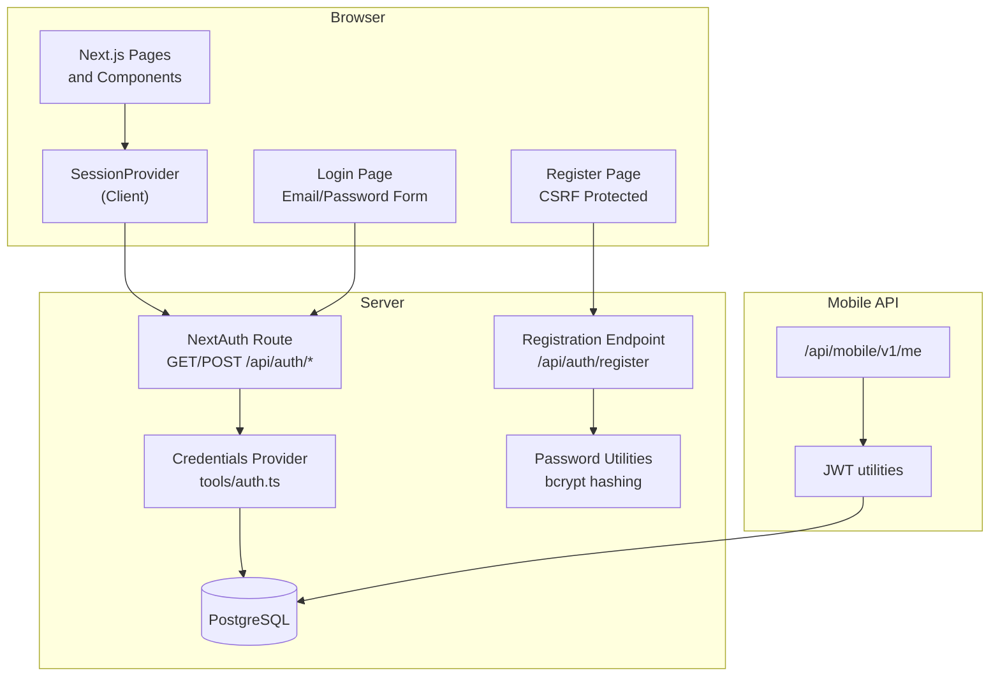
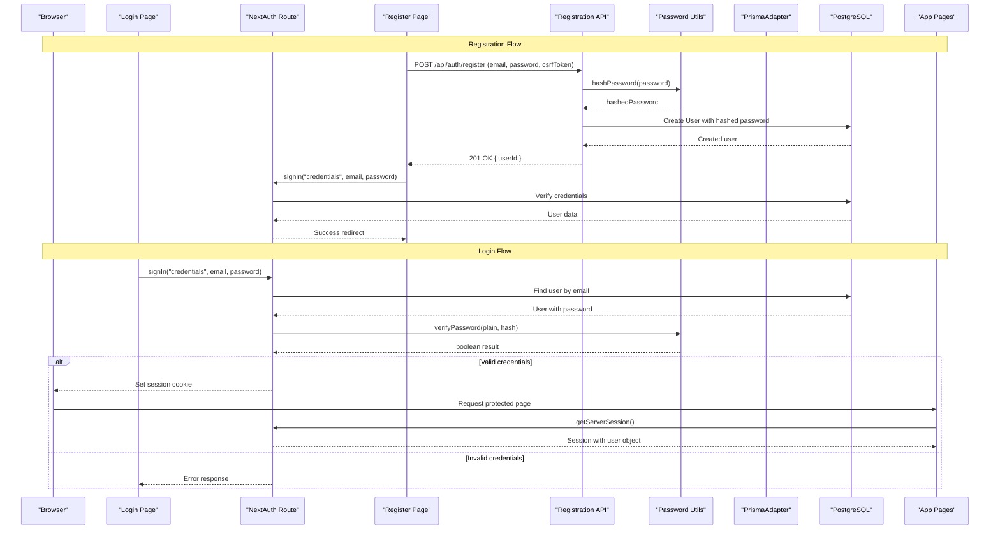
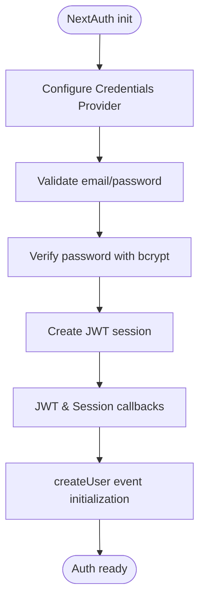
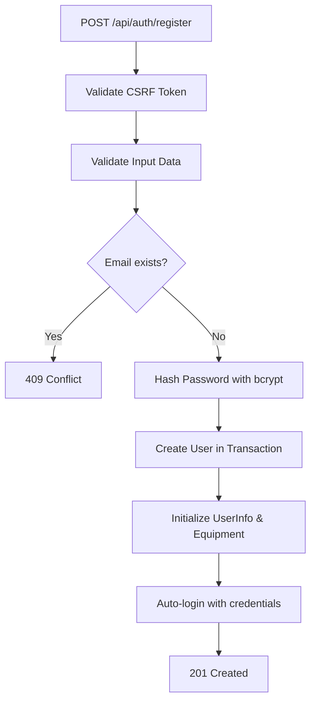
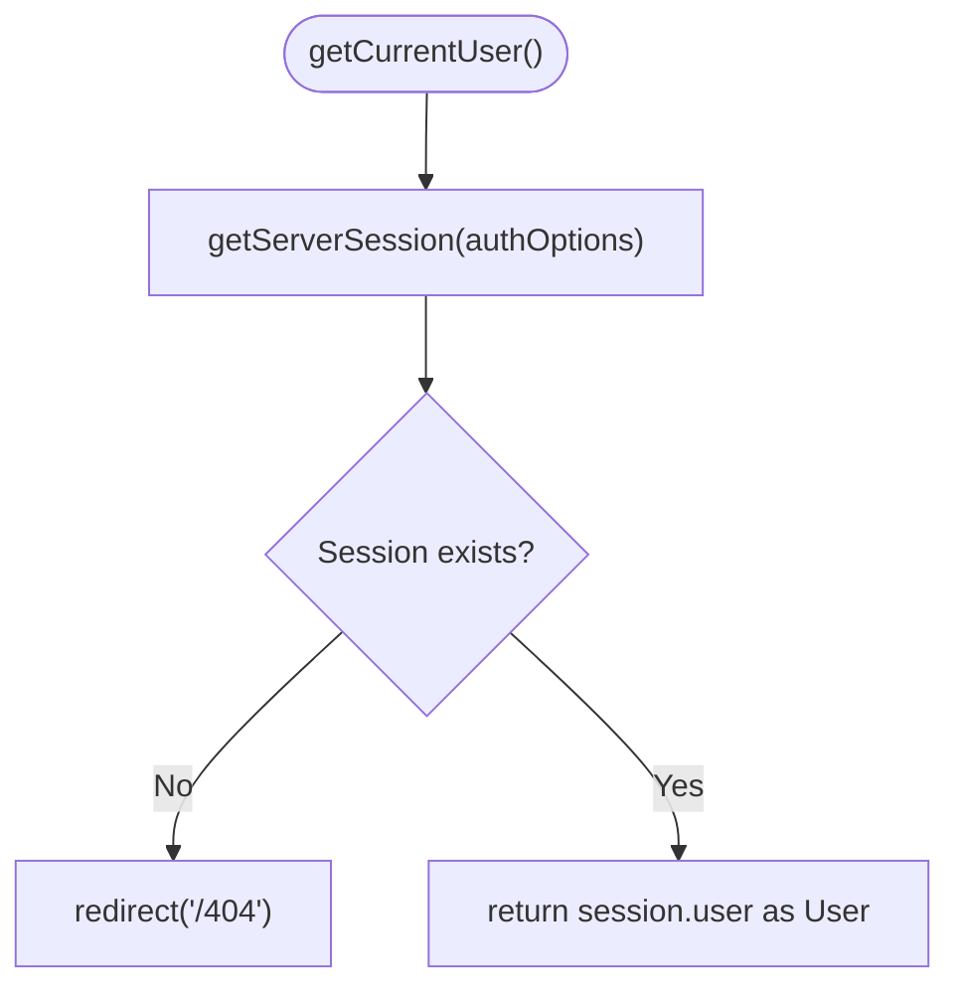
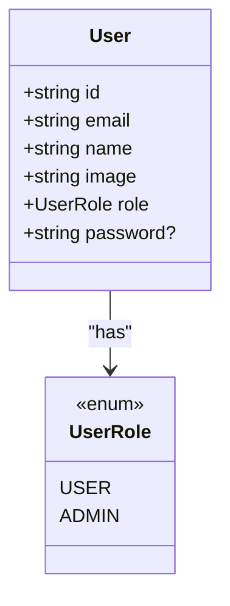
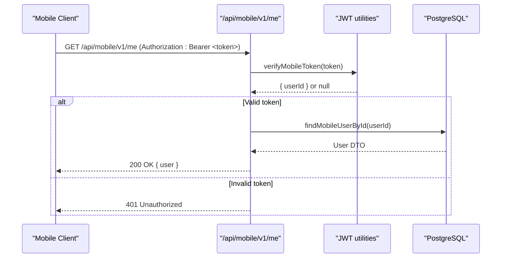
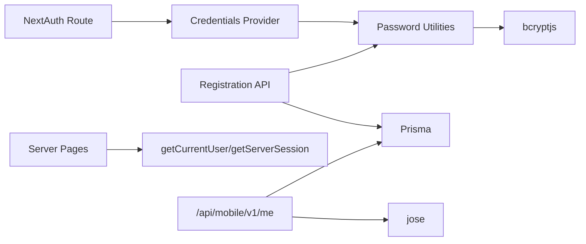

# Authentication and Authorization

<cite>
**Referenced Files in This Document**
- [route.ts](file://src/app/api/auth/[...nextauth]/route.ts)
- [auth.ts](file://src/tools/auth.ts)
- [AuthProvider.tsx](file://src/components/AuthProvider.tsx)
- [schema.prisma](file://prisma/schema.prisma)
- [page.tsx](file://src/app/login/page.tsx)
- [page.tsx](file://src/app/register/page.tsx)
- [route.ts](file://src/app/api/auth/register/route.ts)
- [password.ts](file://src/tools/password.ts)
- [route.ts](file://src/app/api/mobile/v1/me/route.ts)
- [jwt.ts](file://src/mobile/tools/jwt.ts)
- [user.ts](file://src/mobile/tools/user.ts)
</cite>

## Update Summary
**Changes Made**
- Updated authentication flow from OAuth (GitHub/Google) to email/password authentication using NextAuth CredentialsProvider
- Added new registration endpoint with CSRF protection and password validation
- Integrated bcrypt password hashing utilities for secure password storage
- Updated login page to use credentials-based authentication
- Maintained mobile API JWT authentication as separate flow
- Updated Prisma schema to include password field in User model

## Table of Contents
1. Introduction
2. Project Structure
3. Core Components
4. Architecture Overview
5. Detailed Component Analysis
6. Dependency Analysis
7. Performance Considerations
8. Troubleshooting Guide
9. Conclusion

## Introduction
This document explains how MeinGym implements authentication using NextAuth.js with email/password credentials provider, manages sessions on the server, and enforces role-based access control (RBAC) using a UserRole enum. The system supports both web-based authentication through browser sessions and mobile API authentication via JWT tokens. Passwords are securely hashed using bcrypt before storage, and comprehensive input validation ensures data integrity.

## Project Structure
Authentication-related code is organized into:
- NextAuth route handler at app/api/auth/[...nextauth]
- Email/password authentication configuration in tools/auth.ts
- Registration endpoint at app/api/auth/register
- Client-side session provider in components/AuthProvider.tsx
- Login and registration pages with form validation
- Prisma schema defining User model with password field and UserRole
- Mobile API endpoints using JWT for non-browser clients

**Diagram sources**
- [route.ts:1-7](file://src/app/api/auth/[...nextauth]/route.ts#L1-L7)
- [auth.ts:66-143](file://src/tools/auth.ts#L66-L143)
- [route.ts:7-95](file://src/app/api/auth/register/route.ts#L7-L95)
- [password.ts:1-13](file://src/tools/password.ts#L1-L13)
- [page.tsx:1-88](file://src/app/login/page.tsx#L1-L88)
- [page.tsx:1-161](file://src/app/register/page.tsx#L1-L161)

**Section sources**
- [route.ts:1-7](file://src/app/api/auth/[...nextauth]/route.ts#L1-L7)
- [auth.ts:66-143](file://src/tools/auth.ts#L66-L143)
- [route.ts:7-95](file://src/app/api/auth/register/route.ts#L7-L95)
- [password.ts:1-13](file://src/tools/password.ts#L1-L13)

## Core Components
- **NextAuth route handler**: Exposes GET/POST handlers for authentication flows with credentials provider.
- **Credentials provider**: Configures email/password authentication with bcrypt verification.
- **Registration endpoint**: Handles user registration with CSRF protection, input validation, and password hashing.
- **Password utilities**: Provides bcrypt-based password hashing and verification functions.
- **Session helpers**: getServerSession wrapper and getCurrentUser/getCurrentUserId utilities for server contexts.
- **Client session provider**: Wraps the app with SessionProvider for client-side access to session data.
- **Login/Register pages**: User interfaces with form validation and error handling.
- **RBAC enforcement**: Pages check user.role against UserRole.ADMIN to gate admin-only features.
- **Mobile JWT auth**: Separate flow for mobile clients using signed JWTs and Bearer tokens.

**Section sources**
- [route.ts:1-7](file://src/app/api/auth/[...nextauth]/route.ts#L1-L7)
- [auth.ts:83-104](file://src/tools/auth.ts#L83-L104)
- [route.ts:7-95](file://src/app/api/auth/register/route.ts#L7-L95)
- [password.ts:1-13](file://src/tools/password.ts#L1-L13)
- [page.tsx:1-88](file://src/app/login/page.tsx#L1-L88)
- [page.tsx:1-161](file://src/app/register/page.tsx#L1-L161)

## Architecture Overview
The authentication architecture uses NextAuth.js with credentials provider for web browsers and JWT for mobile clients, both backed by PostgreSQL via Prisma. Passwords are securely hashed using bcrypt before storage, and comprehensive validation ensures data integrity throughout the authentication process.

**Diagram sources**
- [route.ts:1-7](file://src/app/api/auth/[...nextauth]/route.ts#L1-L7)
- [auth.ts:83-104](file://src/tools/auth.ts#L83-L104)
- [route.ts:7-95](file://src/app/api/auth/register/route.ts#L7-L95)
- [password.ts:1-13](file://src/tools/password.ts#L1-L13)
- [page.tsx:1-88](file://src/app/login/page.tsx#L1-L88)
- [page.tsx:1-161](file://src/app/register/page.tsx#L1-L161)

## Detailed Component Analysis

### NextAuth Configuration with Credentials Provider
- **Credentials Provider**: Configured with email and password fields, validates credentials against database using bcrypt comparison.
- **Session Strategy**: Uses JWT strategy with 30-day expiration for enhanced security.
- **Callbacks**: JWT callback enriches token with user ID and role; session callback fetches full user data while excluding password field.
- **Events**: createUser event initializes UserInfo and default Equipment for new users.
- **OAuth Providers**: GitHub and Google providers are commented out but available via ENABLE_OAUTH flag.

**Diagram sources**
- [auth.ts:66-143](file://src/tools/auth.ts#L66-L143)

**Section sources**
- [auth.ts:66-143](file://src/tools/auth.ts#L66-L143)

### Registration Endpoint with CSRF Protection
- **CSRF Validation**: Implements double-submit cookie pattern using NextAuth's built-in CSRF token mechanism.
- **Input Validation**: Comprehensive validation including email format, password strength requirements (min 6 chars, letters, numbers).
- **Password Security**: Uses bcrypt hashing with salt rounds for secure password storage.
- **Transaction Safety**: Creates user and initializes equipment within a database transaction.
- **Auto-login**: Automatically logs in users after successful registration.

**Diagram sources**
- [route.ts:7-95](file://src/app/api/auth/register/route.ts#L7-L95)
- [password.ts:1-13](file://src/tools/password.ts#L1-L13)

**Section sources**
- [route.ts:7-95](file://src/app/api/auth/register/route.ts#L7-L95)
- [password.ts:1-13](file://src/tools/password.ts#L1-L13)

### Password Hashing Utilities
- **bcrypt Integration**: Uses bcryptjs library for secure password hashing and verification.
- **Salt Rounds**: Configured with 10 salt rounds for optimal security-performance balance.
- **Verification Function**: Securely compares plain text passwords against stored hashes.
- **Error Handling**: Throws appropriate errors for invalid inputs or cryptographic failures.

**Section sources**
- [password.ts:1-13](file://src/tools/password.ts#L1-L13)

### Session Management Utilities
- **getServerSession wrapper**: Provides a consistent way to retrieve sessions in server contexts.
- **getCurrentUser**: Returns the authenticated User or redirects to a 404 if not authenticated.
- **getCurrentUserId**: Convenience helper to extract the user ID.
- **findUserInfo**: Ensures a UserInfo record exists for a given userId.

**Diagram sources**
- [auth.ts:155-164](file://src/tools/auth.ts#L155-L164)

**Section sources**
- [auth.ts:155-164](file://src/tools/auth.ts#L155-L164)

### Client-Side Session Provider
- **SessionProvider**: Wraps the application tree to expose session state to client components.
- **Integration**: Works seamlessly with NextAuth's credentials provider for automatic session management.

**Section sources**
- [AuthProvider.tsx:1-12](file://src/components/AuthProvider.tsx#L1-L12)

### Login and Registration Pages
- **Login Page**: Simple email/password form with CSRF token integration and error handling.
- **Registration Page**: Comprehensive form with real-time validation, CSRF protection, and auto-login functionality.
- **Form Validation**: Client-side validation for better user experience with detailed error messages.
- **Security**: Proper CSRF token handling prevents cross-site request forgery attacks.

**Section sources**
- [page.tsx:1-88](file://src/app/login/page.tsx#L1-L88)
- [page.tsx:1-161](file://src/app/register/page.tsx#L1-L161)

### Role-Based Access Control (RBAC)
- **Data model**: UserRole enum defines USER and ADMIN roles; User model includes a role field defaulting to USER.
- **Enforcement patterns**:
  - Page-level checks: Admin-only pages redirect unauthorized users.
  - UI gating: Conditional rendering hides admin controls unless user.role === ADMIN.

**Diagram sources**
- [schema.prisma:14-45](file://prisma/schema.prisma#L14-L45)

**Section sources**
- [schema.prisma:14-45](file://prisma/schema.prisma#L14-L45)

### Mobile API Authentication Flow (JWT)
- **Token creation**: createMobileToken signs a JWT with HS256 using a secret and sets expiration.
- **Token verification**: verifyMobileToken validates the token and extracts the userId.
- **Protected endpoint**: /api/mobile/v1/me requires a Bearer token, verifies it, and returns user data.
- **HMAC signing**: Mobile clients sign requests with HMAC for additional security.

**Diagram sources**
- [route.ts:1-28](file://src/app/api/mobile/v1/me/route.ts#L1-L28)
- [jwt.ts:1-31](file://src/mobile/tools/jwt.ts#L1-L1-L31)
- [user.ts:1-49](file://src/mobile/tools/user.ts#L1-L49)

**Section sources**
- [route.ts:1-28](file://src/app/api/mobile/v1/me/route.ts#L1-L28)
- [jwt.ts:1-31](file://src/mobile/tools/jwt.ts#L1-L31)
- [user.ts:1-49](file://src/mobile/tools/user.ts#L1-L49)

## Dependency Analysis
- **NextAuth** depends on CredentialsProvider for email/password authentication and JWT strategy for session management.
- **Registration endpoint** depends on bcrypt for password hashing and Prisma for database operations.
- **Server pages** depend on getCurrentUser to enforce RBAC.
- **Mobile endpoints** depend on jose for JWT operations and prisma for user lookup.
- **Password utilities** provide reusable bcrypt functions for secure password handling.

**Diagram sources**
- [route.ts:1-7](file://src/app/api/auth/[...nextauth]/route.ts#L1-L7)
- [auth.ts:83-104](file://src/tools/auth.ts#L83-L104)
- [route.ts:7-95](file://src/app/api/auth/register/route.ts#L7-L95)
- [password.ts:1-13](file://src/tools/password.ts#L1-L13)
- [route.ts:1-28](file://src/app/api/mobile/v1/me/route.ts#L1-L28)

**Section sources**
- [route.ts:1-7](file://src/app/api/auth/[...nextauth]/route.ts#L1-L7)
- [auth.ts:83-104](file://src/tools/auth.ts#L83-L104)
- [route.ts:7-95](file://src/app/api/auth/register/route.ts#L7-L95)
- [password.ts:1-13](file://src/tools/password.ts#L1-L13)
- [route.ts:1-28](file://src/app/api/mobile/v1/me/route.ts#L1-L28)

## Performance Considerations
- **Session retrieval** uses getServerSession which reads cookies and validates sessions efficiently.
- **Password hashing** uses bcrypt with 10 salt rounds, providing good security without excessive performance impact.
- **Database queries** for user info run only when needed, with caching where appropriate.
- **Mobile JWT verification** is lightweight and avoids repeated database calls beyond user lookup.
- **CSRF protection** adds minimal overhead while significantly improving security.

## Troubleshooting Guide
- **Missing environment variables**: Ensure DATABASE_PRISMA_URL and MOBILE_JWT_SECRET are set.
- **Authentication failures**: Verify email/password combination and check for proper bcrypt hash storage.
- **Registration issues**: Check CSRF token validity and ensure proper form submission with credentials.
- **Session not available**: Confirm SessionProvider is wrapping the app and cookies are enabled.
- **RBAC redirects**: If redirected to 404, ensure the user has the correct role and the session is valid.
- **Mobile token errors**: Validate token format and expiration; ensure the secret matches between signing and verification.
- **Password validation errors**: Check that passwords meet minimum requirements (6+ characters, letters, numbers).

**Section sources**
- [auth.ts:83-104](file://src/tools/auth.ts#L83-L104)
- [route.ts:7-95](file://src/app/api/auth/register/route.ts#L7-L95)
- [route.ts:1-28](file://src/app/api/mobile/v1/me/route.ts#L1-L28)
- [jwt.ts:1-31](file://src/mobile/tools/jwt.ts#L1-L31)

## Conclusion
MeinGym implements robust authentication and authorization using NextAuth.js with credentials provider for web clients and JWT for mobile clients. The system provides secure email/password authentication with bcrypt password hashing, comprehensive input validation, and CSRF protection. RBAC is enforced through a simple UserRole enum and explicit checks in server pages. The design separates concerns cleanly, leveraging Prisma for persistence and providing clear entry points for session management and role checks. The migration from OAuth to credentials-based authentication simplifies the user experience while maintaining security through industry-standard practices.