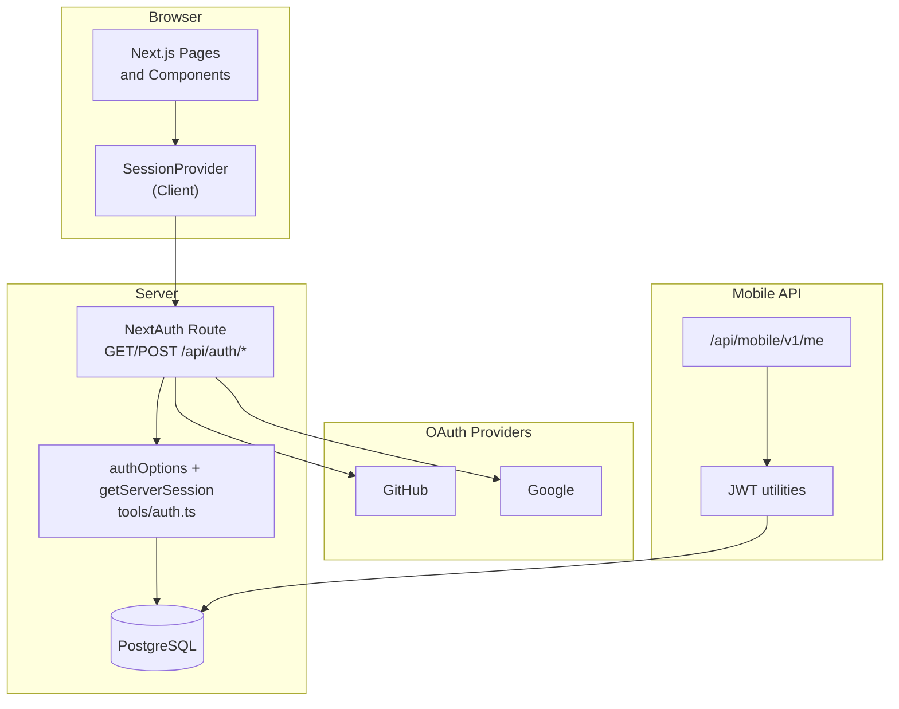
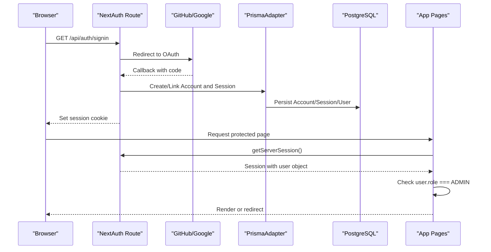
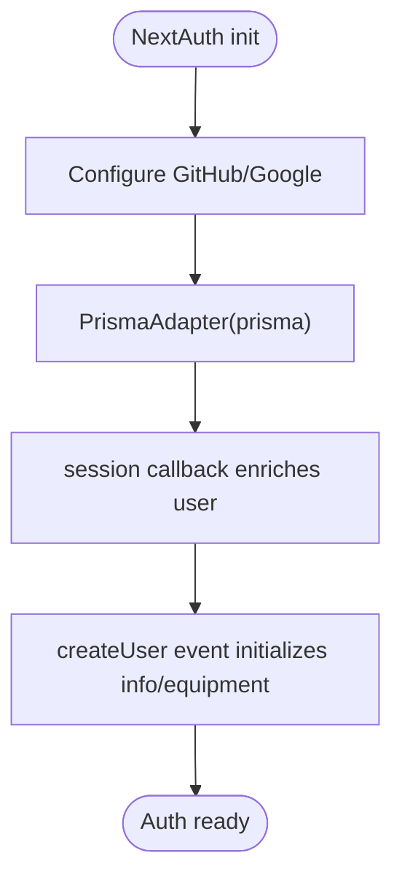
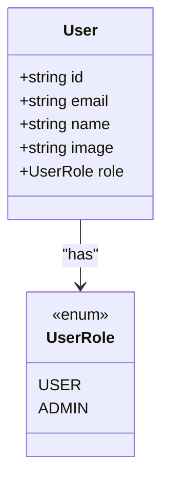
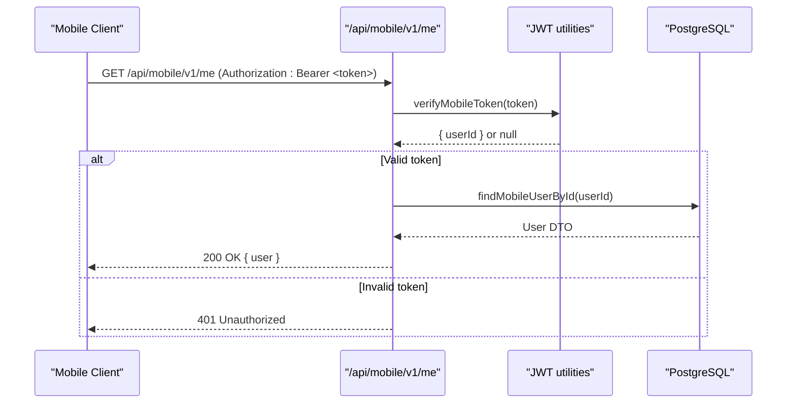
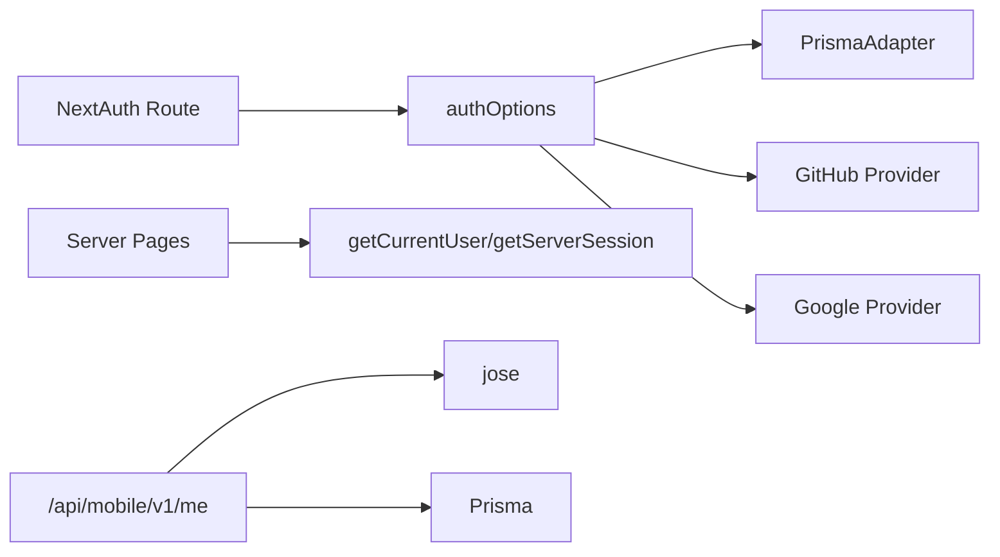

# Authentication and Authorization

<cite>
**Referenced Files in This Document**
- [route.ts](file://src/app/api/auth/[...nextauth]/route.ts)
- [auth.ts](file://src/tools/auth.ts)
- [AuthProvider.tsx](file://src/components/AuthProvider.tsx)
- [schema.prisma](file://prisma/schema.prisma)
- [page.tsx](file://src/app/actions/page.tsx)
- [page.tsx](file://src/app/actions/create/page.tsx)
- [route.ts](file://src/app/api/mobile/v1/me/route.ts)
- [jwt.ts](file://src/mobile/tools/jwt.ts)
- [user.ts](file://src/mobile/tools/user.ts)
</cite>

## Table of Contents
1. Introduction
2. Project Structure
3. Core Components
4. Architecture Overview
5. Detailed Component Analysis
6. Dependency Analysis
7. Performance Considerations
8. Troubleshooting Guide
9. Conclusion

## Introduction
This document explains how MeinGym integrates NextAuth.js for authentication with GitHub and Google OAuth, manages sessions on the server, and enforces role-based access control (RBAC) using a UserRole enum. It also covers the mobile API’s JWT-based authentication flow as an alternative to browser sessions.

## Project Structure
Authentication-related code is organized into:
- NextAuth route handler at app/api/auth/[...nextauth]
- Auth configuration and session helpers in tools/auth.ts
- Client-side session provider in components/AuthProvider.tsx
- Prisma schema defining User, Session, Account, and UserRole
- Server pages that enforce RBAC by checking user.role
- Mobile API endpoints using JWT for non-browser clients

**Diagram sources**
- [route.ts:1-7](file://src/app/api/auth/[...nextauth]/route.ts#L1-L7)
- [auth.ts:1-132](file://src/tools/auth.ts#L1-L132)
- [AuthProvider.tsx:1-11](file://src/components/AuthProvider.tsx#L1-L11)
- [schema.prisma:14-44](file://prisma/schema.prisma#L14-L44)
- [route.ts:1-28](file://src/app/api/mobile/v1/me/route.ts#L1-L28)
- [jwt.ts:1-31](file://src/mobile/tools/jwt.ts#L1-L31)

**Section sources**
- [route.ts:1-7](file://src/app/api/auth/[...nextauth]/route.ts#L1-L7)
- [auth.ts:1-132](file://src/tools/auth.ts#L1-L132)
- [AuthProvider.tsx:1-11](file://src/components/AuthProvider.tsx#L1-L11)
- [schema.prisma:14-44](file://prisma/schema.prisma#L14-L44)

## Core Components
- NextAuth route handler: Exposes GET/POST handlers for OAuth flows.
- Auth options: Configures Prisma adapter, providers (GitHub, Google), session callback, and user creation events.
- Session helpers: getServerSession wrapper and getCurrentUser/getCurrentUserId utilities for server contexts.
- Client session provider: Wraps the app with SessionProvider for client-side access to session data.
- RBAC enforcement: Pages check user.role against UserRole.ADMIN to gate admin-only features.
- Mobile JWT auth: Separate flow for mobile clients using signed JWTs and Bearer tokens.

**Section sources**
- [route.ts:1-7](file://src/app/api/auth/[...nextauth]/route.ts#L1-L7)
- [auth.ts:1-132](file://src/tools/auth.ts#L1-L132)
- [AuthProvider.tsx:1-11](file://src/components/AuthProvider.tsx#L1-L11)
- [page.tsx:1-129](file://src/app/actions/page.tsx#L1-L129)
- [page.tsx:1-18](file://src/app/actions/create/page.tsx#L1-L18)
- [route.ts:1-28](file://src/app/api/mobile/v1/me/route.ts#L1-L28)
- [jwt.ts:1-31](file://src/mobile/tools/jwt.ts#L1-L31)

## Architecture Overview
The authentication architecture combines NextAuth.js for web browsers and JWT for mobile clients, both backed by PostgreSQL via Prisma.

**Diagram sources**
- [route.ts:1-7](file://src/app/api/auth/[...nextauth]/route.ts#L1-L7)
- [auth.ts:1-132](file://src/tools/auth.ts#L1-L132)
- [schema.prisma:116-146](file://prisma/schema.prisma#L116-L146)

## Detailed Component Analysis

### NextAuth Configuration and Providers
- Providers: GitHub and Google are configured with environment variables for client IDs and secrets.
- Adapter: PrismaAdapter connects NextAuth to the database, managing Account, Session, and User tables.
- Session callback: Enriches session.user with full user data from the database.
- Events: On createUser, initializes UserInfo and default Equipment for new users.

**Diagram sources**
- [auth.ts:18-101](file://src/tools/auth.ts#L18-L101)

**Section sources**
- [auth.ts:18-101](file://src/tools/auth.ts#L18-L101)

### Session Management Utilities
- getServerSession wrapper: Provides a consistent way to retrieve sessions in server contexts.
- getCurrentUser: Returns the authenticated User or redirects to a 404 if not authenticated.
- getCurrentUserId: Convenience helper to extract the user ID.
- findUserInfo: Ensures a UserInfo record exists for a given userId.

**Diagram sources**
- [auth.ts:103-131](file://src/tools/auth.ts#L103-L131)

**Section sources**
- [auth.ts:103-131](file://src/tools/auth.ts#L103-L131)

### Client-Side Session Provider
- SessionProvider wraps the application tree to expose session state to client components.

**Section sources**
- [AuthProvider.tsx:1-11](file://src/components/AuthProvider.tsx#L1-L11)

### Role-Based Access Control (RBAC)
- Data model: UserRole enum defines USER and ADMIN roles; User model includes a role field defaulting to USER.
- Enforcement patterns:
  - Page-level checks: Admin-only pages redirect unauthorized users.
  - UI gating: Conditional rendering hides admin controls unless user.role === ADMIN.

**Diagram sources**
- [schema.prisma:14-44](file://prisma/schema.prisma#L14-L44)

**Section sources**
- [schema.prisma:14-44](file://prisma/schema.prisma#L14-L44)
- [page.tsx:98-116](file://src/app/actions/page.tsx#L98-L116)
- [page.tsx:6-11](file://src/app/actions/create/page.tsx#L6-L11)

### Mobile API Authentication Flow (JWT)
- Token creation: createMobileToken signs a JWT with HS256 using a secret and sets expiration.
- Token verification: verifyMobileToken validates the token and extracts the userId.
- Protected endpoint: /api/mobile/v1/me requires a Bearer token, verifies it, and returns user data.

**Diagram sources**
- [route.ts:1-28](file://src/app/api/mobile/v1/me/route.ts#L1-L28)
- [jwt.ts:1-31](file://src/mobile/tools/jwt.ts#L1-L31)
- [user.ts:1-49](file://src/mobile/tools/user.ts#L1-L49)

**Section sources**
- [route.ts:1-28](file://src/app/api/mobile/v1/me/route.ts#L1-L28)
- [jwt.ts:1-31](file://src/mobile/tools/jwt.ts#L1-L31)
- [user.ts:1-49](file://src/mobile/tools/user.ts#L1-L49)

## Dependency Analysis
- NextAuth depends on PrismaAdapter for persistence and on environment variables for OAuth credentials.
- Server pages depend on getCurrentUser to enforce RBAC.
- Mobile endpoints depend on jose for JWT operations and prisma for user lookup.

**Diagram sources**
- [route.ts:1-7](file://src/app/api/auth/[...nextauth]/route.ts#L1-L7)
- [auth.ts:1-132](file://src/tools/auth.ts#L1-L132)
- [route.ts:1-28](file://src/app/api/mobile/v1/me/route.ts#L1-L28)
- [jwt.ts:1-31](file://src/mobile/tools/jwt.ts#L1-L31)

**Section sources**
- [route.ts:1-7](file://src/app/api/auth/[...nextauth]/route.ts#L1-L7)
- [auth.ts:1-132](file://src/tools/auth.ts#L1-L132)
- [route.ts:1-28](file://src/app/api/mobile/v1/me/route.ts#L1-L28)
- [jwt.ts:1-31](file://src/mobile/tools/jwt.ts#L1-L31)

## Performance Considerations
- Session retrieval uses getServerSession which reads cookies and validates sessions efficiently.
- Prisma queries for user info and equipment initialization run only on first login (createUser event).
- Mobile JWT verification is lightweight and avoids repeated database calls beyond user lookup.

[No sources needed since this section provides general guidance]

## Troubleshooting Guide
- Missing environment variables: Ensure GITHUB_APP_ID, GITHUB_SECRET, GOOGLE_CLIENT_ID, GOOGLE_CLIENT_SECRET, and MOBILE_JWT_SECRET are set.
- OAuth callback failures: Verify provider configurations and allowed callbacks in provider dashboards.
- Session not available: Confirm SessionProvider is wrapping the app and cookies are enabled.
- RBAC redirects: If redirected to 404, ensure the user has the correct role and the session is valid.
- Mobile token errors: Validate token format and expiration; ensure the secret matches between signing and verification.

**Section sources**
- [auth.ts:18-101](file://src/tools/auth.ts#L18-L101)
- [route.ts:1-28](file://src/app/api/mobile/v1/me/route.ts#L1-L28)
- [jwt.ts:1-31](file://src/mobile/tools/jwt.ts#L1-L31)

## Conclusion
MeinGym implements robust authentication and authorization using NextAuth.js for web clients and JWT for mobile clients. RBAC is enforced through a simple UserRole enum and explicit checks in server pages. The design separates concerns cleanly, leveraging Prisma for persistence and providing clear entry points for session management and role checks.

[No sources needed since this section summarizes without analyzing specific files]