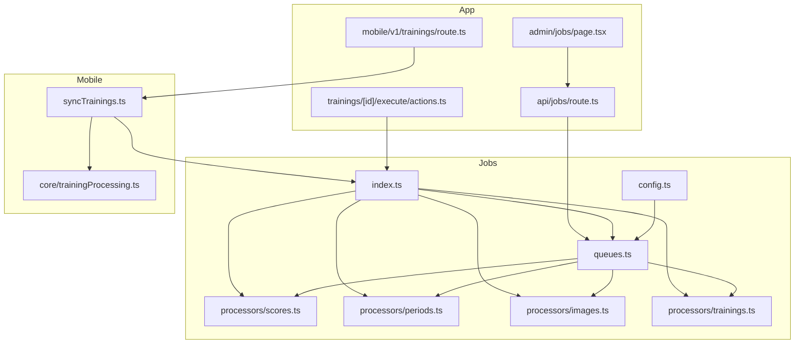
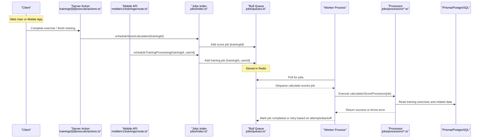
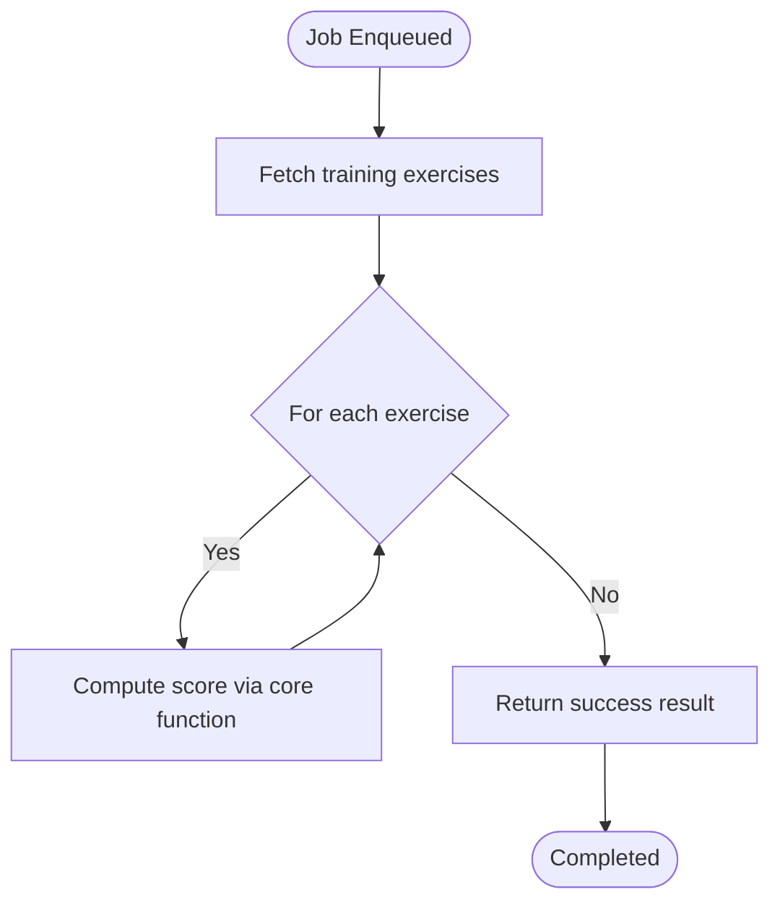
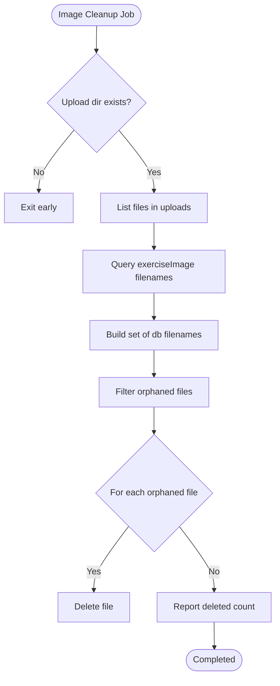
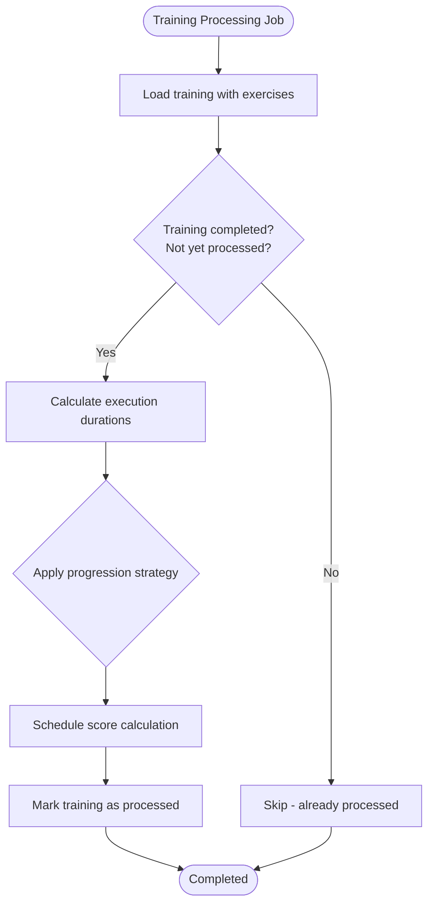
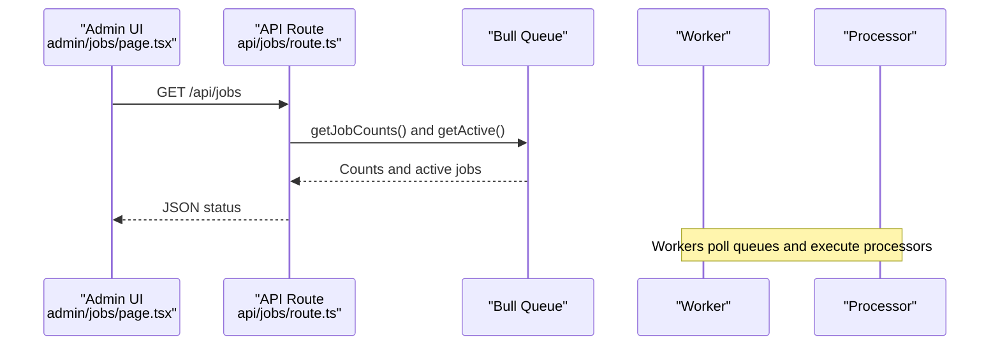
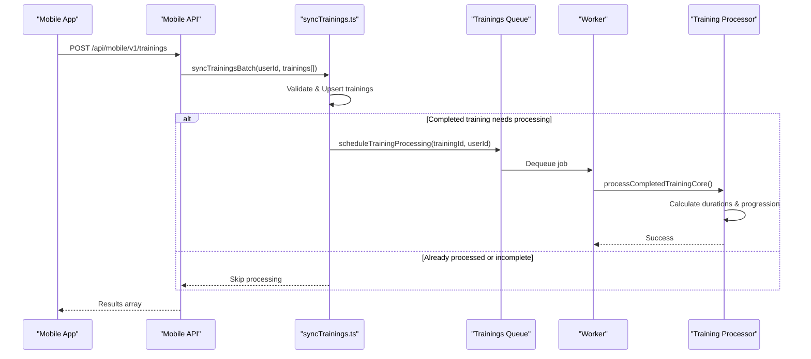
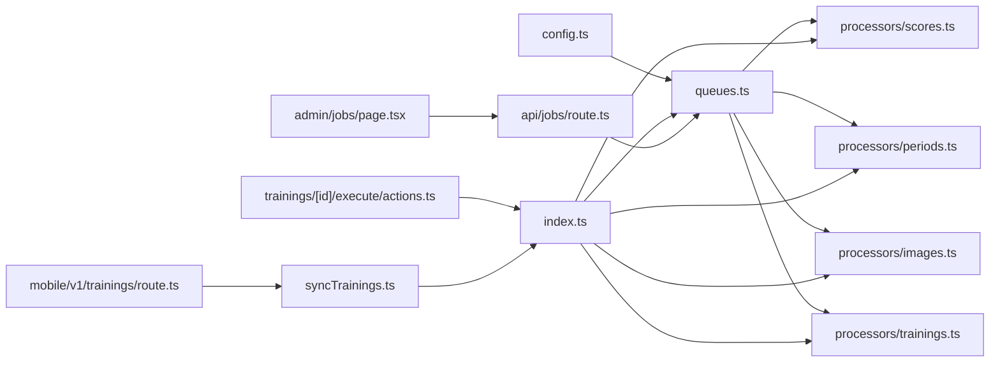

# Background Job System

<cite>
**Referenced Files in This Document**
- [src/jobs/index.ts](file://src/jobs/index.ts)
- [src/jobs/queues.ts](file://src/jobs/queues.ts)
- [src/jobs/config.ts](file://src/jobs/config.ts)
- [src/jobs/processors/scores.ts](file://src/jobs/processors/scores.ts)
- [src/jobs/processors/periods.ts](file://src/jobs/processors/periods.ts)
- [src/jobs/processors/images.ts](file://src/jobs/processors/images.ts)
- [src/jobs/processors/trainings.ts](file://src/jobs/processors/trainings.ts)
- [src/app/api/jobs/route.ts](file://src/app/api/jobs/route.ts)
- [src/app/admin/jobs/page.tsx](file://src/app/admin/jobs/page.tsx)
- [src/app/trainings/[id]/execute/actions.ts](file://src/app/trainings/[id]/execute/actions.ts)
- [src/mobile/syncTrainings.ts](file://src/mobile/syncTrainings.ts)
- [src/core/trainingProcessing.ts](file://src/core/trainingProcessing.ts)
- [src/app/api/mobile/v1/trainings/route.ts](file://src/app/api/mobile/v1/trainings/route.ts)
</cite>

## Update Summary
**Changes Made**
- Added new Training Processing Queue for mobile device synchronization
- Extended configuration with trainings queue and job names
- Created training processing processor following existing patterns
- Integrated mobile sync functionality with background job system
- Updated architecture diagrams to reflect new queue integration

## Table of Contents
1. [Introduction](#introduction)
2. [Project Structure](#project-structure)
3. [Core Components](#core-components)
4. [Architecture Overview](#architecture-overview)
5. [Detailed Component Analysis](#detailed-component-analysis)
6. [Mobile Training Sync Integration](#mobile-training-sync-integration)
7. [Dependency Analysis](#dependency-analysis)
8. [Performance Considerations](#performance-considerations)
9. [Troubleshooting Guide](#troubleshooting-guide)
10. [Conclusion](#conclusion)

## Introduction
This document explains the Bull queue architecture used for asynchronous processing in the application. It focuses on four queues:
- Scores: calculates scores after training exercises are completed.
- Periods: checks and ends inactive training periods on a daily schedule.
- Images: cleans up orphaned image files on a daily schedule.
- **Trainings**: processes completed training synchronization from mobile devices.

The system uses Redis as the message broker, Bull for queue management, and Prisma for database access. Jobs are scheduled from server actions and API routes, processed by background workers, and monitored via an admin dashboard and API endpoint.

## Project Structure
The background job system is implemented under src/jobs with clear separation of concerns:
- Configuration (Redis, queue names, job names, default options)
- Queue definitions and processor bindings
- Processors for each job type
- Entry point that initializes processors and schedules recurring jobs
- API and UI for monitoring

**Diagram sources**
- [src/jobs/config.ts:1-42](file://src/jobs/config.ts#L1-L42)
- [src/jobs/queues.ts:1-27](file://src/jobs/queues.ts#L1-L27)
- [src/jobs/index.ts:1-74](file://src/jobs/index.ts#L1-L74)
- [src/jobs/processors/scores.ts:1-37](file://src/jobs/processors/scores.ts#L1-L37)
- [src/jobs/processors/periods.ts:1-66](file://src/jobs/processors/periods.ts#L1-L66)
- [src/jobs/processors/images.ts:1-71](file://src/jobs/processors/images.ts#L1-L71)
- [src/jobs/processors/trainings.ts:1-29](file://src/jobs/processors/trainings.ts#L1-L29)
- [src/app/api/jobs/route.ts:1-51](file://src/app/api/jobs/route.ts#L1-L51)
- [src/app/admin/jobs/page.tsx:1-204](file://src/app/admin/jobs/page.tsx#L1-L204)
- [src/app/trainings/[id]/execute/actions.ts:279-285](file://src/app/trainings/[id]/execute/actions.ts#L279-L285)
- [src/mobile/syncTrainings.ts:1-237](file://src/mobile/syncTrainings.ts#L1-L237)
- [src/core/trainingProcessing.ts:1-186](file://src/core/trainingProcessing.ts#L1-L186)
- [src/app/api/mobile/v1/trainings/route.ts:1-103](file://src/app/api/mobile/v1/trainings/route.ts#L1-L103)

**Section sources**
- [src/jobs/config.ts:1-42](file://src/jobs/config.ts#L1-L42)
- [src/jobs/queues.ts:1-27](file://src/jobs/queues.ts#L1-L27)
- [src/jobs/index.ts:1-74](file://src/jobs/index.ts#L1-L74)

## Core Components
- Configuration: Centralizes Redis connection settings, queue names, job names, and default job options including retry attempts and exponential backoff.
- Queues: Defines four Bull queues (scores, periods, images, trainings), binds each job name to its processor, and connects to Redis using the shared configuration.
- Index: Initializes processors, exports queues, provides helper functions to schedule jobs, and sets up recurring jobs for period checks and image cleanup.
- Processors: Implement business logic for each job type, interact with Prisma, and handle errors and cleanup.

Key behaviors:
- Default job options include 3 attempts with exponential backoff and removal upon completion.
- Recurring jobs use cron expressions: midnight for period checks and 3 AM for image cleanup.
- Score calculation jobs are triggered on demand when training exercises are completed.
- **Training processing jobs are triggered when mobile trainings are synced and need processing.**

**Section sources**
- [src/jobs/config.ts:1-42](file://src/jobs/config.ts#L1-L42)
- [src/jobs/queues.ts:1-27](file://src/jobs/queues.ts#L1-L27)
- [src/jobs/index.ts:1-74](file://src/jobs/index.ts#L1-L74)

## Architecture Overview
The background job system integrates with the Next.js app through server actions and API routes. Workers run separately and consume jobs from Redis. Monitoring is available via an API endpoint and an admin page.

**Diagram sources**
- [src/app/trainings/[id]/execute/actions.ts:279-285](file://src/app/trainings/[id]/execute/actions.ts#L279-L285)
- [src/app/api/mobile/v1/trainings/route.ts:60-103](file://src/app/api/mobile/v1/trainings/route.ts#L60-L103)
- [src/jobs/index.ts:15-24](file://src/jobs/index.ts#L15-L24)
- [src/jobs/index.ts:64-73](file://src/jobs/index.ts#L64-L73)
- [src/jobs/queues.ts:8-26](file://src/jobs/queues.ts#L8-L26)
- [src/jobs/processors/scores.ts:1-37](file://src/jobs/processors/scores.ts#L1-L37)

## Detailed Component Analysis

### Scores Queue and Processor
Purpose:
- Calculate scores for all exercises within a training after completion events.

Flow:
- Server action triggers scheduling of a score calculation job with the training ID.
- The worker dequeues the job and executes the processor.
- The processor reads training exercises and computes scores using core logic.
- On success, returns a summary; on failure, throws an error to trigger retries.

Retry strategy:
- Uses default job options: 3 attempts with exponential backoff.

**Diagram sources**
- [src/jobs/processors/scores.ts:1-37](file://src/jobs/processors/scores.ts#L1-L37)
- [src/jobs/index.ts:15-24](file://src/jobs/index.ts#L15-L24)

**Section sources**
- [src/jobs/processors/scores.ts:1-37](file://src/jobs/processors/scores.ts#L1-L37)
- [src/jobs/index.ts:15-24](file://src/jobs/index.ts#L15-L24)

### Periods Queue and Processor
Purpose:
- Check current training periods and end those inactive for more than a week.

Flow:
- Scheduled daily at midnight via cron.
- Processor finds all current periods and their most recent completed training.
- If no completed training exists or it is older than one week, the period is ended.
- Returns a summary of ended periods.

**Diagram sources**
- [src/jobs/processors/periods.ts:1-66](file://src/jobs/processors/periods.ts#L1-L66)
- [src/jobs/index.ts:26-40](file://src/jobs/index.ts#L26-L40)

**Section sources**
- [src/jobs/processors/periods.ts:1-66](file://src/jobs/processors/periods.ts#L1-L66)
- [src/jobs/index.ts:26-40](file://src/jobs/index.ts#L26-L40)

### Images Queue and Processor
Purpose:
- Clean up orphaned image files stored under public/uploads that are not referenced in the database.

Flow:
- Scheduled daily at 3 AM via cron.
- Processor lists files in the uploads directory and compares against filenames stored in the database.
- Deletes files not found in the database and reports counts.

**Diagram sources**
- [src/jobs/processors/images.ts:1-71](file://src/jobs/processors/images.ts#L1-L71)
- [src/jobs/index.ts:42-56](file://src/jobs/index.ts#L42-L56)

**Section sources**
- [src/jobs/processors/images.ts:1-71](file://src/jobs/processors/images.ts#L1-L71)
- [src/jobs/index.ts:42-56](file://src/jobs/index.ts#L42-L56)

### Trainings Queue and Processor
Purpose:
- Process completed training synchronization from mobile devices, calculating durations, progression strategies, and scheduling score calculations.

Flow:
- Mobile API receives batch sync requests and validates JWT authentication.
- For each completed training without prior processing, enqueues a training processing job.
- Worker dequeues the job and executes the training processing processor.
- Processor calculates execution durations, applies progression strategies, and schedules score calculations.
- Marks training as processed to prevent duplicate processing.

**Diagram sources**
- [src/jobs/processors/trainings.ts:10-28](file://src/jobs/processors/trainings.ts#L10-L28)
- [src/core/trainingProcessing.ts:30-186](file://src/core/trainingProcessing.ts#L30-L186)

**Section sources**
- [src/jobs/processors/trainings.ts:1-29](file://src/jobs/processors/trainings.ts#L1-L29)
- [src/jobs/index.ts:64-73](file://src/jobs/index.ts#L64-L73)

### Scheduling and Integration Points
- Score calculation is scheduled from the training execution flow when exercises are finalized.
- Training processing is scheduled from mobile sync operations when completed trainings are received.
- Period checks and image cleanup are scheduled once at startup and repeated daily via cron.
- Monitoring endpoints expose queue statistics and active jobs.

**Diagram sources**
- [src/app/admin/jobs/page.tsx:1-204](file://src/app/admin/jobs/page.tsx#L1-L204)
- [src/app/api/jobs/route.ts:1-51](file://src/app/api/jobs/route.ts#L1-L51)

**Section sources**
- [src/app/trainings/[id]/execute/actions.ts:279-285](file://src/app/trainings/[id]/execute/actions.ts#L279-L285)
- [src/app/api/jobs/route.ts:1-51](file://src/app/api/jobs/route.ts#L1-L51)
- [src/app/admin/jobs/page.tsx:1-204](file://src/app/admin/jobs/page.tsx#L1-L204)

## Mobile Training Sync Integration
The background job system now supports mobile device synchronization through a dedicated training processing queue.

### Mobile Sync Flow
1. **Authentication**: Mobile apps authenticate using JWT tokens via the `/api/mobile/v1/trainings` endpoint.
2. **Batch Processing**: Accepts arrays of completed trainings (max 20 per request).
3. **Upsert Logic**: Creates or updates trainings by `(userId, externalId)` composite key.
4. **Background Processing**: Enqueues training processing jobs for completed trainings that haven't been processed yet.

### Key Features
- **Idempotent Processing**: Uses `processedAt` field to prevent duplicate processing.
- **Batch Validation**: Enforces maximum batch size limits for performance.
- **Transaction Safety**: All database operations wrapped in transactions.
- **Error Handling**: Individual training failures don't affect batch processing.

**Diagram sources**
- [src/app/api/mobile/v1/trainings/route.ts:60-103](file://src/app/api/mobile/v1/trainings/route.ts#L60-L103)
- [src/mobile/syncTrainings.ts:66-237](file://src/mobile/syncTrainings.ts#L66-L237)
- [src/jobs/index.ts:64-73](file://src/jobs/index.ts#L64-L73)
- [src/jobs/processors/trainings.ts:10-28](file://src/jobs/processors/trainings.ts#L10-L28)
- [src/core/trainingProcessing.ts:30-186](file://src/core/trainingProcessing.ts#L30-L186)

**Section sources**
- [src/app/api/mobile/v1/trainings/route.ts:60-103](file://src/app/api/mobile/v1/trainings/route.ts#L60-L103)
- [src/mobile/syncTrainings.ts:1-237](file://src/mobile/syncTrainings.ts#L1-L237)
- [src/jobs/index.ts:64-73](file://src/jobs/index.ts#L64-L73)

## Dependency Analysis
The job system has clear boundaries and minimal coupling:
- Config centralizes environment-dependent settings and constants.
- Queues depend on config and bind processors to job names.
- Index imports processors and exposes helpers for scheduling.
- Processors depend on Prisma and core business logic modules.
- App components integrate by calling index helpers and querying the API.

**Diagram sources**
- [src/jobs/config.ts:1-42](file://src/jobs/config.ts#L1-L42)
- [src/jobs/queues.ts:1-27](file://src/jobs/queues.ts#L1-L27)
- [src/jobs/index.ts:1-74](file://src/jobs/index.ts#L1-L74)
- [src/jobs/processors/scores.ts:1-37](file://src/jobs/processors/scores.ts#L1-L37)
- [src/jobs/processors/periods.ts:1-66](file://src/jobs/processors/periods.ts#L1-L66)
- [src/jobs/processors/images.ts:1-71](file://src/jobs/processors/images.ts#L1-L71)
- [src/jobs/processors/trainings.ts:1-29](file://src/jobs/processors/trainings.ts#L1-L29)
- [src/app/trainings/[id]/execute/actions.ts:279-285](file://src/app/trainings/[id]/execute/actions.ts#L279-L285)
- [src/app/api/mobile/v1/trainings/route.ts:60-103](file://src/app/api/mobile/v1/trainings/route.ts#L60-L103)
- [src/mobile/syncTrainings.ts:1-237](file://src/mobile/syncTrainings.ts#L1-L237)
- [src/app/api/jobs/route.ts:1-51](file://src/app/api/jobs/route.ts#L1-L51)
- [src/app/admin/jobs/page.tsx:1-204](file://src/app/admin/jobs/page.tsx#L1-L204)

**Section sources**
- [src/jobs/config.ts:1-42](file://src/jobs/config.ts#L1-L42)
- [src/jobs/queues.ts:1-27](file://src/jobs/queues.ts#L1-L27)
- [src/jobs/index.ts:1-74](file://src/jobs/index.ts#L1-L74)

## Performance Considerations
- Use separate worker processes for job execution to avoid blocking the main application thread.
- Keep jobs idempotent and small; process only necessary data per job.
- Leverage exponential backoff to handle transient failures gracefully.
- Monitor queue lengths and active jobs to detect bottlenecks.
- Ensure database connections are properly managed within processors to avoid leaks.
- **Mobile sync batches are limited to 20 trainings per request to maintain performance.**
- **Training processing uses transaction isolation to ensure data consistency during bulk operations.**

## Troubleshooting Guide
Common issues and resolutions:
- Redis connectivity problems: Verify REDIS_HOST and REDIS_PORT environment variables and ensure Redis is running.
- Jobs not executing: Confirm workers are started and listening to the correct queues.
- Frequent retries: Inspect processor logs for errors; check database queries and external dependencies.
- Orphaned images not cleaned: Validate filesystem permissions and upload directory path.
- Monitoring gaps: Ensure the API route is accessible and the admin page can fetch status.
- **Mobile sync failures: Check JWT token validity and verify mobile app authentication setup.**
- **Training processing duplicates: Verify `processedAt` field is being set correctly and unique constraints are enforced.**

Operational tips:
- Use the admin dashboard to refresh queue stats and view active jobs.
- Review job return values and stack traces to diagnose failures.
- Adjust retry strategies if specific jobs require different backoff behavior.
- **Monitor mobile sync batch sizes and adjust MAX_BATCH_SIZE if needed for your deployment scale.**

**Section sources**
- [src/app/api/jobs/route.ts:1-51](file://src/app/api/jobs/route.ts#L1-L51)
- [src/app/admin/jobs/page.tsx:1-204](file://src/app/admin/jobs/page.tsx#L1-L204)
- [src/app/api/mobile/v1/trainings/route.ts:60-103](file://src/app/api/mobile/v1/trainings/route.ts#L60-L103)
- [src/mobile/syncTrainings.ts:64-64](file://src/mobile/syncTrainings.ts#L64-L64)

## Conclusion
The Bull-based background job system provides robust asynchronous processing for scoring, period management, image cleanup, and now mobile training synchronization. With centralized configuration, clear queue definitions, and dedicated processors, the system scales well and remains maintainable. The addition of the training processing queue enables seamless mobile device integration while maintaining the same reliability and performance characteristics as existing queues. Monitoring via API and admin UI ensures visibility into job health and performance across all four queue types.