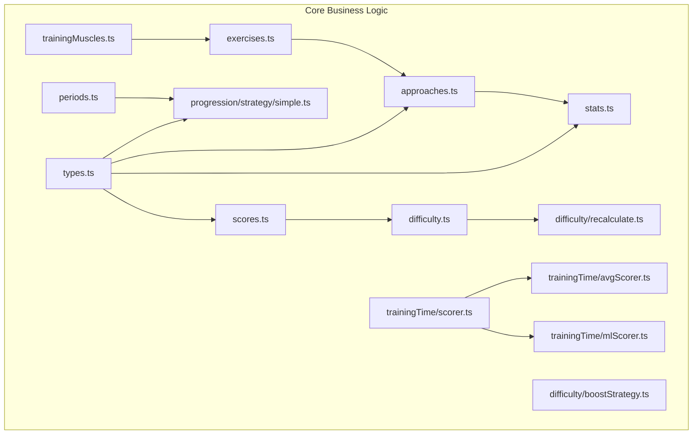
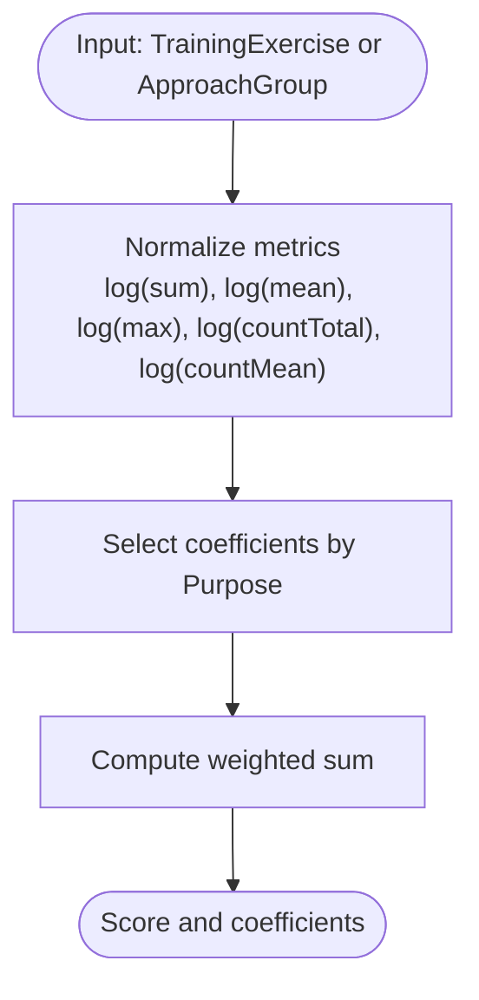
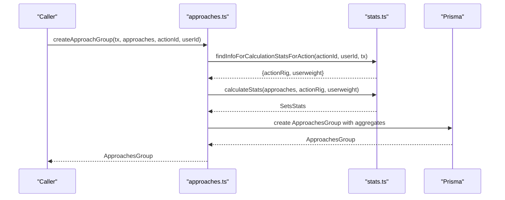
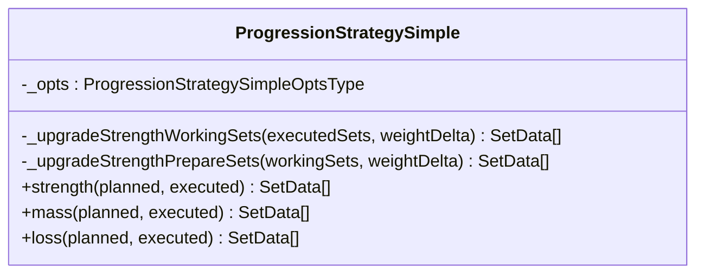
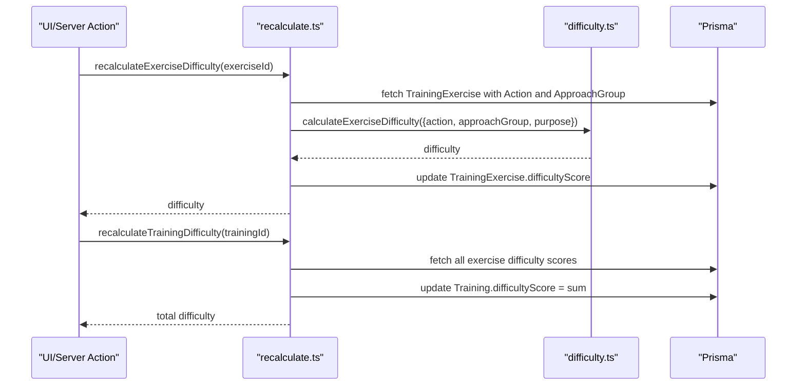
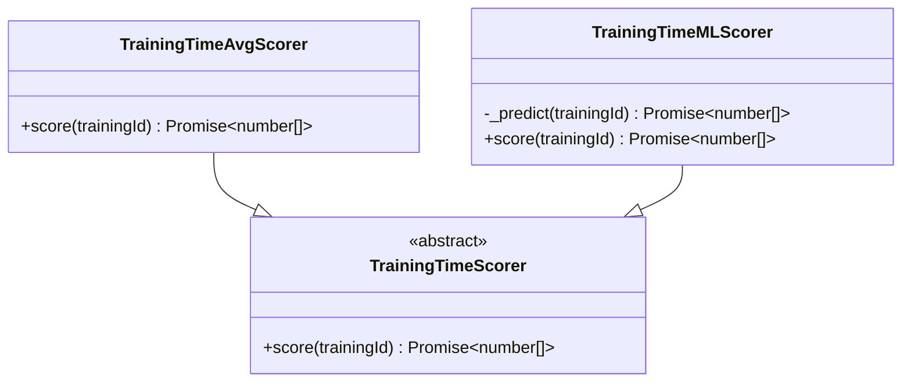
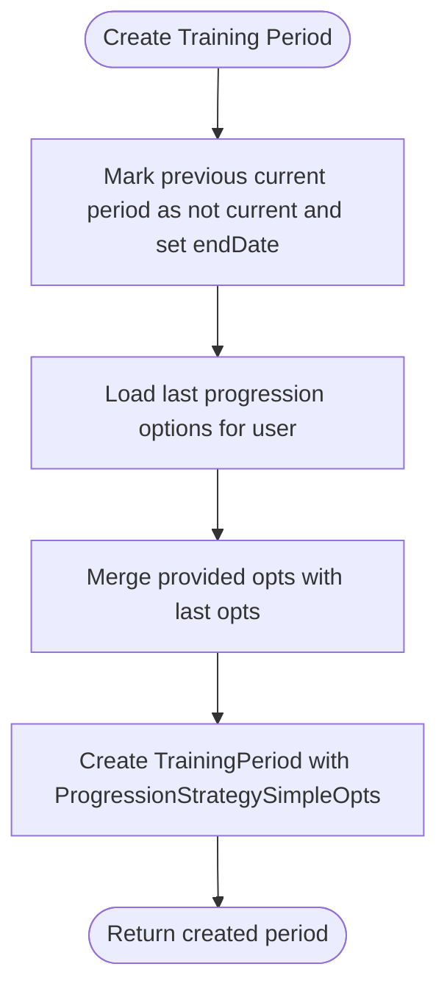
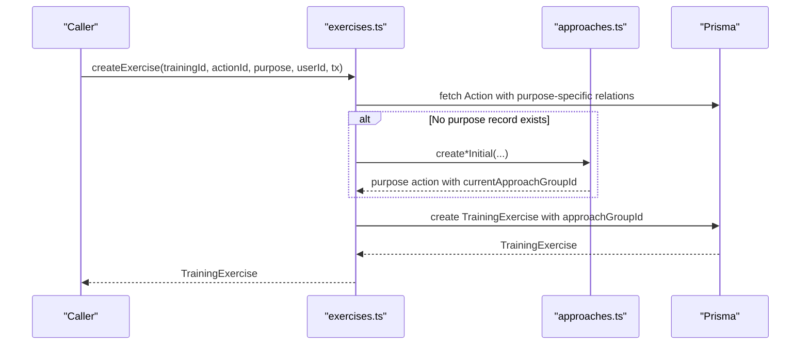
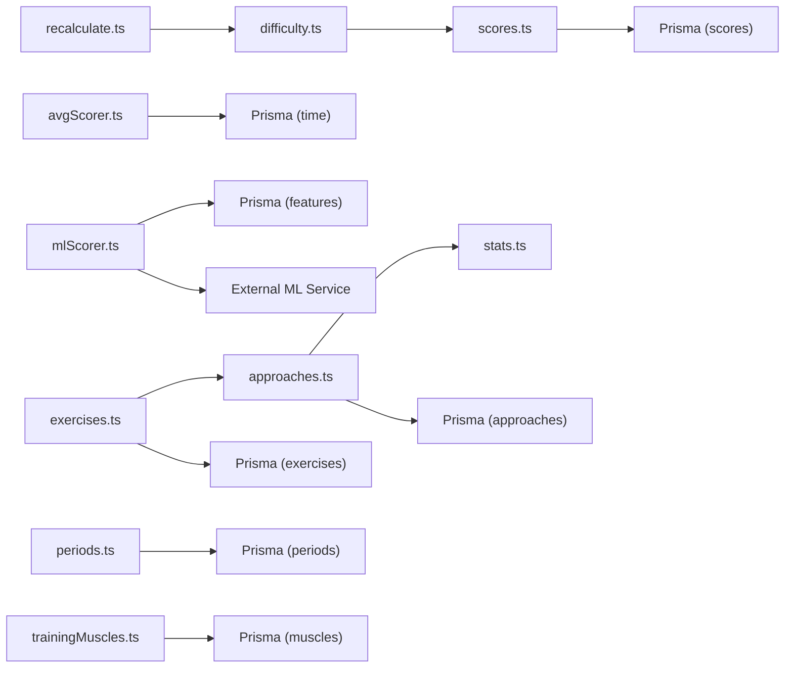

# Core Business Logic

<cite>
**Referenced Files in This Document**
- [scores.ts](file://src/core/scores.ts)
- [approaches.ts](file://src/core/approaches.ts)
- [stats.ts](file://src/core/stats.ts)
- [types.ts](file://src/core/types.ts)
- [simple.ts](file://src/core/progression/strategy/simple.ts)
- [difficulty.ts](file://src/core/difficulty.ts)
- [recalculate.ts](file://src/core/difficulty/recalculate.ts)
- [boostStrategy.ts](file://src/core/difficulty/boostStrategy.ts)
- [scorer.ts](file://src/core/trainingTime/scorer.ts)
- [avgScorer.ts](file://src/core/trainingTime/avgScorer.ts)
- [mlScorer.ts](file://src/core/trainingTime/mlScorer.ts)
- [periods.ts](file://src/core/periods.ts)
- [exercises.ts](file://src/core/exercises.ts)
- [trainingMuscles.ts](file://src/core/trainingMuscles.ts)
</cite>

## Table of Contents
1. [Introduction](#introduction)
2. [Project Structure](#project-structure)
3. [Core Components](#core-components)
4. [Architecture Overview](#architecture-overview)
5. [Detailed Component Analysis](#detailed-component-analysis)
6. [Dependency Analysis](#dependency-analysis)
7. [Performance Considerations](#performance-considerations)
8. [Troubleshooting Guide](#troubleshooting-guide)
9. [Conclusion](#conclusion)

## Introduction
This document explains the pure business logic layer in src/core/, focusing on:
- Scoring normalization and purpose-driven scoring coefficients (STRENGTH, MASS, LOSS)
- Progression strategies for STRENGTH, MASS, and LOSS with a simple strategy class
- Statistics computation for approach groups and training muscle involvement
- Training time scoring via average-based and ML-based scorers
- Periodization management and how progression options are tracked per period

The core modules are intentionally pure TypeScript with minimal external dependencies, making them easy to understand, test, and reuse across the application.

## Project Structure
The core business logic is organized by concern:
- scores.ts: Normalization and scoring per purpose
- approaches.ts: Approach group creation and linking per purpose
- stats.ts: Aggregation of set-level data into approach group statistics
- types.ts: Shared type definitions used across core modules
- progression/strategy/simple.ts: Simple progression strategy implementation
- difficulty.ts and difficulty/*: Difficulty calculation and recalculation utilities
- trainingTime/*: Training time scoring abstractions and implementations
- periods.ts: Training period lifecycle and progression option persistence
- exercises.ts: Exercise creation with purpose-specific initialization
- trainingMuscles.ts: Muscle involvement statistics for a training session



**Diagram sources**
- [scores.ts:1-122](file://src/core/scores.ts#L1-L122)
- [approaches.ts:1-189](file://src/core/approaches.ts#L1-L189)
- [stats.ts:1-83](file://src/core/stats.ts#L1-L83)
- [types.ts:1-20](file://src/core/types.ts#L1-L20)
- [simple.ts:1-267](file://src/core/progression/strategy/simple.ts#L1-L267)
- [difficulty.ts:1-23](file://src/core/difficulty.ts#L1-L23)
- [recalculate.ts:1-63](file://src/core/difficulty/recalculate.ts#L1-L63)
- [boostStrategy.ts:1-13](file://src/core/difficulty/boostStrategy.ts#L1-L13)
- [scorer.ts:1-9](file://src/core/trainingTime/scorer.ts#L1-L9)
- [avgScorer.ts:1-47](file://src/core/trainingTime/avgScorer.ts#L1-L47)
- [mlScorer.ts:1-87](file://src/core/trainingTime/mlScorer.ts#L1-L87)
- [periods.ts:1-191](file://src/core/periods.ts#L1-L191)
- [exercises.ts:1-153](file://src/core/exercises.ts#L1-L153)
- [trainingMuscles.ts:1-145](file://src/core/trainingMuscles.ts#L1-L145)

**Section sources**
- [scores.ts:1-122](file://src/core/scores.ts#L1-L122)
- [approaches.ts:1-189](file://src/core/approaches.ts#L1-L189)
- [stats.ts:1-83](file://src/core/stats.ts#L1-L83)
- [types.ts:1-20](file://src/core/types.ts#L1-L20)
- [simple.ts:1-267](file://src/core/progression/strategy/simple.ts#L1-L267)
- [difficulty.ts:1-23](file://src/core/difficulty.ts#L1-L23)
- [recalculate.ts:1-63](file://src/core/difficulty/recalculate.ts#L1-L63)
- [boostStrategy.ts:1-13](file://src/core/difficulty/boostStrategy.ts#L1-L13)
- [scorer.ts:1-9](file://src/core/trainingTime/scorer.ts#L1-L9)
- [avgScorer.ts:1-47](file://src/core/trainingTime/avgScorer.ts#L1-L47)
- [mlScorer.ts:1-87](file://src/core/trainingTime/mlScorer.ts#L1-L87)
- [periods.ts:1-191](file://src/core/periods.ts#L1-L191)
- [exercises.ts:1-153](file://src/core/exercises.ts#L1-L153)
- [trainingMuscles.ts:1-145](file://src/core/trainingMuscles.ts#L1-L145)

## Core Components
- Scoring normalization and purpose-driven coefficients:
  - Log-normalizes key metrics (sum, mean, max, total count, mean count)
  - Applies purpose-specific weights to compute a single score
  - Provides preview scoring using aggregated approach group data before execution
- Approach group statistics:
  - Computes aggregate stats from sets (length, sum, mean, max, counts)
  - Handles different rigs (e.g., OTHER uses user weight)
- Progression strategy:
  - Simple strategy class with methods for strength, mass, and loss
  - Adjusts sets based on executed performance and configuration
- Difficulty calculation:
  - Combines action base difficulty with preview score
  - Supports recalculation at exercise and training levels
- Training time scoring:
  - Abstract scorer interface with average-based and ML-based implementations
- Periodization:
  - Create/end/get current periods with associated progression options
- Exercises and muscles:
  - Purpose-aware exercise creation with default approach groups
  - Recompute muscle involvement stats per training session

**Section sources**
- [scores.ts:1-122](file://src/core/scores.ts#L1-L122)
- [approaches.ts:1-189](file://src/core/approaches.ts#L1-L189)
- [stats.ts:1-83](file://src/core/stats.ts#L1-L83)
- [simple.ts:1-267](file://src/core/progression/strategy/simple.ts#L1-L267)
- [difficulty.ts:1-23](file://src/core/difficulty.ts#L1-L23)
- [recalculate.ts:1-63](file://src/core/difficulty/recalculate.ts#L1-L63)
- [scorer.ts:1-9](file://src/core/trainingTime/scorer.ts#L1-L9)
- [avgScorer.ts:1-47](file://src/core/trainingTime/avgScorer.ts#L1-L47)
- [mlScorer.ts:1-87](file://src/core/trainingTime/mlScorer.ts#L1-L87)
- [periods.ts:1-191](file://src/core/periods.ts#L1-L191)
- [exercises.ts:1-153](file://src/core/exercises.ts#L1-L153)
- [trainingMuscles.ts:1-145](file://src/core/trainingMuscles.ts#L1-L145)

## Architecture Overview
The core layer is composed of cohesive modules that interact through well-defined interfaces and shared types. The following diagram maps the primary relationships between scoring, progression, difficulty, and time scoring components.

```mermaid
classDiagram
class Scores {
+normLogFn(val) number
+norm(item) ActionHistoryDataNormalized
+scoreNormalized(purpose, data) {score, coefficients}
+createScore(exercise) Promise~TrainingExerciseScore~
+previewScore(purpose, approachGroup) number
}
class Stats {
+calculateStats(setsData, actionRig, userWeight) SetsStats
+findInfoForCalculationStatsForAction(actionId, userId, tx) InfoForCalculatingStats
}
class Approaches {
+createApproachGroup(tx, approaches, actionId, userId) ApproachesGroup
+linkNewApproachGroupToActionByPurpose(tx, purpose, actionByPurposeId, newGroup) void
+createMassInitial(userId, actionId, actionRig, bigCount, tx) ActionMass
+createStrengthInitial(userId, actionId, allowed, tx) ActionStrength
+createLossInitial(userId, actionId, actionRig, bigCount, tx) ActionLoss
}
class ProgressionStrategySimple {
+strength(planned, executed) SetData[]
+mass(planned, executed) SetData[]
+loss(planned, executed) SetData[]
}
class Difficulty {
+calculateExerciseDifficulty(input) number
+calculateTrainingDifficulty(exercises) number
}
class Recalculate {
+recalculateExerciseDifficulty(exerciseId) Promise~number~
+recalculateTrainingDifficulty(trainingId) Promise~number~
+recalculateExerciseAndTrainingDifficulty(exerciseId, trainingId) Promise~{exerciseDifficulty, trainingDifficulty}~
}
class TrainingTimeScorer {
<<abstract>>
+score(trainingId) Promise~number[]~
}
class AvgScorer {
+score(trainingId) Promise~number[]~
}
class MLScorer {
+score(trainingId) Promise~number[]~
}
class Periods {
+createTrainingPeriod(userId, opts) TrainingPeriod
+endCurrentTrainingPeriod(userId) TrainingPeriod|null
+getCurrentTrainingPeriod(userId) TrainingPeriod|null
+getCurrentTrainingPeriodWithOptions(userId) {currentPeriod, progressionOpts}
+getUserTrainingPeriods(userId) TrainingPeriod[]
+updateProgressionStrategySimpleOpts(id, opts) void
}
class Exercises {
+createExercise(trainingId, actionId, purpose, userId, tx) TrainingExercise
}
class TrainingMuscles {
+recomputeTrainingMuscleStats(trainingId, tx) void
+fetchTrainingMuscleStats(trainingId) any[]
}
Scores --> Stats : "uses"
Approaches --> Stats : "uses"
Difficulty --> Scores : "uses previewScore"
Recalculate --> Difficulty : "uses"
AvgScorer --|> TrainingTimeScorer
MLScorer --|> TrainingTimeScorer
Periods --> ProgressionStrategySimple : "uses defaults"
Exercises --> Approaches : "creates initial groups"
TrainingMuscles --> Exercises : "relies on actions/muscles"
```

**Diagram sources**
- [scores.ts:1-122](file://src/core/scores.ts#L1-L122)
- [stats.ts:1-83](file://src/core/stats.ts#L1-L83)
- [approaches.ts:1-189](file://src/core/approaches.ts#L1-L189)
- [simple.ts:1-267](file://src/core/progression/strategy/simple.ts#L1-L267)
- [difficulty.ts:1-23](file://src/core/difficulty.ts#L1-L23)
- [recalculate.ts:1-63](file://src/core/difficulty/recalculate.ts#L1-L63)
- [scorer.ts:1-9](file://src/core/trainingTime/scorer.ts#L1-L9)
- [avgScorer.ts:1-47](file://src/core/trainingTime/avgScorer.ts#L1-L47)
- [mlScorer.ts:1-87](file://src/core/trainingTime/mlScorer.ts#L1-L87)
- [periods.ts:1-191](file://src/core/periods.ts#L1-L191)
- [exercises.ts:1-153](file://src/core/exercises.ts#L1-L153)
- [trainingMuscles.ts:1-145](file://src/core/trainingMuscles.ts#L1-L145)

## Detailed Component Analysis

### Scoring Normalization and Purpose Coefficients
- Normalization applies a logarithmic transform to raw metrics to stabilize variance and handle scale differences.
- Purpose-specific coefficients define how each metric contributes to the final score:
  - STRENGTH emphasizes maximum and sum, penalizes excessive mean reps
  - MASS emphasizes mean and count metrics, adds small max contribution
  - LOSS emphasizes total and mean counts, includes max as a secondary factor
- Preview scoring allows estimating difficulty or expected score before execution using aggregated approach group data.



**Diagram sources**
- [scores.ts:24-51](file://src/core/scores.ts#L24-L51)
- [scores.ts:53-78](file://src/core/scores.ts#L53-L78)
- [scores.ts:108-121](file://src/core/scores.ts#L108-L121)

**Section sources**
- [scores.ts:1-122](file://src/core/scores.ts#L1-L122)

### Approach Groups and Statistics Computation
- Approach groups aggregate planned or executed sets into meaningful statistics:
  - Length (number of sets)
  - Weight sum, mean, max
  - Total and mean rep counts
- For rigs like OTHER, actual weight equals user bodyweight plus set weight offset.
- Default approach templates exist for STRENGTH, MASS, and LOSS purposes.



**Diagram sources**
- [approaches.ts:41-68](file://src/core/approaches.ts#L41-L68)
- [stats.ts:31-49](file://src/core/stats.ts#L31-L49)
- [stats.ts:51-82](file://src/core/stats.ts#L51-L82)

**Section sources**
- [approaches.ts:1-189](file://src/core/approaches.ts#L1-L189)
- [stats.ts:1-83](file://src/core/stats.ts#L1-L83)
- [types.ts:1-20](file://src/core/types.ts#L1-L20)

### Progression Strategy (Simple)
- Strength:
  - Builds working and preparing sets based on last successful sets
  - Increases weight or reps depending on performance; ensures last set targets 1 rep
  - Adjusts for one-dumbbell constraints (even counts)
- Mass:
  - Iterates through planned sets, increases weight when rep thresholds are met
  - Optionally adds a drop set at lower weight with higher reps
  - Adjusts for big-count mode and one-dumbbell constraints
- Loss:
  - Increases mean reps per set until reaching a cap; may add extra sets
  - Caps total sets and adjusts weight incrementally if exceeded
  - Ensures even counts for one-dumbbell



**Diagram sources**
- [simple.ts:52-158](file://src/core/progression/strategy/simple.ts#L52-L158)
- [simple.ts:160-223](file://src/core/progression/strategy/simple.ts#L160-L223)
- [simple.ts:225-266](file://src/core/progression/strategy/simple.ts#L225-L266)

**Section sources**
- [simple.ts:1-267](file://src/core/progression/strategy/simple.ts#L1-L267)

### Difficulty Calculation and Recalculation
- Exercise difficulty combines action base difficulty with preview score derived from approach group aggregates.
- Training difficulty sums individual exercise difficulties.
- Recalculation functions update database fields for both exercise and training difficulty.



**Diagram sources**
- [difficulty.ts:10-22](file://src/core/difficulty.ts#L10-L22)
- [recalculate.ts:10-31](file://src/core/difficulty/recalculate.ts#L10-L31)
- [recalculate.ts:36-50](file://src/core/difficulty/recalculate.ts#L36-L50)

**Section sources**
- [difficulty.ts:1-23](file://src/core/difficulty.ts#L1-23)
- [recalculate.ts:1-63](file://src/core/difficulty/recalculate.ts#L1-63)
- [boostStrategy.ts:1-13](file://src/core/difficulty/boostStrategy.ts#L1-L13)

### Training Time Scoring
- Abstract scorer defines a common interface for scoring training duration.
- Average scorer estimates time per exercise based on purpose-specific minutes per set and number of approaches.
- ML scorer queries training features and calls an external model service to predict durations.



**Diagram sources**
- [scorer.ts:1-9](file://src/core/trainingTime/scorer.ts#L1-L9)
- [avgScorer.ts:11-46](file://src/core/trainingTime/avgScorer.ts#L11-L46)
- [mlScorer.ts:42-86](file://src/core/trainingTime/mlScorer.ts#L42-L86)

**Section sources**
- [scorer.ts:1-9](file://src/core/trainingTime/scorer.ts#L1-L9)
- [avgScorer.ts:1-47](file://src/core/trainingTime/avgScorer.ts#L1-47)
- [mlScorer.ts:1-87](file://src/core/trainingTime/mlScorer.ts#L1-L87)

### Periodization and Progression Options
- Creates a new training period, marking previous current period as ended.
- Persists progression options for the simple strategy within the period.
- Retrieves current period and its progression options, or lists all periods for a user.
- Updates progression options for existing records.



**Diagram sources**
- [periods.ts:38-80](file://src/core/periods.ts#L38-L80)
- [periods.ts:88-111](file://src/core/periods.ts#L88-L111)
- [periods.ts:119-128](file://src/core/periods.ts#L119-L128)
- [periods.ts:136-161](file://src/core/periods.ts#L136-L161)
- [periods.ts:169-180](file://src/core/periods.ts#L169-L180)
- [periods.ts:182-191](file://src/core/periods.ts#L182-L191)

**Section sources**
- [periods.ts:1-191](file://src/core/periods.ts#L1-L191)

### Exercises and Muscle Involvement
- Exercise creation validates purpose compatibility and initializes purpose-specific action records with default approach groups.
- Muscle stats recompute counts for agonist, synergist, and stabilizer roles across exercises in a training session.
- Fetching muscle stats returns enriched data including muscle titles and group titles, sorted by usage and role priority.



**Diagram sources**
- [exercises.ts:43-152](file://src/core/exercises.ts#L43-L152)
- [approaches.ts:104-188](file://src/core/approaches.ts#L104-L188)

**Section sources**
- [exercises.ts:1-153](file://src/core/exercises.ts#L1-L153)
- [trainingMuscles.ts:1-145](file://src/core/trainingMuscles.ts#L1-L145)

## Dependency Analysis
- scores.ts depends on Prisma for creating TrainingExerciseScore records and uses shared types.
- approaches.ts relies on stats.ts for computing aggregates and Prisma for persistence.
- difficulty.ts uses scores.ts preview scoring; recalculate.ts orchestrates updates.
- trainingTime scorers depend on Prisma and, for ML, an external HTTP endpoint.
- periods.ts integrates progression options and Prisma for lifecycle management.
- exercises.ts coordinates purpose-specific initialization via approaches.ts.
- trainingMuscles.ts reads action-muscle relationships and persists aggregated stats.



**Diagram sources**
- [scores.ts:1-122](file://src/core/scores.ts#L1-L122)
- [approaches.ts:1-189](file://src/core/approaches.ts#L1-L189)
- [stats.ts:1-83](file://src/core/stats.ts#L1-L83)
- [difficulty.ts:1-23](file://src/core/difficulty.ts#L1-L23)
- [recalculate.ts:1-63](file://src/core/difficulty/recalculate.ts#L1-L63)
- [avgScorer.ts:1-47](file://src/core/trainingTime/avgScorer.ts#L1-L47)
- [mlScorer.ts:1-87](file://src/core/trainingTime/mlScorer.ts#L1-L87)
- [periods.ts:1-191](file://src/core/periods.ts#L1-L191)
- [exercises.ts:1-153](file://src/core/exercises.ts#L1-L153)
- [trainingMuscles.ts:1-145](file://src/core/trainingMuscles.ts#L1-L145)

**Section sources**
- [scores.ts:1-122](file://src/core/scores.ts#L1-L122)
- [approaches.ts:1-189](file://src/core/approaches.ts#L1-L189)
- [stats.ts:1-83](file://src/core/stats.ts#L1-L83)
- [difficulty.ts:1-23](file://src/core/difficulty.ts#L1-L23)
- [recalculate.ts:1-63](file://src/core/difficulty/recalculate.ts#L1-L63)
- [avgScorer.ts:1-47](file://src/core/trainingTime/avgScorer.ts#L1-L47)
- [mlScorer.ts:1-87](file://src/core/trainingTime/mlScorer.ts#L1-L87)
- [periods.ts:1-191](file://src/core/periods.ts#L1-L191)
- [exercises.ts:1-153](file://src/core/exercises.ts#L1-L153)
- [trainingMuscles.ts:1-145](file://src/core/trainingMuscles.ts#L1-L145)

## Performance Considerations
- Log normalization reduces sensitivity to outliers and stabilizes gradients for scoring.
- Approach group aggregation computes O(n) over sets; ensure efficient input sizes.
- ML scorer performs network I/O; consider caching or fallback to average scorer on failure.
- Recalculation functions batch updates where possible to minimize round trips.
- Muscle stats recomputation runs only when training has not started; avoid redundant work.

[No sources needed since this section provides general guidance]

## Troubleshooting Guide
- If preview scoring yields unexpected values, verify approach group aggregates and rig handling (OTHER uses user weight).
- When difficulty recalculation fails, check that action base and approach group data exist for the exercise.
- For training time scoring errors, ensure the ML service is reachable and responding with predictions; otherwise, rely on average scorer results.
- If muscle stats are missing, confirm that exercises have valid action-muscle relationships and that the training has not started.

**Section sources**
- [scores.ts:108-121](file://src/core/scores.ts#L108-L121)
- [stats.ts:31-49](file://src/core/stats.ts#L31-L49)
- [recalculate.ts:10-31](file://src/core/difficulty/recalculate.ts#L10-L31)
- [mlScorer.ts:64-86](file://src/core/trainingTime/mlScorer.ts#L64-L86)
- [trainingMuscles.ts:4-16](file://src/core/trainingMuscles.ts#L4-L16)

## Conclusion
The core business logic layer encapsulates essential workout analytics and planning capabilities:
- Purpose-driven scoring normalizes diverse metrics into comparable scores
- Simple progression strategies adapt load intelligently based on performance
- Difficulty calculations combine movement complexity with execution potential
- Training time scorers provide both heuristic and ML-based estimates
- Periodization tracks progression options and lifecycle state
- Muscle involvement statistics support targeted analysis and visualization

These modules are designed for clarity, testability, and extensibility, enabling robust workout tracking and progressive overload across STRENGTH, MASS, and LOSS goals.

[No sources needed since this section summarizes without analyzing specific files]