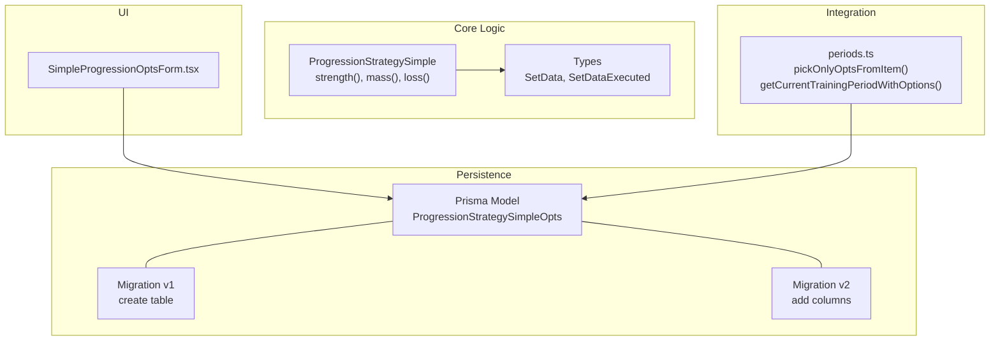
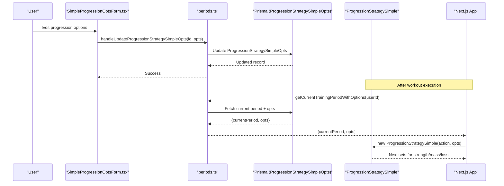
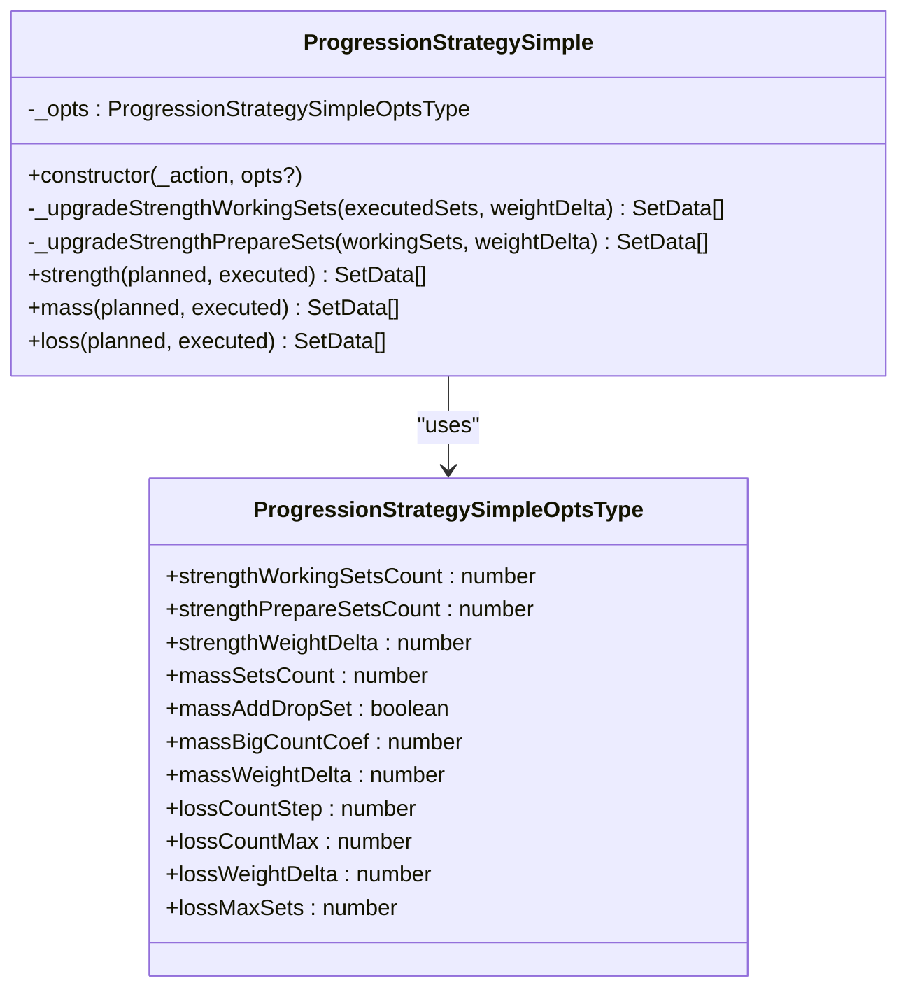
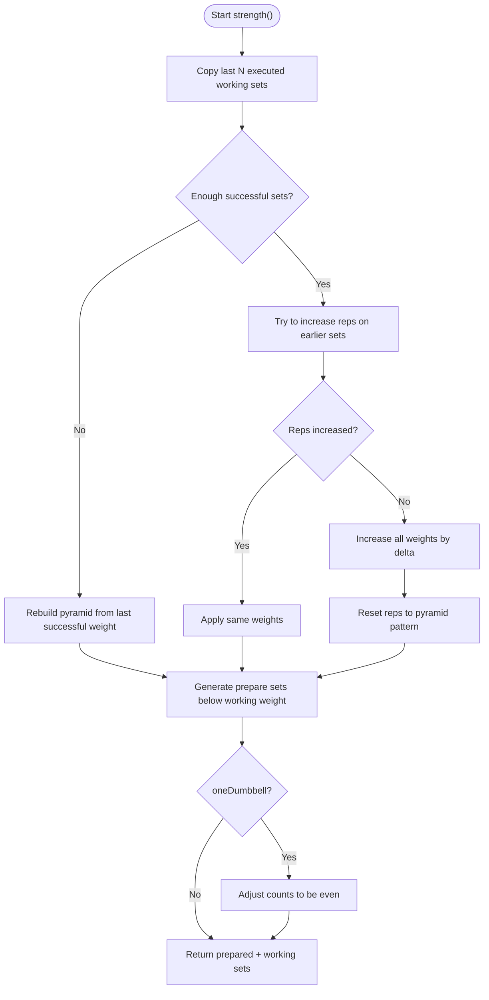
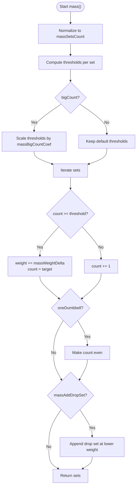
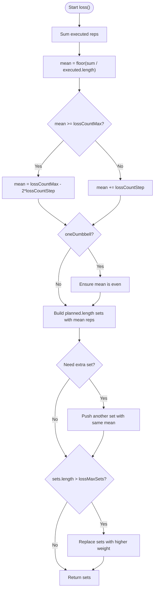
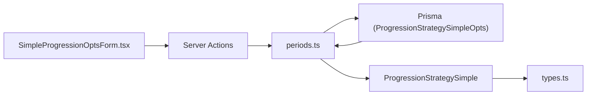

# Progression Strategies

<cite>
**Referenced Files in This Document**
- [simple.ts](file://src/core/progression/strategy/simple.ts)
- [types.ts](file://src/core/types.ts)
- [SimpleProgressionOptsForm.tsx](file://src/app/progression/SimpleProgressionOptsForm.tsx)
- [periods.ts](file://src/core/periods.ts)
- [schema.prisma](file://prisma/schema.prisma)
- [migration.sql](file://prisma/migrations/20250430093143_progression_simple_opts/migration.sql)
- [migration.sql](file://prisma/migrations/20250430114209_add_progression_opts/migration.sql)
- [simple.test.ts](file://src/tests/core/progression/strategy/simple.test.ts)
- [simple-one-dumbbell.test.ts](file://src/tests/core/progression/strategy/simple-one-dumbbell.test.ts)
</cite>

## Table of Contents
1. [Introduction](#introduction)
2. [Project Structure](#project-structure)
3. [Core Components](#core-components)
4. [Architecture Overview](#architecture-overview)
5. [Detailed Component Analysis](#detailed-component-analysis)
6. [Dependency Analysis](#dependency-analysis)
7. [Performance Considerations](#performance-considerations)
8. [Troubleshooting Guide](#troubleshooting-guide)
9. [Conclusion](#conclusion)

## Introduction
This document explains the simple progression strategy used by MeinGym to automatically adjust future sets for three training goals: strength, mass (hypertrophy), and loss (endurance). The strategy is implemented as a pure TypeScript class with configurable options stored per user and per training period. It uses a pyramid approach for strength, a tree-pattern rep scheme for mass (with optional drop sets), and increasing repetition targets for loss, with weight increases applied progressively.

## Project Structure
The progression logic lives in the core module under src/core/progression/strategy/simple.ts. Configuration defaults are defined there and persisted via Prisma model ProgressionStrategySimpleOpts linked to TrainingPeriod. A client-side form allows users to edit these options. Tests validate behavior across different exercise types, including one-dumbbell constraints.



**Diagram sources**
- [simple.ts:23-64](file://src/core/progression/strategy/simple.ts#L23-L64)
- [types.ts:10-19](file://src/core/types.ts#L10-L19)
- [schema.prisma:616-642](file://prisma/schema.prisma#L616-L642)
- [migration.sql:1-25](file://prisma/migrations/20250430093143_progression_simple_opts/migration.sql#L1-L25)
- [migration.sql:1-8](file://prisma/migrations/20250430114209_add_progression_opts/migration.sql#L1-L8)
- [SimpleProgressionOptsForm.tsx:1-191](file://src/app/progression/SimpleProgressionOptsForm.tsx#L1-L191)
- [periods.ts:11-27](file://src/core/periods.ts#L11-L27)

**Section sources**
- [simple.ts:23-64](file://src/core/progression/strategy/simple.ts#L23-L64)
- [types.ts:10-19](file://src/core/types.ts#L10-L19)
- [schema.prisma:616-642](file://prisma/schema.prisma#L616-L642)
- [migration.sql:1-25](file://prisma/migrations/20250430093143_progression_simple_opts/migration.sql#L1-L25)
- [migration.sql:1-8](file://prisma/migrations/20250430114209_add_progression_opts/migration.sql#L1-L8)
- [SimpleProgressionOptsForm.tsx:1-191](file://src/app/progression/SimpleProgressionOptsForm.tsx#L1-L191)
- [periods.ts:11-27](file://src/core/periods.ts#L11-L27)

## Core Components
- ProgressionStrategySimple: Implements strength(), mass(), and loss() methods that compute next session’s sets based on executed sets and action attributes.
- ProgressionStrategySimpleOptsType: Configurable parameters controlling set counts, deltas, and goal-specific thresholds. Defaults are provided.
- Types: SetData and SetDataExecuted define input/output structures for sets.

Key behaviors:
- Strength: Pyramid of working sets plus preparatory sets; last working set always targets 1 rep; gradual weight increase when reps are met.
- Mass: Tree-pattern reps where each set has a threshold; if exceeded, increase weight by delta and reset reps to target; optional drop set at lower weight.
- Loss: Increase mean reps per set until hitting max; then add an extra set and gradually increase weight while maintaining rep targets.

**Section sources**
- [simple.ts:23-64](file://src/core/progression/strategy/simple.ts#L23-L64)
- [simple.ts:66-158](file://src/core/progression/strategy/simple.ts#L66-L158)
- [simple.ts:160-223](file://src/core/progression/strategy/simple.ts#L160-L223)
- [simple.ts:225-265](file://src/core/progression/strategy/simple.ts#L225-L265)
- [types.ts:10-19](file://src/core/types.ts#L10-L19)

## Architecture Overview
The strategy is invoked after a training execution to generate the next plan. Options are loaded from the current training period’s ProgressionStrategySimpleOpts record. The UI exposes a form to update these options.



**Diagram sources**
- [SimpleProgressionOptsForm.tsx:47-51](file://src/app/progression/SimpleProgressionOptsForm.tsx#L47-L51)
- [periods.ts:182-190](file://src/core/periods.ts#L182-L190)
- [periods.ts:136-161](file://src/core/periods.ts#L136-L161)
- [schema.prisma:616-642](file://prisma/schema.prisma#L616-L642)
- [simple.ts:52-64](file://src/core/progression/strategy/simple.ts#L52-L64)

## Detailed Component Analysis

### ProgressionStrategySimple Class
The class encapsulates all progression logic. It takes an Action subset (rig, strengthAllowed, bigCount, oneDumbbell) and optional overrides for defaults.



**Diagram sources**
- [simple.ts:23-64](file://src/core/progression/strategy/simple.ts#L23-L64)
- [simple.ts:66-158](file://src/core/progression/strategy/simple.ts#L66-L158)
- [simple.ts:160-223](file://src/core/progression/strategy/simple.ts#L160-L223)
- [simple.ts:225-265](file://src/core/progression/strategy/simple.ts#L225-L265)

#### Strength Progression
- Builds a pyramid of working sets with decreasing reps and increasing weights.
- Prepares warm-up sets below working weights with higher reps.
- If not enough successful sets were completed, rebuilds the pyramid using the last successful weight.
- Ensures the final working set targets 1 rep.
- For one-dumbbell exercises, enforces even total reps per set.



**Diagram sources**
- [simple.ts:66-158](file://src/core/progression/strategy/simple.ts#L66-L158)

**Section sources**
- [simple.ts:66-158](file://src/core/progression/strategy/simple.ts#L66-L158)

#### Mass Progression
- Normalizes to a fixed number of sets.
- Uses thresholds per set; if count exceeds threshold, increase weight by delta and reset reps to target; otherwise increment reps.
- Supports “big count” exercises by scaling thresholds with a coefficient.
- Optionally appends a drop set at lower weight with high reps.
- Enforces even reps for one-dumbbell exercises.



**Diagram sources**
- [simple.ts:160-223](file://src/core/progression/strategy/simple.ts#L160-L223)

**Section sources**
- [simple.ts:160-223](file://src/core/progression/strategy/simple.ts#L160-L223)

#### Loss Progression
- Computes mean reps across executed sets.
- Increases mean by lossCountStep unless it reaches lossCountMax; then resets to a lower baseline and adds an extra set.
- Maintains uniform reps across sets; increases weight once set count grows beyond lossMaxSets.
- Enforces even reps for one-dumbbell exercises.



**Diagram sources**
- [simple.ts:225-265](file://src/core/progression/strategy/simple.ts#L225-L265)

**Section sources**
- [simple.ts:225-265](file://src/core/progression/strategy/simple.ts#L225-L265)

### Configuration and Persistence
- ProgressionStrategySimpleOptsType defines all tunable parameters with sensible defaults.
- Prisma model ProgressionStrategySimpleOpts stores options per user and per training period.
- Migration files create the table and add additional columns for weight deltas and loss-specific thresholds.
- periods.ts provides helpers to pick only relevant fields and fetch current options.

```mermaid
erDiagram
USER ||--o{ PROGRESSION_STRATEGY_SIMPLE_OPTS : "has many"
TRAINING_PERIOD ||--|| PROGRESSION_STRATEGY_SIMPLE_OPTS : "has one"
PROGRESSION_STRATEGY_SIMPLE_OPTS {
int id PK
string userId FK
int trainingPeriodId UK FK
int strengthWorkingSetsCount
int strengthPrepareSetsCount
float strengthWeightDelta
int massSetsCount
float massBigCountCoef
float massWeightDelta
bool massAddDropSet
int lossCountStep
int lossCountMax
float lossWeightDelta
int lossMaxSets
datetime createdAt
datetime updatedAt
}
```

**Diagram sources**
- [schema.prisma:616-642](file://prisma/schema.prisma#L616-L642)
- [migration.sql:1-25](file://prisma/migrations/20250430093143_progression_simple_opts/migration.sql#L1-L25)
- [migration.sql:1-8](file://prisma/migrations/20250430114209_add_progression_opts/migration.sql#L1-L8)

**Section sources**
- [simple.ts:23-50](file://src/core/progression/strategy/simple.ts#L23-L50)
- [schema.prisma:616-642](file://prisma/schema.prisma#L616-L642)
- [migration.sql:1-25](file://prisma/migrations/20250430093143_progression_simple_opts/migration.sql#L1-L25)
- [migration.sql:1-8](file://prisma/migrations/20250430114209_add_progression_opts/migration.sql#L1-L8)
- [periods.ts:11-27](file://src/core/periods.ts#L11-L27)

### UI Integration
- SimpleProgressionOptsForm renders inputs for all options, binds to state, and submits updates via Server Actions.
- Values map directly to ProgressionStrategySimpleOptsType fields.

**Section sources**
- [SimpleProgressionOptsForm.tsx:1-191](file://src/app/progression/SimpleProgressionOptsForm.tsx#L1-L191)

### Test Coverage Highlights
- Validates strength pyramid building, prepare sets generation, and progressive weight increases.
- Confirms mass progression thresholds, weight increments, and optional drop sets.
- Verifies loss progression mean rep increases, cap handling, and set count adjustments.
- Ensures one-dumbbell exercises enforce even reps across all strategies.

**Section sources**
- [simple.test.ts:32-141](file://src/tests/core/progression/strategy/simple.test.ts#L32-L141)
- [simple.test.ts:143-173](file://src/tests/core/progression/strategy/simple.test.ts#L143-L173)
- [simple.test.ts:175-218](file://src/tests/core/progression/strategy/simple.test.ts#L175-L218)
- [simple-one-dumbbell.test.ts:32-66](file://src/tests/core/progression/strategy/simple-one-dumbbell.test.ts#L32-L66)

## Dependency Analysis
- ProgressionStrategySimple depends on:
  - Types: SetData, SetDataExecuted
  - Action attributes: rig, strengthAllowed, bigCount, oneDumbbell
- Data flow:
  - UI updates options -> periods.ts persists via Prisma -> current options fetched -> strategy computes next sets.
- External dependencies:
  - Prisma ORM for persistence
  - Chai assert for validation within tests



**Diagram sources**
- [SimpleProgressionOptsForm.tsx:47-51](file://src/app/progression/SimpleProgressionOptsForm.tsx#L47-L51)
- [periods.ts:182-190](file://src/core/periods.ts#L182-L190)
- [simple.ts:52-64](file://src/core/progression/strategy/simple.ts#L52-L64)
- [types.ts:10-19](file://src/core/types.ts#L10-L19)

**Section sources**
- [SimpleProgressionOptsForm.tsx:47-51](file://src/app/progression/SimpleProgressionOptsForm.tsx#L47-L51)
- [periods.ts:182-190](file://src/core/periods.ts#L182-L190)
- [simple.ts:52-64](file://src/core/progression/strategy/simple.ts#L52-L64)
- [types.ts:10-19](file://src/core/types.ts#L10-L19)

## Performance Considerations
- The strategy performs O(n) operations over executed sets to compute means and build new set lists.
- Memory usage is minimal, creating small arrays of SetData objects.
- Avoid excessive re-computation by caching options per period and reusing strategy instances.

[No sources needed since this section provides general guidance]

## Troubleshooting Guide
- Unexpected low reps or weights:
  - Verify executed sets contain sufficient successful attempts; insufficient success triggers pyramid rebuild with lower weights.
- One-dumbbell exercises showing odd reps:
  - Ensure oneDumbbell flag is set correctly; the strategy enforces even reps for strength, mass, and loss.
- Mass progression not increasing weight:
  - Check thresholds and massBigCountCoef; ensure counts meet or exceed thresholds before weight increases.
- Loss progression stuck at max reps:
  - When reaching lossCountMax, the strategy resets mean and adds an extra set; verify lossMaxSets and lossWeightDelta.

**Section sources**
- [simple.ts:66-158](file://src/core/progression/strategy/simple.ts#L66-L158)
- [simple.ts:160-223](file://src/core/progression/strategy/simple.ts#L160-L223)
- [simple.ts:225-265](file://src/core/progression/strategy/simple.ts#L225-L265)
- [simple-one-dumbbell.test.ts:32-66](file://src/tests/core/progression/strategy/simple-one-dumbbell.test.ts#L32-L66)

## Conclusion
The simple progression strategy offers a clear, configurable framework for advancing strength, mass, and loss goals. By leveraging pyramid-based strength plans, tree-pattern hypertrophy schemes, and progressive endurance targets, it adapts to user performance while respecting equipment constraints. The integration with Prisma ensures per-period customization, and comprehensive tests validate correctness across scenarios.

[No sources needed since this section summarizes without analyzing specific files]