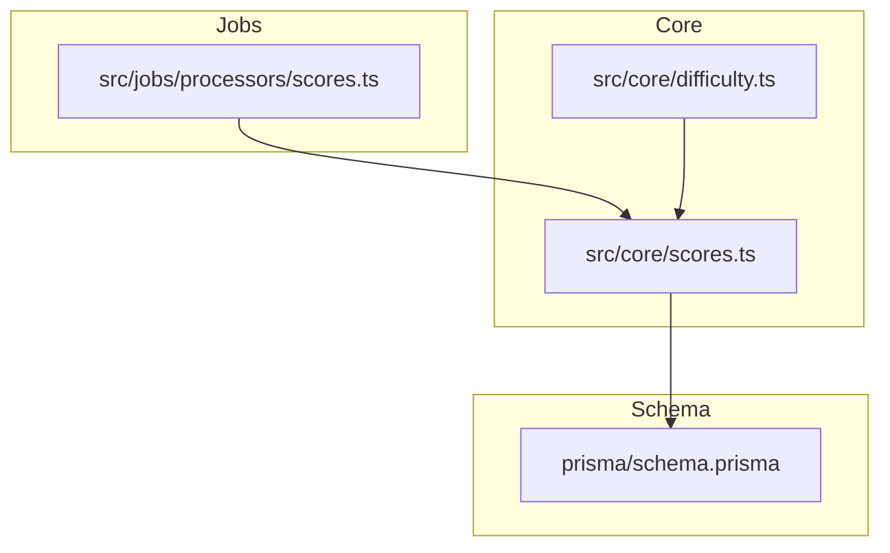
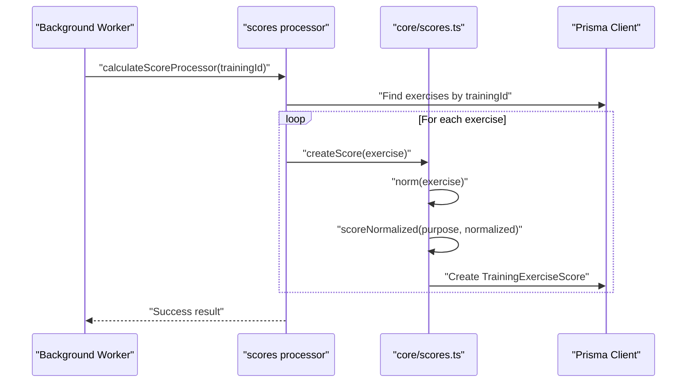
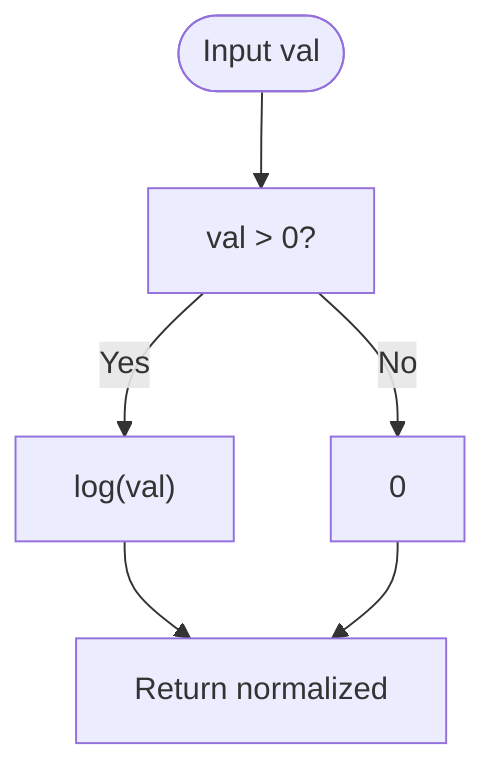
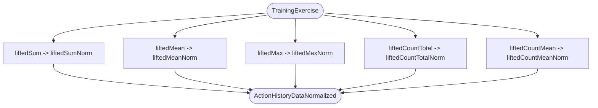
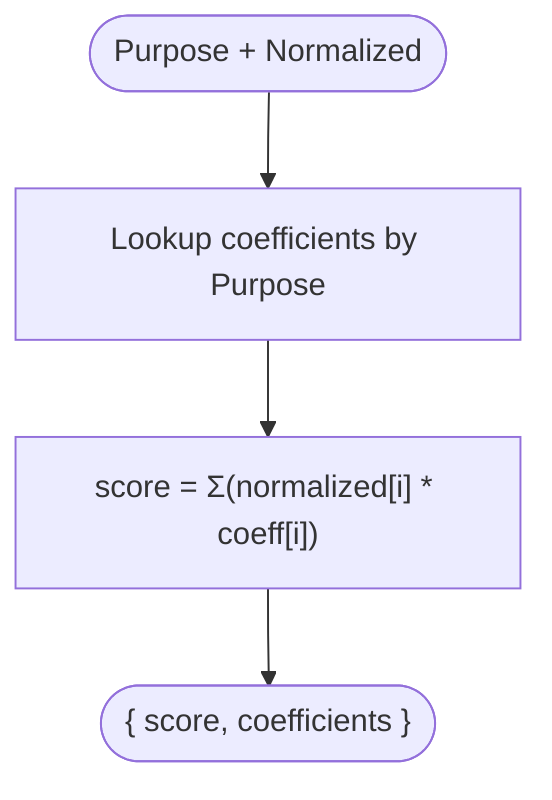
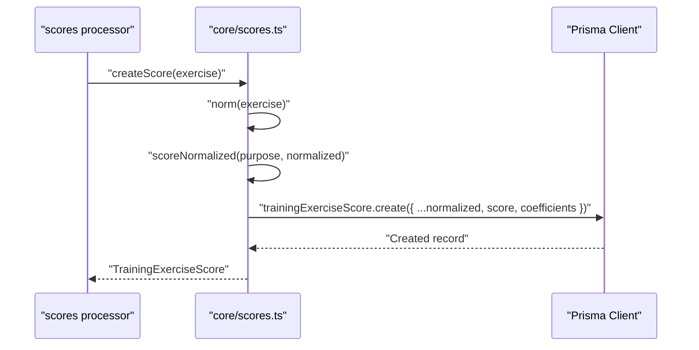
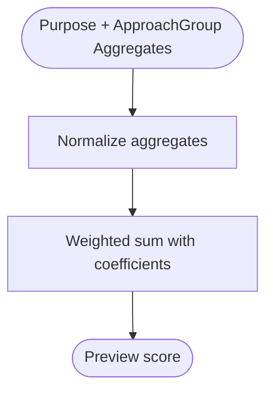
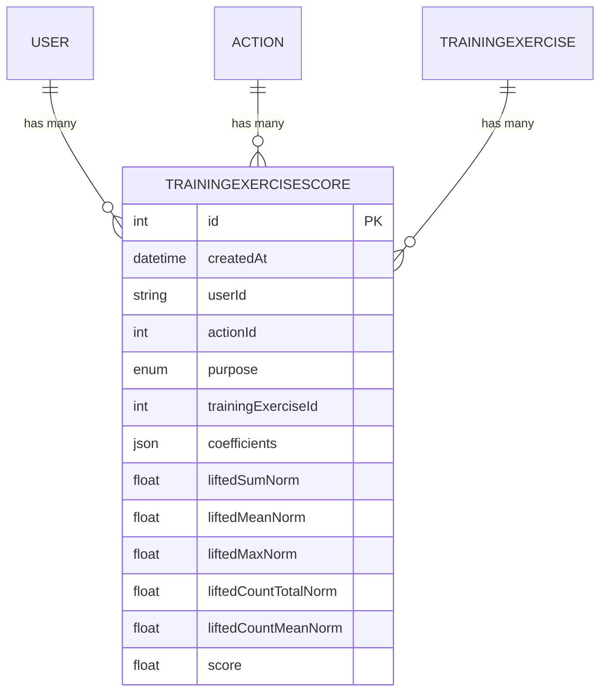
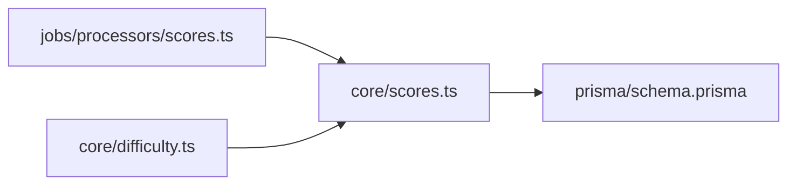

# Scoring and Analytics

<cite>
**Referenced Files in This Document**
- [scores.ts](file://src/core/scores.ts)
- [schema.prisma](file://prisma/schema.prisma)
- [difficulty.ts](file://src/core/difficulty.ts)
- [scores.test.ts](file://src/tests/core/scores.test.ts)
- [scores.ts (job processor)](file://src/jobs/processors/scores.ts)
</cite>

## Table of Contents
1. [Introduction](#introduction)
2. [Project Structure](#project-structure)
3. [Core Components](#core-components)
4. [Architecture Overview](#architecture-overview)
5. [Detailed Component Analysis](#detailed-component-analysis)
6. [Dependency Analysis](#dependency-analysis)
7. [Performance Considerations](#performance-considerations)
8. [Troubleshooting Guide](#troubleshooting-guide)
9. [Conclusion](#conclusion)

## Introduction
This document explains how exercise performance is normalized and scored using log-scaling and purpose-specific coefficients. It focuses on the normalization function, the scoring matrix per training purpose, and the creation of TrainingExerciseScore records. The system computes five normalized metrics—liftedSumNorm, liftedMeanNorm, liftedMaxNorm, liftedCountTotalNorm, and liftedCountMeanNorm—and combines them with a purpose-driven coefficient matrix to produce a single score.

## Project Structure
The scoring logic resides in the core module and integrates with the database schema via Prisma. Background jobs trigger score calculation for completed trainings. Difficulty calculations reuse the same normalization and scoring pipeline to estimate difficulty before execution.



**Diagram sources**
- [scores.ts](file://src/core/scores.ts)
- [difficulty.ts](file://src/core/difficulty.ts)
- [scores.ts (job processor)](file://src/jobs/processors/scores.ts)
- [schema.prisma](file://prisma/schema.prisma)

**Section sources**
- [scores.ts](file://src/core/scores.ts)
- [schema.prisma](file://prisma/schema.prisma)
- [difficulty.ts](file://src/core/difficulty.ts)
- [scores.ts (job processor)](file://src/jobs/processors/scores.ts)

## Core Components
- Log-normalization: A simple logarithmic transform applied to each metric to compress dynamic ranges and stabilize variance.
- Purpose-specific coefficients: A matrix that weights the normalized metrics differently depending on whether the goal is STRENGTH, MASS, or LOSS.
- Score computation: Weighted sum of normalized metrics using the selected coefficient set.
- Record creation: Persist normalized values, coefficients, and final score into TrainingExerciseScore.
- Preview scoring: Pre-compute an approximate score using approach group aggregates prior to actual execution.

Key responsibilities:
- normLogFn: Applies log scaling to raw metrics.
- norm: Normalizes all five metrics from a TrainingExercise.
- scoreNormalized: Computes weighted score using purpose-specific coefficients.
- createScore: Persists normalized data and score to the database.
- previewScore: Estimates score from planned/approach aggregates.

**Section sources**
- [scores.ts](file://src/core/scores.ts)

## Architecture Overview
The scoring pipeline is pure and deterministic, operating on TrainingExercise data and persisting results. Background workers compute scores after training completion. Difficulty estimation reuses the same normalization and scoring functions to provide pre-execution insights.



**Diagram sources**
- [scores.ts (job processor)](file://src/jobs/processors/scores.ts)
- [scores.ts](file://src/core/scores.ts)
- [schema.prisma](file://prisma/schema.prisma)

## Detailed Component Analysis

### Log-Normalization Function
- Purpose: Stabilize scale differences across metrics by applying a natural logarithm to positive values; zero maps to zero.
- Input: Single numeric metric value.
- Output: Normalized value suitable for linear combination with coefficients.



**Diagram sources**
- [scores.ts](file://src/core/scores.ts)

**Section sources**
- [scores.ts](file://src/core/scores.ts)

### Normalization of Five Metrics
- Inputs: liftedSum, liftedMean, liftedMax, liftedCountTotal, liftedCountMean from TrainingExercise.
- Process: Apply log-normalization to each metric independently.
- Outputs: liftedSumNorm, liftedMeanNorm, liftedMaxNorm, liftedCountTotalNorm, liftedCountMeanNorm.



**Diagram sources**
- [scores.ts](file://src/core/scores.ts)

**Section sources**
- [scores.ts](file://src/core/scores.ts)

### Purpose-Specific Coefficients Matrix
- STRENGTH: Emphasizes max and sum, penalizes high count mean (negative coefficient), ignores mean weight.
- MASS: Emphasizes mean weight and total volume, small positive contribution from max, ignores count total.
- LOSS: Emphasizes counts and max, ignores mean weight and sum.

Coefficients are stored inline and used to compute the weighted score.

```mermaid
classDiagram
class ScoreCoefficients {
+STRENGTH : { liftedMaxNorm, liftedSumNorm, liftedMeanNorm, liftedCountTotalNorm, liftedCountMeanNorm }
+MASS : { liftedMeanNorm, liftedCountMeanNorm, liftedSumNorm, liftedCountTotalNorm, liftedMaxNorm }
+LOSS : { liftedCountTotalNorm, liftedCountMeanNorm, liftedMaxNorm, liftedMeanNorm, liftedSumNorm }
}
```

**Diagram sources**
- [scores.ts](file://src/core/scores.ts)

**Section sources**
- [scores.ts](file://src/core/scores.ts)

### Score Computation
- Inputs: Purpose and normalized metrics.
- Process: Multiply each normalized metric by its corresponding coefficient and sum them up.
- Output: Numeric score and the coefficients used.



**Diagram sources**
- [scores.ts](file://src/core/scores.ts)

**Section sources**
- [scores.ts](file://src/core/scores.ts)

### Creating TrainingExerciseScore Records
- Trigger: After training execution completes, background job processes each exercise.
- Steps:
  - Normalize metrics.
  - Compute score with purpose-specific coefficients.
  - Persist normalized values, coefficients, and score into TrainingExerciseScore.
- Data persisted includes timestamps, user/action linkage, purpose, and all normalized fields.



**Diagram sources**
- [scores.ts (job processor)](file://src/jobs/processors/scores.ts)
- [scores.ts](file://src/core/scores.ts)
- [schema.prisma](file://prisma/schema.prisma)

**Section sources**
- [scores.ts](file://src/core/scores.ts)
- [scores.ts (job processor)](file://src/jobs/processors/scores.ts)
- [schema.prisma](file://prisma/schema.prisma)

### Preview Scoring (Pre-Execution)
- Purpose: Estimate difficulty and expected score before actual execution using approach group aggregates.
- Inputs: Purpose and aggregate metrics (sum, mean, max, countTotal, countMean).
- Process: Same normalization and coefficient weighting as post-execution scoring.
- Usage: Combined with action base to calculate exercise/training difficulty.



**Diagram sources**
- [scores.ts](file://src/core/scores.ts)
- [difficulty.ts](file://src/core/difficulty.ts)

**Section sources**
- [scores.ts](file://src/core/scores.ts)
- [difficulty.ts](file://src/core/difficulty.ts)

### Database Model: TrainingExerciseScore
- Fields include timestamp, user/action/purpose linkage, normalized metrics, coefficients JSON, and final score.
- Indexed by userId, actionId, purpose, createdAt for efficient querying.
- Relationships link back to User, Action, and TrainingExercise.



**Diagram sources**
- [schema.prisma](file://prisma/schema.prisma)

**Section sources**
- [schema.prisma](file://prisma/schema.prisma)

## Dependency Analysis
- Core scoring depends only on Prisma client for persistence and type definitions from the generated client.
- Job processor orchestrates batch score creation per training.
- Difficulty module consumes preview scoring to estimate difficulty without requiring executed data.



**Diagram sources**
- [scores.ts (job processor)](file://src/jobs/processors/scores.ts)
- [scores.ts](file://src/core/scores.ts)
- [difficulty.ts](file://src/core/difficulty.ts)
- [schema.prisma](file://prisma/schema.prisma)

**Section sources**
- [scores.ts (job processor)](file://src/jobs/processors/scores.ts)
- [scores.ts](file://src/core/scores.ts)
- [difficulty.ts](file://src/core/difficulty.ts)
- [schema.prisma](file://prisma/schema.prisma)

## Performance Considerations
- Log normalization is O(1) per metric; overall normalization is O(1) since the number of metrics is fixed.
- Score computation is a constant-time weighted sum over five metrics.
- Batch processing in the job processor avoids repeated overhead per training.
- Indexing on TrainingExerciseScore supports fast retrieval by user, action, purpose, and time.

[No sources needed since this section provides general guidance]

## Troubleshooting Guide
- If scores are not created:
  - Ensure the background worker is running and processing jobs.
  - Verify that TrainingExercise records have valid purpose and aggregated metrics.
- If preview scores seem off:
  - Confirm approach group aggregates reflect realistic planned sets.
  - Check purpose selection matches intended goal.
- If difficulty estimates are unexpected:
  - Validate action base values and approach group aggregates.
  - Review purpose-specific coefficients for alignment with goals.

**Section sources**
- [scores.ts (job processor)](file://src/jobs/processors/scores.ts)
- [difficulty.ts](file://src/core/difficulty.ts)

## Conclusion
The scoring system uses robust log-normalization and purpose-specific coefficients to convert raw exercise metrics into comparable scores. It persists detailed normalized data and coefficients for historical analysis, while also enabling pre-execution difficulty estimation. The design is modular, efficient, and well-integrated with background processing and database indexing for scalability.