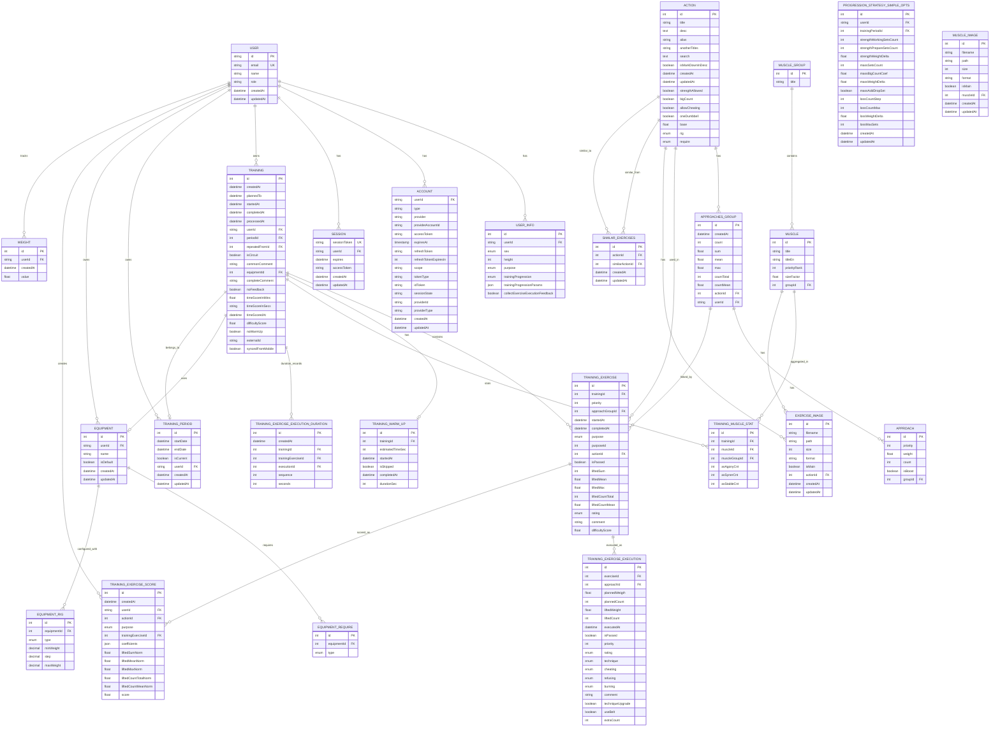
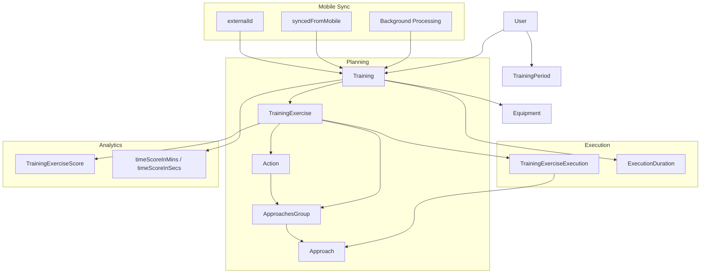
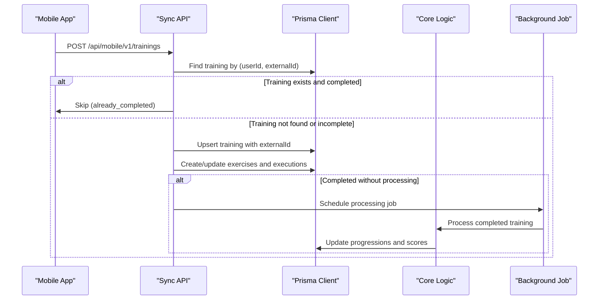
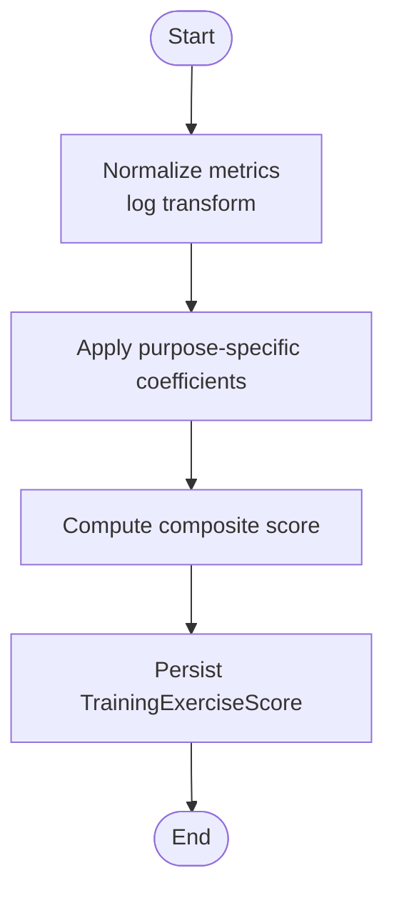
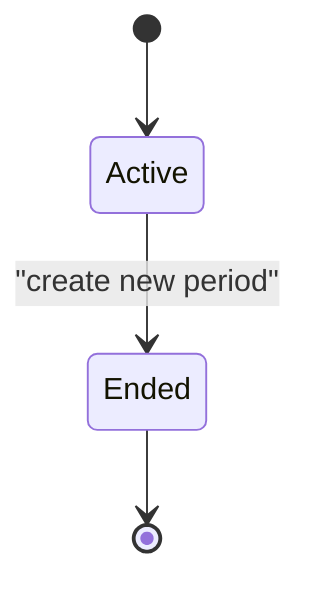
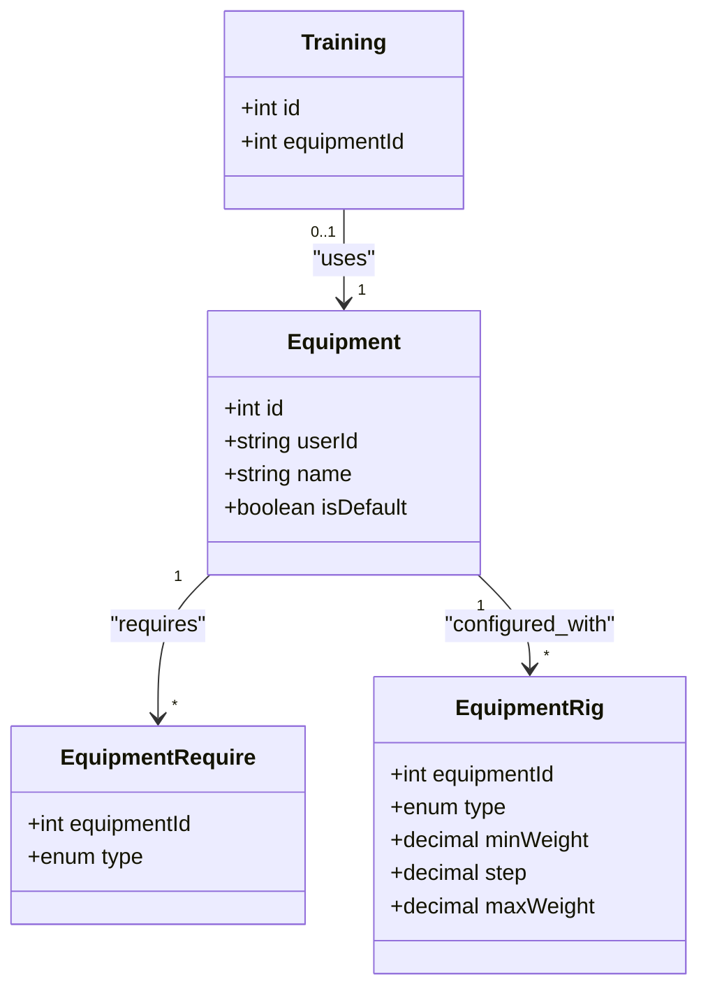
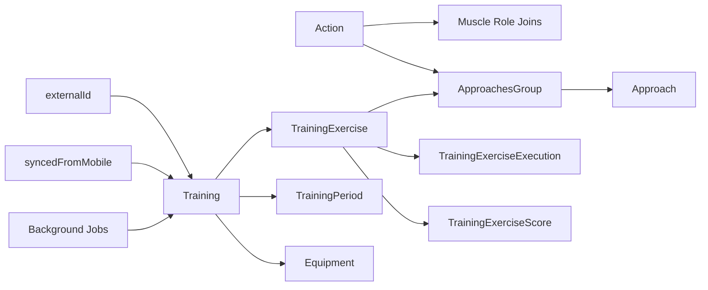

# Data Model

<cite>
**Referenced Files in This Document**
- [schema.prisma](file://prisma/schema.prisma)
- [syncTrainings.ts](file://src/mobile/syncTrainings.ts)
- [route.ts (mobile trainings)](file://src/app/api/mobile/v1/trainings/route.ts)
- [trainingProcessing.ts](file://src/core/trainingProcessing.ts)
- [config.ts](file://src/jobs/config.ts)
- [queues.ts](file://src/jobs/queues.ts)
- [trainings processor](file://src/jobs/processors/trainings.ts)
- [weights.ts](file://src/mobile/weights.ts)
- [weight_user_date_index migration](file://prisma/migrations/20260808225012_weight_user_date_index/migration.sql)
- [scores.ts](file://src/core/scores.ts)
- [periods.ts](file://src/core/periods.ts)
- [avgScorer.ts](file://src/core/trainingTime/avgScorer.ts)
- [page.tsx (training execute)](file://src/app/trainings/[id]/execute/page.tsx)
- [actions page.tsx](file://src/app/actions/page.tsx)
</cite>

## Update Summary
**Changes Made**
- Added comprehensive mobile synchronization support with externalId and syncedFromMobile fields
- Implemented batch training sync API with JWT authentication and background processing
- Enhanced weight query performance with optimized indexes
- Added compound unique constraints for mobile sync integrity
- Integrated Bull/Redis job system for asynchronous training processing

## Table of Contents
1. Introduction
2. Project Structure
3. Core Components
4. Architecture Overview
5. Detailed Component Analysis
6. Dependency Analysis
7. Performance Considerations
8. Troubleshooting Guide
9. Conclusion

## Introduction
This document provides a comprehensive overview of the Prisma data model used by MeinGym, focusing on User, Action (exercises), Training lifecycle, Execution tracking, Scoring, Periods, Equipment, and the new Mobile Synchronization system. It explains key relationships, enums, indexes, and how core business logic interacts with the schema, including enhanced mobile sync capabilities and performance optimizations.

## Project Structure
The data model is defined in a single Prisma schema file and evolved through numerous migrations. The most relevant entities for this document are:
- Identity and profiles: User, UserInfo, Account, Session
- Exercise catalog: Action, MuscleGroup, Muscle, and muscle-role mappings
- Planning and execution: Training, TrainingExercise, ApproachesGroup, Approach, TrainingExerciseExecution
- Progression and periodization: TrainingPeriod, ProgressionStrategySimpleOpts
- Scoring: TrainingExerciseScore
- Equipment: Equipment, EquipmentRequire, EquipmentRig
- Supporting assets: ExerciseImage, MuscleImage
- Time tracking: TrainingExerciseExecutionDuration, TrainingWarmUp
- **Mobile synchronization**: External ID tracking and sync status flags

**Diagram sources**
- [schema.prisma](file://prisma/schema.prisma)

**Section sources**
- [schema.prisma](file://prisma/schema.prisma)

## Core Components
- User and profile: User stores identity and role; UserInfo stores personal attributes and preferences such as purpose, progression settings, and feedback collection flag.
- Action (exercise): Catalog entry with metadata, muscle roles, rig and requirement tags, and search index.
- Approaches and groups: Plan sets per exercise via ApproachesGroup and Approach; used to pre-plan weights and reps.
- Training lifecycle: Training represents a workout plan; TrainingExercise links an Action to a Training with purpose-specific aggregation fields; TrainingExerciseExecution records actual performance per Approach.
- Scoring: TrainingExerciseScore captures normalized metrics and computed scores per exercise and purpose.
- Periods: TrainingPeriod segments user history with optional progression strategy options.
- Equipment: Per-user equipment sets with required types and rig configurations; linked to Training.
- **Mobile synchronization**: External ID tracking and sync status flags for mobile app integration.

**Section sources**
- [schema.prisma](file://prisma/schema.prisma)

## Architecture Overview
The data model supports planning, execution, analytics, and mobile synchronization:
- Planning: Actions define exercises; ApproachesGroup and Approach define planned sets; TrainingExercise ties an Action into a Training with purpose context and aggregates.
- Execution: TrainingExerciseExecution records each set's planned vs. actual values and qualitative flags; durations are tracked separately.
- Analytics: Scores are computed from TrainingExercise aggregates and persisted in TrainingExerciseScore; time scoring uses ApproachesGroup counts.
- **Mobile Sync**: External IDs enable upsert operations; syncedFromMobile flags track data origin; batch processing with background jobs ensures reliable synchronization.

**Diagram sources**
- [schema.prisma](file://prisma/schema.prisma)
- [avgScorer.ts](file://src/core/trainingTime/avgScorer.ts)

## Detailed Component Analysis

### User and Profile
- User holds authentication-related relations (Account, Session) and owns UserInfo, Training, TrainingPeriod, Equipment, and scores.
- UserInfo includes sex, height, purpose, progression settings, and a flag to control feedback collection during execution.

Key relationships:
- One-to-one profile: User → UserInfo
- Authentication: User ↔ Account, User ↔ Session

**Section sources**
- [schema.prisma](file://prisma/schema.prisma)

### Action (Exercises) and Muscles
- Action models an exercise with descriptive fields, flags (strengthAllowed, bigCount, allowCheating, oneDumbbell), and a base metric derived from muscle roles.
- Muscle relationships are modeled via four join tables: Agony, Synergy, Stabilizer, Antagonist. These capture nuanced biomechanical roles per exercise.
- Search optimization: A GIN trigram index on Action.search enables fast fuzzy searches.

Additional features:
- Similar exercises via SimilarExercises self-referencing relation.
- Images: ExerciseImage linked to Action.

**Section sources**
- [schema.prisma](file://prisma/schema.prisma)
- [actions page.tsx](file://src/app/actions/page.tsx)

### ApproachesGroup and Approach
- ApproachesGroup defines a set of planned repetitions and weights for an Action per user/purpose context; it maintains aggregate statistics (sum, mean, max, counts).
- Approach items represent individual sets within a group with priority, weight, count, and optional boost flag.

Usage:
- TrainingExercise references an ApproachesGroup to inherit planned structure.
- Execution records link back to specific Approaches.

**Section sources**
- [schema.prisma](file://prisma/schema.prisma)

### Training Lifecycle and Mobile Synchronization
- Training encapsulates a workout with timestamps (plannedTo, startedAt, completedAt, processedAt), comments, circuit mode, and optional repeat linkage.
- TrainingExercise binds an Action to a Training with purpose context and aggregates for lifted metrics and ratings.
- Execution: TrainingExerciseExecution records per-set details, including planned vs. actual, quality flags (rating, technique, cheating, refusing, burning), belt usage, and extra reps.
- Duration: TrainingExerciseExecutionDuration tracks per-execution timing sequences.
- Warm-up: Optional TrainingWarmUp associated with Training.

**Updated** Added mobile synchronization capabilities:
- **externalId**: Unique identifier for mobile sync upsert operations
- **syncedFromMobile**: Boolean flag indicating if training originated from mobile app
- **Compound unique constraint**: Ensures uniqueness of (userId, externalId) pairs
- **Batch sync API**: Supports up to 20 trainings per request with background processing

Execution creation flow:
- When starting execution, missing executions are created per Approach for each exercise.
- Mobile sync validates existing completed trainings and skips updates to prevent data corruption.

**Diagram sources**
- [syncTrainings.ts](file://src/mobile/syncTrainings.ts)
- [route.ts (mobile trainings)](file://src/app/api/mobile/v1/trainings/route.ts)
- [trainingProcessing.ts](file://src/core/trainingProcessing.ts)

**Section sources**
- [schema.prisma](file://prisma/schema.prisma)
- [syncTrainings.ts](file://src/mobile/syncTrainings.ts)
- [route.ts (mobile trainings)](file://src/app/api/mobile/v1/trainings/route.ts)

### Scoring
- TrainingExerciseScore stores normalized metrics and a composite score per exercise and purpose.
- Normalization applies log transforms to aggregated metrics; coefficients differ by purpose (Strength, Mass, Loss).
- Preview scoring can be computed from ApproachesGroup aggregates before execution.

**Diagram sources**
- [scores.ts](file://src/core/scores.ts)

**Section sources**
- [schema.prisma](file://prisma/schema.prisma)
- [scores.ts](file://src/core/scores.ts)

### Periods and Progression
- TrainingPeriod segments user history with start/end dates and a current flag; only one period should be current at a time.
- ProgressionStrategySimpleOpts configures automatic progression parameters per period.
- Business logic ensures that creating a new period marks the previous one as ended and copies or defaults progression options.

**Diagram sources**
- [periods.ts](file://src/core/periods.ts)

**Section sources**
- [schema.prisma](file://prisma/schema.prisma)
- [periods.ts](file://src/core/periods.ts)

### Equipment
- Equipment belongs to a user and can be marked default; it lists required types (via EquipmentRequire) and configured rigs (via EquipmentRig) with weight ranges and steps.
- Training optionally references an Equipment to contextualize the workout environment.

**Diagram sources**
- [schema.prisma](file://prisma/schema.prisma)

**Section sources**
- [schema.prisma](file://prisma/schema.prisma)

### Mobile Synchronization System
**New** Comprehensive mobile sync infrastructure:
- **JWT Authentication**: Secure token-based authentication for mobile clients
- **Batch Processing**: Up to 20 trainings per request with atomic transactions
- **Upsert Logic**: Creates new trainings or updates existing ones based on externalId
- **Conflict Resolution**: Skips updates to already completed trainings to prevent data corruption
- **Background Processing**: Uses Bull/Redis queue system for asynchronous training processing
- **Validation**: Input validation and error handling for robust sync operations

Key components:
- `syncTrainingsBatch`: Core sync logic with transactional safety
- `processCompletedTrainingCore`: Extracted processing logic for background jobs
- `scheduleTrainingProcessing`: Queue management for async processing
- Mobile API routes with proper authentication and validation

**Section sources**
- [syncTrainings.ts](file://src/mobile/syncTrainings.ts)
- [trainingProcessing.ts](file://src/core/trainingProcessing.ts)
- [config.ts](file://src/jobs/config.ts)
- [queues.ts](file://src/jobs/queues.ts)
- [trainings processor](file://src/jobs/processors/trainings.ts)

## Dependency Analysis
Key dependency chains:
- Training → TrainingExercise → ApproachesGroup → Approach → TrainingExerciseExecution
- TrainingExercise → TrainingExerciseScore (analytics)
- Action → Muscle role joins (Agony/Synergy/Stabilizer/Antagonist)
- Training → TrainingPeriod (progression segmentation)
- Training → Equipment (contextual setup)
- **Mobile Sync**: externalId → Training (upsert operations)
- **Background Jobs**: Training completion → Job queue → Processing → Score calculation

Indexes and search:
- Action.search uses a GIN trigram index for efficient fuzzy matching.
- TrainingPeriod has a composite index on (userId, isCurrent) for quick current-period queries.
- TrainingExerciseScore has an index on (userId, actionId, purpose, createdAt) for history queries.
- **Weight queries**: Optimized index on (userId, createdAt) for mobile weight sync performance.

**Diagram sources**
- [schema.prisma](file://prisma/schema.prisma)

**Section sources**
- [schema.prisma](file://prisma/schema.prisma)

## Performance Considerations
- Use the GIN trigram index on Action.search for fast fuzzy searches across titles and aliases.
- Leverage existing indexes on TrainingPeriod (userId, isCurrent) and TrainingExerciseScore (userId, actionId, purpose, createdAt) for efficient queries.
- Avoid N+1 queries when loading actions with related muscles and images; prefer include/select patterns demonstrated in the actions page.
- For execution creation, batch insertions reduce round-trips.
- **Mobile sync performance**: Batch processing limits (20 trainings per request) prevent overwhelming the server.
- **Weight query optimization**: New index on Weight(userId, createdAt) improves mobile weight list performance.
- **Background processing**: Asynchronous job processing prevents blocking API responses.

**Section sources**
- [weights.ts](file://src/mobile/weights.ts)
- [weight_user_date_index migration](file://prisma/migrations/20260808225012_weight_user_date_index/migration.sql)

## Troubleshooting Guide
Common issues and checks:
- Missing executions: Ensure createExecutions runs when entering execution mode; verify that each TrainingExercise has corresponding TrainingExerciseExecution entries per Approach.
- Score computation: Confirm that TrainingExercise aggregates (liftedSum, liftedMean, liftedMax, counts) are updated before scoring; check job queues for background processing.
- Current period management: Verify that creating a new period updates the previous period's isCurrent flag and sets endDate.
- Equipment constraints: Validate that EquipmentRequire and EquipmentRig entries match allowed ActionRequire and ActionRig enums.
- **Mobile sync issues**: Check externalId uniqueness and ensure completed trainings are not being overwritten.
- **Background job failures**: Monitor Redis/Bull queue health and check job processing logs.
- **Weight sync performance**: Verify the new Weight(userId, createdAt) index is properly utilized.

**Section sources**
- [page.tsx (training execute)](file://src/app/trainings/[id]/execute/page.tsx)
- [scores.ts](file://src/core/scores.ts)
- [periods.ts](file://src/core/periods.ts)

## Conclusion
The Prisma schema models a robust fitness application with clear separation between planning (Actions, Approaches), execution (Training, TrainingExercise, TrainingExerciseExecution), and analytics (TrainingExerciseScore). The new mobile synchronization system provides secure, efficient data exchange between mobile apps and the backend, while maintaining data integrity through externalId-based upserts and background processing. Periodization and equipment configuration provide flexibility for personalized training programs. Indexes and normalization strategies support efficient search and scoring workflows, with recent performance optimizations for weight queries enhancing mobile app responsiveness.