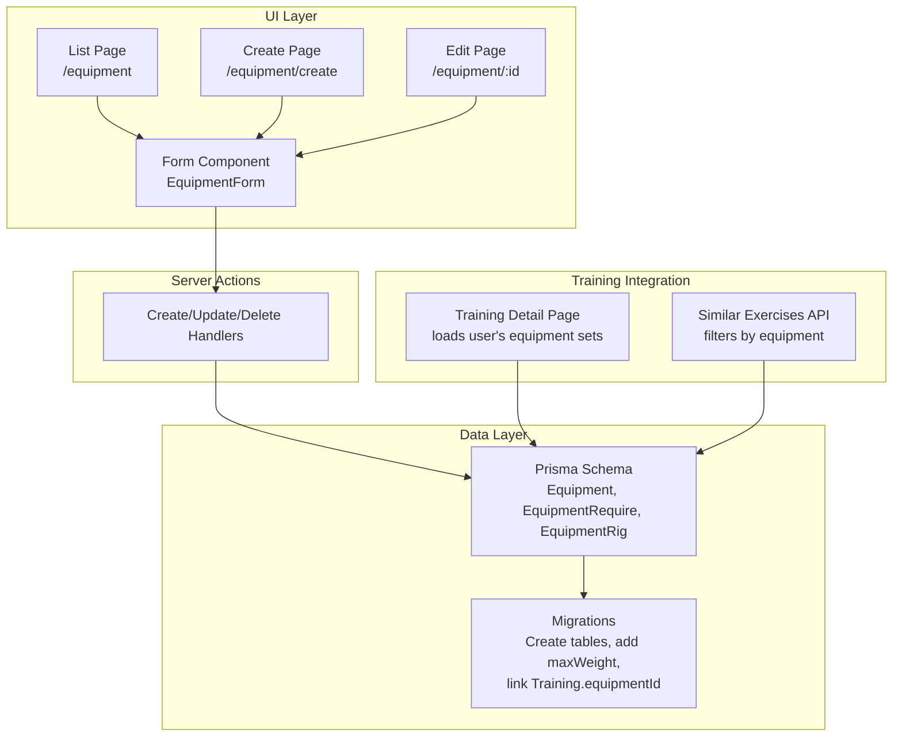
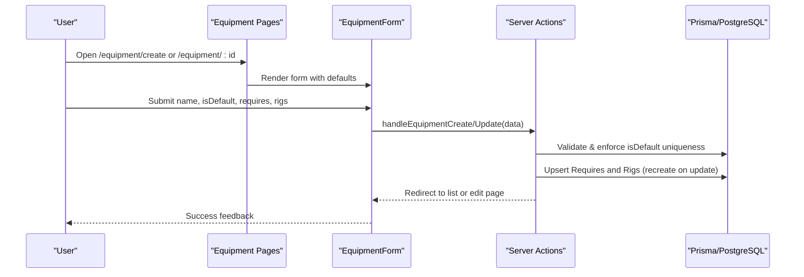
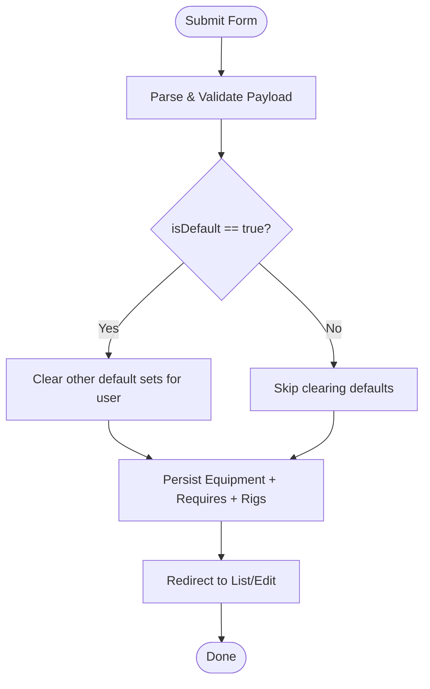
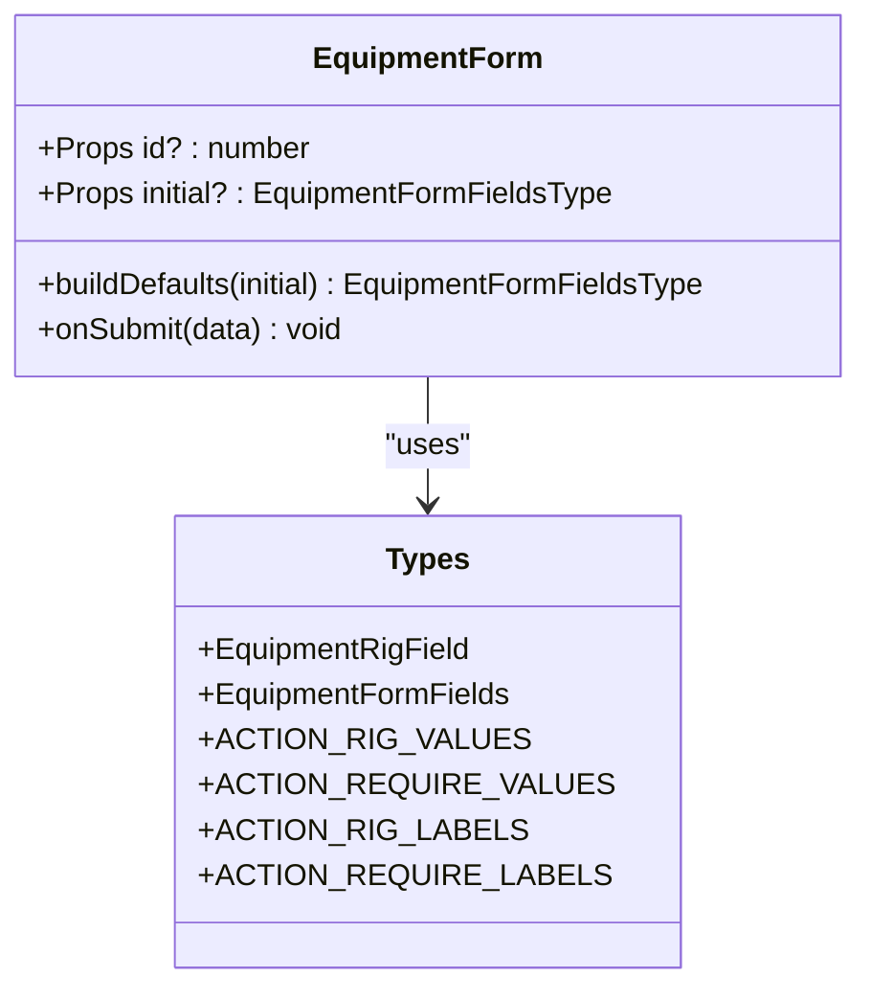
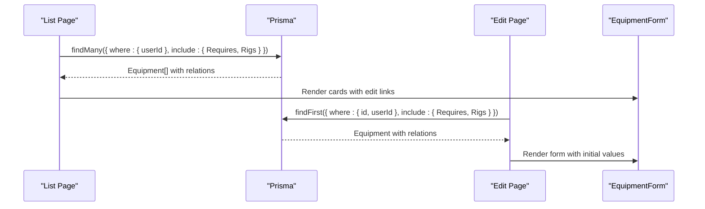
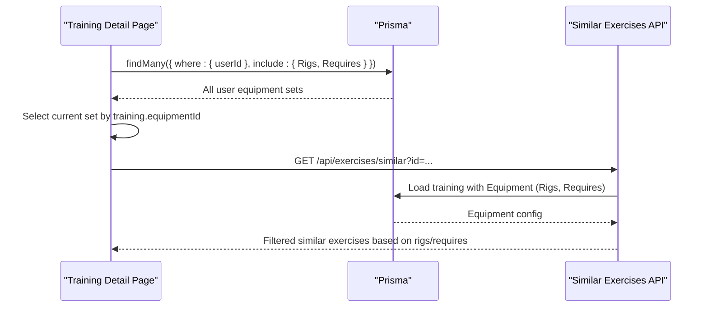
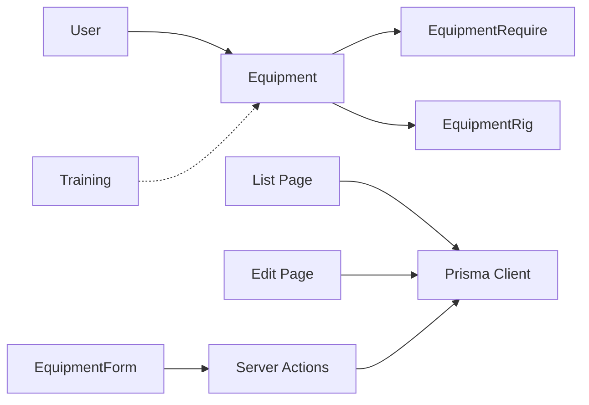

# Equipment Management

<cite>
**Referenced Files in This Document**
- [schema.prisma](file://prisma/schema.prisma)
- [20260530132935_equipment/migration.sql](file://prisma/migrations/20260530132935_equipment/migration.sql)
- [20260530145105_equip_add_max_weight/migration.sql](file://prisma/migrations/20260530145105_equip_add_max_weight/migration.sql)
- [20260530153317_add_equipment_id_to_training/migration.sql](file://prisma/migrations/20260530153317_add_equipment_id_to_training/migration.sql)
- [page.tsx](file://src/app/equipment/page.tsx)
- [actions.ts](file://src/app/equipment/actions.ts)
- [types.ts](file://src/app/equipment/types.ts)
- [EquipmentForm.tsx](file://src/app/equipment/components/EquipmentForm.tsx)
- [create/page.tsx](file://src/app/equipment/create/page.tsx)
- [edit page.tsx](file://src/app/equipment/[id]/page.tsx)
- [trainings/[id]/page.tsx](file://src/app/trainings/[id]/page.tsx)
- [similar/route.ts](file://src/app/api/exercises/similar/route.ts)
</cite>

## Table of Contents
1. Introduction
2. Project Structure
3. Core Components
4. Architecture Overview
5. Detailed Component Analysis
6. Dependency Analysis
7. Performance Considerations
8. Troubleshooting Guide
9. Conclusion

## Introduction
This document explains the per-user equipment sets feature with rig capabilities and weight constraints. It covers how users define equipment sets, associate required equipment types, configure rig-specific weight ranges (min, step, max), and link a selected set to their training sessions. It also documents the isDefault flag behavior and cascade delete semantics for related records.

## Project Structure
The equipment management spans Prisma schema definitions, migrations, Next.js App Router pages, server actions, and client components:
- Data model and relationships are defined in the Prisma schema and migrations.
- UI for listing, creating, and editing equipment sets lives under src/app/equipment.
- Server actions handle validation, persistence, and default-set enforcement.
- Training pages consume equipment sets to constrain available rigs and requirements during exercise selection and execution.



**Diagram sources**
- [schema.prisma](file://prisma/schema.prisma)
- [20260530132935_equipment/migration.sql](file://prisma/migrations/20260530132935_equipment/migration.sql)
- [20260530145105_equip_add_max_weight/migration.sql](file://prisma/migrations/20260530145105_equip_add_max_weight/migration.sql)
- [20260530153317_add_equipment_id_to_training/migration.sql](file://prisma/migrations/20260530153317_add_equipment_id_to_training/migration.sql)
- [page.tsx](file://src/app/equipment/page.tsx)
- [create/page.tsx](file://src/app/equipment/create/page.tsx)
- [edit page.tsx](file://src/app/equipment/[id]/page.tsx)
- [EquipmentForm.tsx](file://src/app/equipment/components/EquipmentForm.tsx)
- [actions.ts](file://src/app/equipment/actions.ts)
- [trainings/[id]/page.tsx](file://src/app/trainings/[id]/page.tsx)
- [similar/route.ts](file://src/app/api/exercises/similar/route.ts)

**Section sources**
- [schema.prisma](file://prisma/schema.prisma)
- [20260530132935_equipment/migration.sql](file://prisma/migrations/20260530132935_equipment/migration.sql)
- [20260530145105_equip_add_max_weight/migration.sql](file://prisma/migrations/20260530145105_equip_add_max_weight/migration.sql)
- [20260530153317_add_equipment_id_to_training/migration.sql](file://prisma/migrations/20260530153317_add_equipment_id_to_training/migration.sql)
- [page.tsx](file://src/app/equipment/page.tsx)
- [create/page.tsx](file://src/app/equipment/create/page.tsx)
- [edit page.tsx](file://src/app/equipment/[id]/page.tsx)
- [EquipmentForm.tsx](file://src/app/equipment/components/EquipmentForm.tsx)
- [actions.ts](file://src/app/equipment/actions.ts)
- [trainings/[id]/page.tsx](file://src/app/trainings/[id]/page.tsx)
- [similar/route.ts](file://src/app/api/exercises/similar/route.ts)

## Core Components
- Equipment: Per-user named set with an isDefault flag; linked to Training via optional foreign key.
- EquipmentRequire: Declares required equipment types for the set (e.g., pull bar, bench, simulator).
- EquipmentRig: Defines rig-specific weight constraints: minWeight, step, maxWeight.
- Training: Optional reference to an Equipment set to constrain available rigs and requirements.

Key behaviors:
- isDefault ensures only one default set per user; enforced at save time.
- Cascade delete removes Requires and Rigs when an Equipment is deleted.
- Unique constraints prevent duplicate require or rig entries per type within a set.

**Section sources**
- [schema.prisma](file://prisma/schema.prisma)
- [20260530132935_equipment/migration.sql](file://prisma/migrations/20260530132935_equipment/migration.sql)
- [20260530145105_equip_add_max_weight/migration.sql](file://prisma/migrations/20260530145105_equip_add_max_weight/migration.sql)
- [20260530153317_add_equipment_id_to_training/migration.sql](file://prisma/migrations/20260530153317_add_equipment_id_to_training/migration.sql)

## Architecture Overview
The system combines a data layer (Prisma + PostgreSQL) with a Next.js App Router frontend and server actions. Users manage equipment sets through dedicated pages; server actions validate and persist changes; training flows consume the configured sets to constrain exercise options.



**Diagram sources**
- [page.tsx](file://src/app/equipment/page.tsx)
- [create/page.tsx](file://src/app/equipment/create/page.tsx)
- [edit page.tsx](file://src/app/equipment/[id]/page.tsx)
- [EquipmentForm.tsx](file://src/app/equipment/components/EquipmentForm.tsx)
- [actions.ts](file://src/app/equipment/actions.ts)
- [schema.prisma](file://prisma/schema.prisma)

## Detailed Component Analysis

### Data Model and Relationships
- Equipment has many-to-one relation to User and optional one-to-many relation to Training.
- EquipmentRequire and EquipmentRig are child entities of Equipment with unique constraints on (equipmentId, type).
- EquipmentRig includes minWeight, step, maxWeight to constrain load increments and limits per rig type.

```mermaid
erDiagram
USER ||--o{ EQUIPMENT : "owns"
EQUIPMENT ||--o{ EQUIPMENT_REQUIRE : "has"
EQUIPMENT ||--o{ EQUIPMENT_RIG : "has"
TRAINING }o--|| EQUIPMENT : "optional link"
EQUIPMENT {
int id PK
string userId FK
string name
boolean isDefault
datetime createdAt
datetime updatedAt
}
EQUIPMENT_REQUIRE {
int id PK
int equipmentId FK
enum type
}
EQUIPMENT_RIG {
int id PK
int equipmentId FK
enum type
decimal minWeight
decimal step
decimal maxWeight
}
TRAINING {
int id PK
int? equipmentId FK
}
```

**Diagram sources**
- [schema.prisma](file://prisma/schema.prisma)
- [20260530132935_equipment/migration.sql](file://prisma/migrations/20260530132935_equipment/migration.sql)
- [20260530145105_equip_add_max_weight/migration.sql](file://prisma/migrations/20260530145105_equip_add_max_weight/migration.sql)
- [20260530153317_add_equipment_id_to_training/migration.sql](file://prisma/migrations/20260530153317_add_equipment_id_to_training/migration.sql)

**Section sources**
- [schema.prisma](file://prisma/schema.prisma)

### Server Actions: Create, Update, Delete
- Create: Validates input, enforces single default set per user, creates Requires and Rigs in a transaction, then redirects.
- Update: Verifies ownership, toggles default if needed, fully replaces Requires and Rigs, persists changes, and redirects.
- Delete: Confirms ownership and deletes the set; cascade removes related Require and Rig rows.



**Diagram sources**
- [actions.ts](file://src/app/equipment/actions.ts)
- [types.ts](file://src/app/equipment/types.ts)

**Section sources**
- [actions.ts](file://src/app/equipment/actions.ts)

### Client Form: EquipmentForm
- Builds default rig entries for all non-OTHER rig types.
- Allows enabling each rig and setting minWeight, step, maxWeight.
- Submits either create or update handler based on presence of id.



**Diagram sources**
- [EquipmentForm.tsx](file://src/app/equipment/components/EquipmentForm.tsx)
- [types.ts](file://src/app/equipment/types.ts)

**Section sources**
- [EquipmentForm.tsx](file://src/app/equipment/components/EquipmentForm.tsx)
- [types.ts](file://src/app/equipment/types.ts)

### Listing and Editing Pages
- List page fetches user’s equipment sets with Requires and Rigs, sorts by default and name, and provides edit/delete actions.
- Edit page loads existing set details, maps Rigs into form-friendly structure, and renders the same form for updates.



**Diagram sources**
- [page.tsx](file://src/app/equipment/page.tsx)
- [edit page.tsx](file://src/app/equipment/[id]/page.tsx)
- [EquipmentForm.tsx](file://src/app/equipment/components/EquipmentForm.tsx)

**Section sources**
- [page.tsx](file://src/app/equipment/page.tsx)
- [edit page.tsx](file://src/app/equipment/[id]/page.tsx)

### Training Integration: Using Equipment Sets
- Training detail page loads all user equipment sets and selects the current set based on training.equipmentId.
- Available rigs and requirements for exercise selection are derived from the selected set; fallbacks use defaults when no set is chosen.
- Similar exercises API filters suggestions based on the training’s equipment configuration.



**Diagram sources**
- [trainings/[id]/page.tsx](file://src/app/trainings/[id]/page.tsx)
- [similar/route.ts](file://src/app/api/exercises/similar/route.ts)

**Section sources**
- [trainings/[id]/page.tsx](file://src/app/trainings/[id]/page.tsx)
- [similar/route.ts](file://src/app/api/exercises/similar/route.ts)

## Dependency Analysis
- Equipment depends on User (ownership) and is optionally referenced by Training.
- EquipmentRequire and EquipmentRig depend on Equipment with cascade delete.
- UI components depend on types and server actions; server actions depend on Prisma client and auth utilities.



**Diagram sources**
- [schema.prisma](file://prisma/schema.prisma)
- [page.tsx](file://src/app/equipment/page.tsx)
- [edit page.tsx](file://src/app/equipment/[id]/page.tsx)
- [EquipmentForm.tsx](file://src/app/equipment/components/EquipmentForm.tsx)
- [actions.ts](file://src/app/equipment/actions.ts)

**Section sources**
- [schema.prisma](file://prisma/schema.prisma)
- [page.tsx](file://src/app/equipment/page.tsx)
- [edit page.tsx](file://src/app/equipment/[id]/page.tsx)
- [EquipmentForm.tsx](file://src/app/equipment/components/EquipmentForm.tsx)
- [actions.ts](file://src/app/equipment/actions.ts)

## Performance Considerations
- Use Prisma transactions for create/update to ensure atomicity of Equipment, Requires, and Rigs writes.
- Avoid unnecessary re-renders by passing minimal initial data to forms.
- Indexing: userId index on Equipment supports fast per-user queries; unique constraints on (equipmentId, type) prevent duplicates efficiently.
- When loading training-related data, include only necessary relations to reduce payload size.

[No sources needed since this section provides general guidance]

## Troubleshooting Guide
- Duplicate default set: Ensure only one isDefault per user; server actions clear previous defaults before saving new ones.
- Missing rigs/requires after update: The update handler recreates child records; verify that enabled flags and rig types are correctly submitted.
- Ownership errors: Server actions assert ownership before mutating; confirm the current user matches the equipment owner.
- Constraint violations: Unique constraints on (equipmentId, type) for both Requires and Rigs will reject duplicates; adjust inputs accordingly.

**Section sources**
- [actions.ts](file://src/app/equipment/actions.ts)
- [schema.prisma](file://prisma/schema.prisma)

## Conclusion
The equipment management feature enables users to define personalized equipment sets with explicit rig capabilities and weight constraints. These sets influence exercise selection and execution by constraining available rigs and requirements. The design leverages Prisma constraints and transactions to maintain data integrity while providing a streamlined UI for creation and editing. Proper usage of isDefault and cascade delete ensures consistent state across related records.