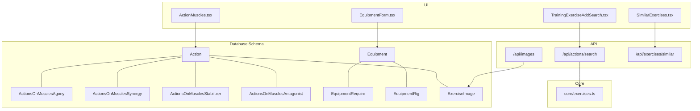
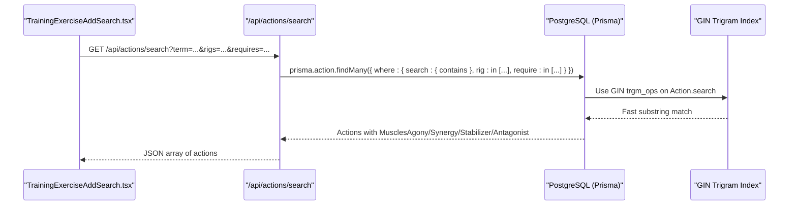
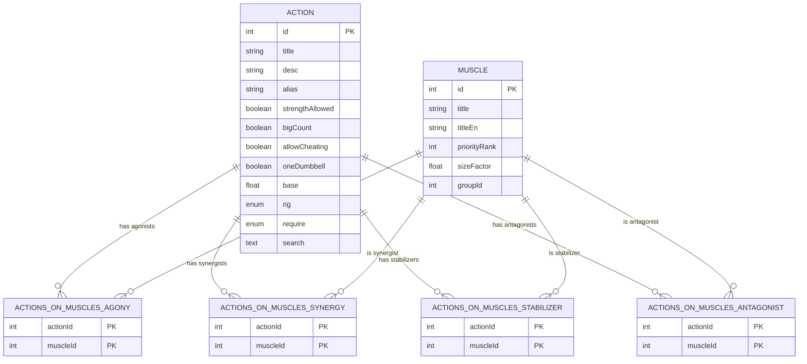
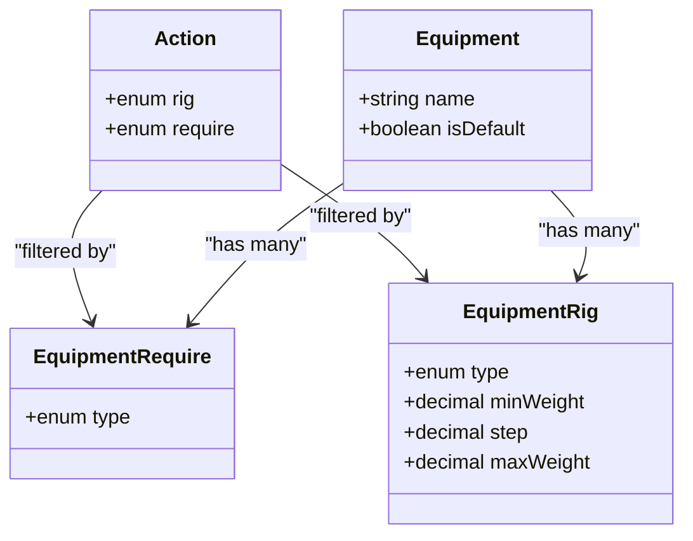
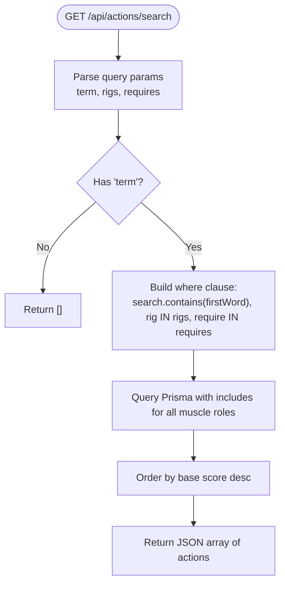
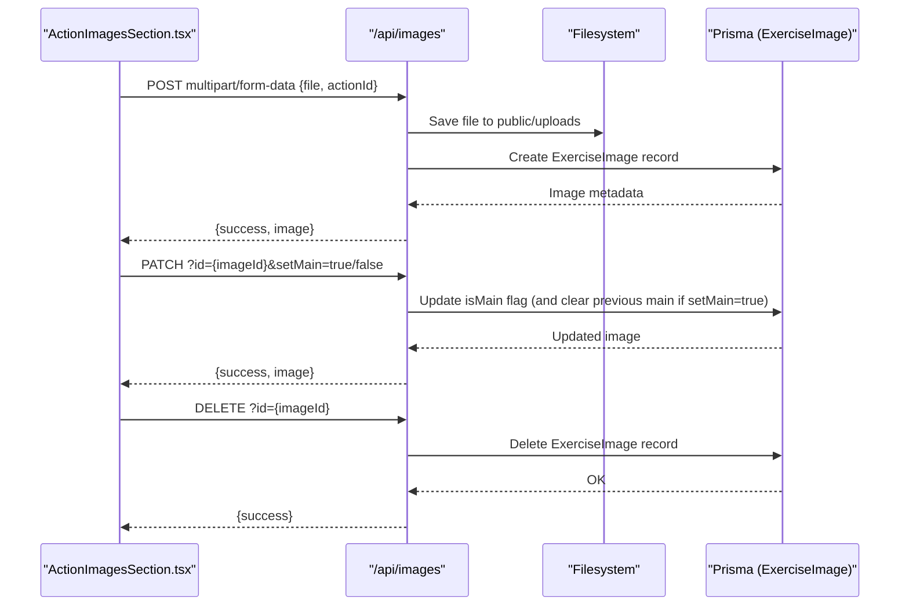
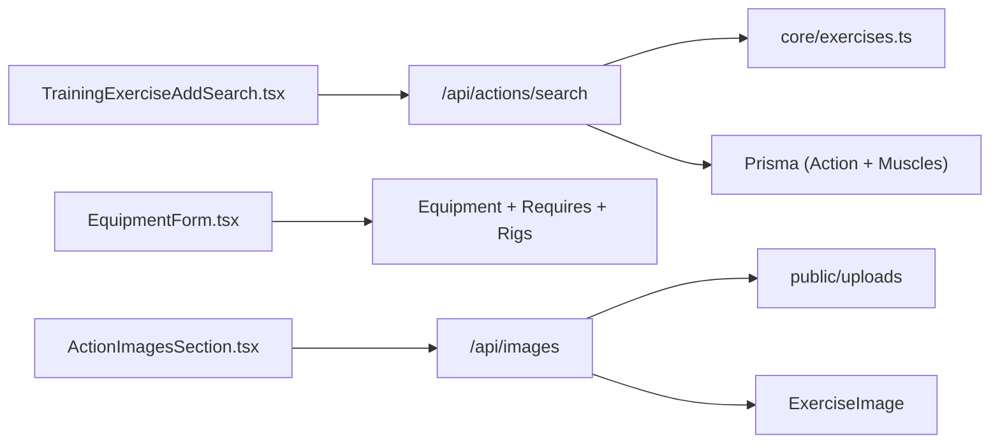

# Exercise Catalog

<cite>
**Referenced Files in This Document**
- [schema.prisma](file://prisma/schema.prisma)
- [20260530103546_action_require/migration.sql](file://prisma/migrations/20260530103546_action_require/migration.sql)
- [20260530132935_equipment/migration.sql](file://prisma/migrations/20260530132935_equipment/migration.sql)
- [20260602165000_action_search_gin_trgm/migration.sql](file://prisma/migrations/20260602165000_action_search_gin_trgm/migration.sql)
- [route.ts (actions/search)](file://src/app/api/actions/search/route.ts)
- [exercises.ts (core)](file://src/core/exercises.ts)
- [types.ts (equipment)](file://src/app/equipment/types.ts)
- [EquipmentForm.tsx](file://src/app/equipment/components/EquipmentForm.tsx)
- [TrainingExerciseAddSearch.tsx](file://src/app/trainings/components/TrainingExerciseAddSearch.tsx)
- [ActionMuscles.tsx](file://src/app/actions/components/ActionMuscles.tsx)
- [types.ts (actions)](file://src/app/actions/types.ts)
- [route.ts (images)](file://src/app/api/images/route.ts)
- [SimilarExercises.tsx](file://src/app/actions/components/SimilarExercises.tsx)
- [route.ts (exercises/similar)](file://src/app/api/exercises/similar/route.ts)
</cite>

## Table of Contents
1. [Introduction](#introduction)
2. [Project Structure](#project-structure)
3. [Core Components](#core-components)
4. [Architecture Overview](#architecture-overview)
5. [Detailed Component Analysis](#detailed-component-analysis)
6. [Dependency Analysis](#dependency-analysis)
7. [Performance Considerations](#performance-considerations)
8. [Troubleshooting Guide](#troubleshooting-guide)
9. [Conclusion](#conclusion)

## Introduction
This document explains the Action (exercise) model and its ecosystem within the application: muscle mappings, equipment requirements, rig types, and search capabilities. It focuses on how exercises are modeled, related to muscles, constrained by equipment, and efficiently searched using a GIN trigram index.

## Project Structure
The exercise catalog spans database schema definitions, API routes for search and images, core constants for defaults, and UI components that render and filter exercises based on rig and equipment.



**Diagram sources**
- [schema.prisma](file://prisma/schema.prisma)
- [route.ts (actions/search)](file://src/app/api/actions/search/route.ts)
- [route.ts (images)](file://src/app/api/images/route.ts)
- [route.ts (exercises/similar)](file://src/app/api/exercises/similar/route.ts)
- [exercises.ts (core)](file://src/core/exercises.ts)
- [TrainingExerciseAddSearch.tsx](file://src/app/trainings/components/TrainingExerciseAddSearch.tsx)
- [ActionMuscles.tsx](file://src/app/actions/components/ActionMuscles.tsx)
- [EquipmentForm.tsx](file://src/app/equipment/components/EquipmentForm.tsx)
- [SimilarExercises.tsx](file://src/app/actions/components/SimilarExercises.tsx)

**Section sources**
- [schema.prisma](file://prisma/schema.prisma)

## Core Components
- Action (exercise) model with fields for title, description, alias, markdown flag, and a searchable text column.
- Muscle mapping via four junction tables: Agony, Synergy, Stabilizer, Antagonist.
- Rig type enum and requirement enum to classify exercises by equipment usage.
- Equipment model per user with required types and rig-specific weight settings.
- Exercise image model for visual documentation.
- Similar exercises relationship for cross-referencing related movements.

Key enums and models:
- ActionRig: BLOCKS, BARBELL, DUMBBELL, KETTLEBELL, OTHER
- ActionRequire: NONE, UPBAR, BENCH, SIMULATOR
- Equipment, EquipmentRequire, EquipmentRig
- ActionsOnMuscles* tables linking Action and Muscle
- ExerciseImage linked to Action
- SimilarExercises linking two Actions

**Section sources**
- [schema.prisma](file://prisma/schema.prisma)
- [20260530103546_action_require/migration.sql](file://prisma/migrations/20260530103546_action_require/migration.sql)
- [20260530132935_equipment/migration.sql](file://prisma/migrations/20260530132935_equipment/migration.sql)

## Architecture Overview
The exercise catalog is centered around the Action entity, enriched by muscle relationships, equipment constraints, and search indexing. The search API filters by term, rig types, and equipment requirements, returning actions with their muscle groups. Images are managed through a dedicated API.



**Diagram sources**
- [route.ts (actions/search)](file://src/app/api/actions/search/route.ts)
- [20260602165000_action_search_gin_trgm/migration.sql](file://prisma/migrations/20260602165000_action_search_gin_trgm/migration.sql)
- [schema.prisma](file://prisma/schema.prisma)

## Detailed Component Analysis

### Action Model and Muscle Mappings
- Action stores metadata and a searchable text field used for substring matching.
- Four junction tables map muscles to actions by role:
  - Agony: primary movers
  - Synergy: assisting muscles
  - Stabilizer: stabilizing muscles
  - Antagonist: opposing muscles
- Each junction includes both actionId and muscleId with composite primary keys.
- Muscles have group associations and descriptive metadata.



**Diagram sources**
- [schema.prisma](file://prisma/schema.prisma)

**Section sources**
- [schema.prisma](file://prisma/schema.prisma)
- [ActionMuscles.tsx](file://src/app/actions/components/ActionMuscles.tsx)
- [types.ts (actions)](file://src/app/actions/types.ts)

### Rig Types and Equipment Requirements
- ActionRig classifies the primary equipment category for an exercise: blocks/barbell/dumbbell/kettlebell/bodyweight.
- ActionRequire indicates minimal equipment needs: none, pull-up bars/dips, bench, or simulator.
- User-defined Equipment sets can specify which ActionRequire types are available and per-rig weight ranges (min, step, max).
- Training pages load current equipment and derive allowed rigs and requires for filtering.



**Diagram sources**
- [schema.prisma](file://prisma/schema.prisma)
- [types.ts (equipment)](file://src/app/equipment/types.ts)
- [EquipmentForm.tsx](file://src/app/equipment/components/EquipmentForm.tsx)

**Section sources**
- [schema.prisma](file://prisma/schema.prisma)
- [types.ts (equipment)](file://src/app/equipment/types.ts)
- [EquipmentForm.tsx](file://src/app/equipment/components/EquipmentForm.tsx)
- [TrainingExerciseAddSearch.tsx](file://src/app/trainings/components/TrainingExerciseAddSearch.tsx)

### Search Capabilities and GIN Trigram Index
- The search endpoint accepts a term and optional rigs/requires filters.
- The first word of the term is used for a fast substring match against Action.search.
- PostgreSQL pg_trgm extension enables GIN trigram indexing for efficient LIKE '%...%' queries.
- Results include full muscle mappings grouped by role.



**Diagram sources**
- [route.ts (actions/search)](file://src/app/api/actions/search/route.ts)
- [20260602165000_action_search_gin_trgm/migration.sql](file://prisma/migrations/20260602165000_action_search_gin_trgm/migration.sql)
- [exercises.ts (core)](file://src/core/exercises.ts)

**Section sources**
- [route.ts (actions/search)](file://src/app/api/actions/search/route.ts)
- [20260602165000_action_search_gin_trgm/migration.sql](file://prisma/migrations/20260602165000_action_search_gin_trgm/migration.sql)
- [exercises.ts (core)](file://src/core/exercises.ts)

### Exercise Images Handling
- Exercise images are stored with filename, path, size, format, and a main flag.
- Upload API validates file type and size, persists metadata, and manages the main image.
- Retrieval lists images for a given action; deletion removes metadata only.



**Diagram sources**
- [route.ts (images)](file://src/app/api/images/route.ts)
- [schema.prisma](file://prisma/schema.prisma)

**Section sources**
- [route.ts (images)](file://src/app/api/images/route.ts)
- [schema.prisma](file://prisma/schema.prisma)

### Similar Exercises Relationship
- SimilarExercises links two Actions bidirectionally (SimilarTo/SimilarFrom).
- The similar endpoint returns related actions filtered by the same rig and require constraints.
- UI renders similar exercises as links to their cards.

```mermaid
classDiagram
class Action {
+int id
+string title
+enum rig
+enum require
}
class SimilarExercises {
+int actionId
+int similarActionId
}
Action ||--o{ SimilarExercises : "SimilarFrom"
Action ||--o{ SimilarExercises : "SimilarTo"
```

**Diagram sources**
- [schema.prisma](file://prisma/schema.prisma)
- [route.ts (exercises/similar)](file://src/app/api/exercises/similar/route.ts)
- [SimilarExercises.tsx](file://src/app/actions/components/SimilarExercises.tsx)

**Section sources**
- [schema.prisma](file://prisma/schema.prisma)
- [route.ts (exercises/similar)](file://src/app/api/exercises/similar/route.ts)
- [SimilarExercises.tsx](file://src/app/actions/components/SimilarExercises.tsx)

## Dependency Analysis
- Search depends on core default enums for rigs and requires to build default filters when not provided.
- UI components pass selected rigs and requires from user’s equipment configuration into search requests.
- Muscle display components rely on included relations from the search query.
- Image APIs depend on filesystem operations and Prisma records.



**Diagram sources**
- [TrainingExerciseAddSearch.tsx](file://src/app/trainings/components/TrainingExerciseAddSearch.tsx)
- [route.ts (actions/search)](file://src/app/api/actions/search/route.ts)
- [exercises.ts (core)](file://src/core/exercises.ts)
- [EquipmentForm.tsx](file://src/app/equipment/components/EquipmentForm.tsx)
- [route.ts (images)](file://src/app/api/images/route.ts)
- [schema.prisma](file://prisma/schema.prisma)

**Section sources**
- [TrainingExerciseAddSearch.tsx](file://src/app/trainings/components/TrainingExerciseAddSearch.tsx)
- [route.ts (actions/search)](file://src/app/api/actions/search/route.ts)
- [exercises.ts (core)](file://src/core/exercises.ts)
- [EquipmentForm.tsx](file://src/app/equipment/components/EquipmentForm.tsx)
- [route.ts (images)](file://src/app/api/images/route.ts)
- [schema.prisma](file://prisma/schema.prisma)

## Performance Considerations
- GIN trigram index on Action.search accelerates substring searches significantly.
- Ordering by base score prioritizes foundational exercises.
- Include-only queries fetch necessary muscle data without over-fetching unrelated entities.
- File uploads validate formats and sizes to prevent abuse and ensure storage efficiency.

[No sources needed since this section provides general guidance]

## Troubleshooting Guide
- Search returns empty results:
  - Ensure the term is present and trimmed.
  - Verify rigs and requires parameters align with available values.
  - Confirm the GIN trigram index exists and pg_trgm extension is enabled.
- Muscle mappings missing:
  - Check that the query includes all muscle relation tables.
  - Validate junction table entries exist for the action.
- Equipment filters not applied:
  - Confirm user’s Equipment records include the desired requires and rigs.
  - Ensure UI passes correct comma-separated lists to the search endpoint.
- Image upload failures:
  - Validate file type and size limits.
  - Check filesystem permissions and upload directory existence.

**Section sources**
- [route.ts (actions/search)](file://src/app/api/actions/search/route.ts)
- [20260602165000_action_search_gin_trgm/migration.sql](file://prisma/migrations/20260602165000_action_search_gin_trgm/migration.sql)
- [route.ts (images)](file://src/app/api/images/route.ts)

## Conclusion
The exercise catalog centers on a robust Action model enriched by detailed muscle mappings, flexible equipment constraints, and high-performance search. Users can tailor equipment profiles, filter exercises by rig and requirements, and leverage fast substring search backed by a GIN trigram index. Visual documentation is supported via exercise images, and related exercises are discoverable through explicit similarity relationships.

[No sources needed since this section summarizes without analyzing specific files]