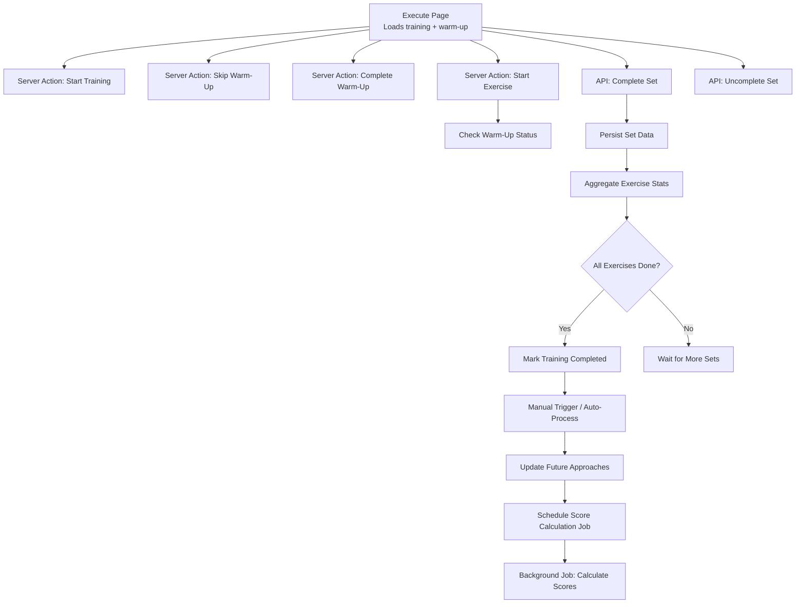
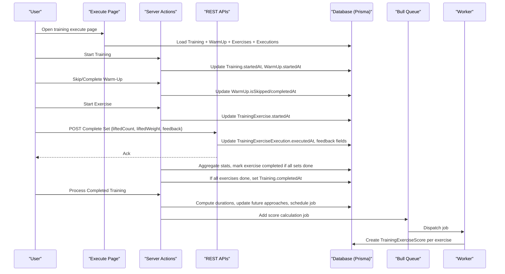
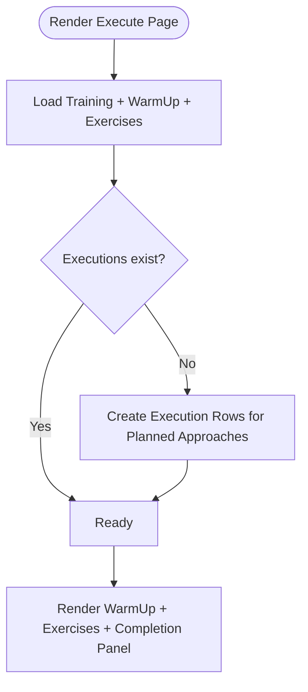
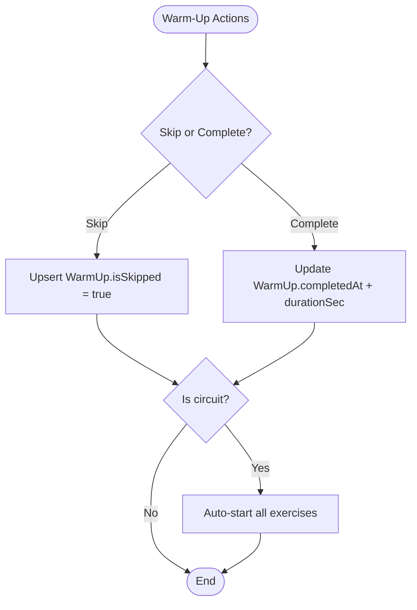
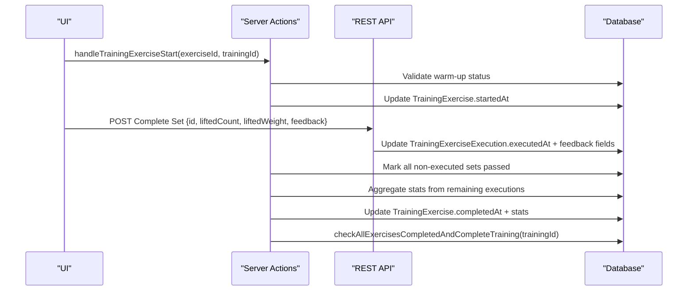
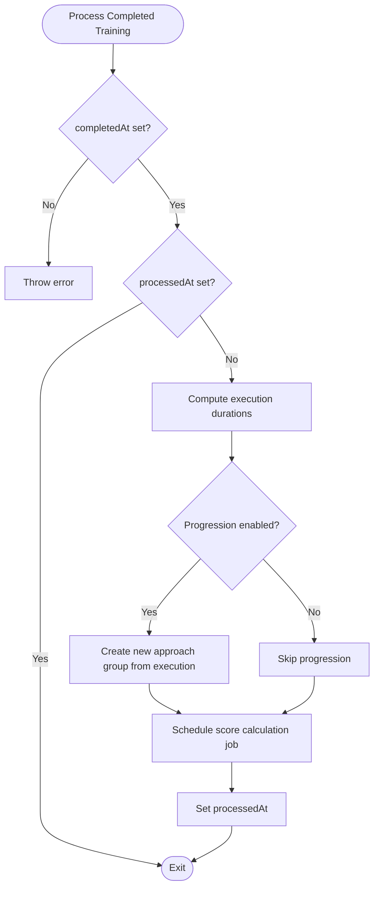
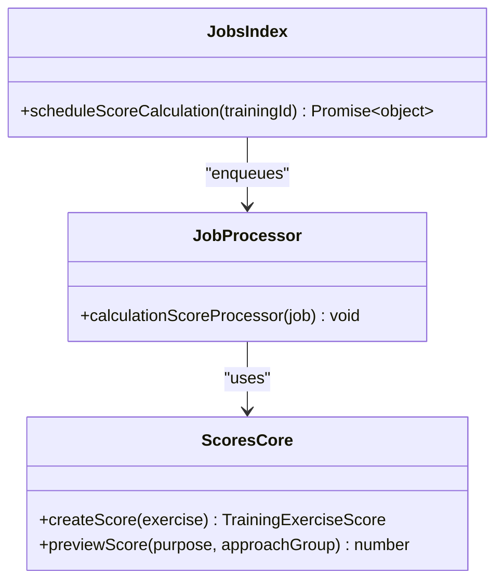
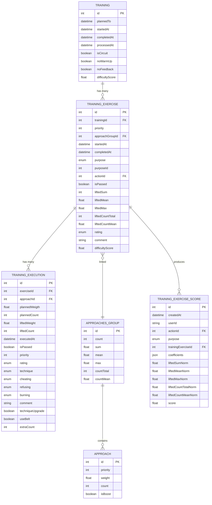
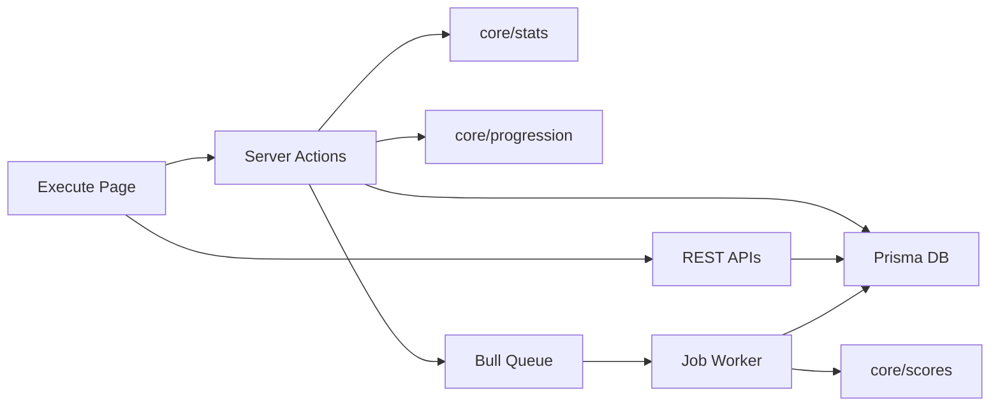

# Training Execution Flow

<cite>
**Referenced Files in This Document**
- [page.tsx](file://src/app/trainings/[id]/execute/page.tsx)
- [actions.ts](file://src/app/trainings/[id]/execute/actions.ts)
- [complete/route.ts](file://src/app/api/trainings/exercise/execution/complete/route.ts)
- [uncomplete/route.ts](file://src/app/api/trainings/exercise/execution/uncomplete/route.ts)
- [scores.ts](file://src/core/scores.ts)
- [scores processor](file://src/jobs/processors/scores.ts)
- [jobs index](file://src/jobs/index.ts)
- [TrainingExecuteCompletePanel.tsx](file://src/app/trainings/[id]/execute/components/TrainingExecuteCompletePanel.tsx)
- [TrainingProcessPanel.tsx](file://src/app/trainings/[id]/execute/components/TrainingProcessPanel.tsx)
- [schema.prisma](file://prisma/schema.prisma)
</cite>

## Table of Contents
1. Introduction
2. Project Structure
3. Core Components
4. Architecture Overview
5. Detailed Component Analysis
6. Dependency Analysis
7. Performance Considerations
8. Troubleshooting Guide
9. Conclusion

## Introduction
This document explains the end-to-end workflow of a training session from creation through execution to completion and score calculation. It covers lifecycle states, warm-up tracking, per-set execution feedback, progression updates, and background scoring. The flow is implemented with Next.js App Router Server Actions and REST endpoints, backed by Prisma and PostgreSQL, with Redis + Bull for background jobs.

## Project Structure
The training execution UI is centered on the execute page, which loads the training plan, initializes execution records, and renders warm-up and exercise cards. User interactions trigger Server Actions or API routes that persist state changes and orchestrate post-processing.

**Diagram sources**
- [page.tsx:30-129](file://src/app/trainings/[id]/execute/page.tsx#L30-L129)
- [actions.ts:41-126](file://src/app/trainings/[id]/execute/actions.ts#L41-L126)
- [complete/route.ts:26-66](file://src/app/api/trainings/exercise/execution/complete/route.ts#L26-L66)
- [uncomplete/route.ts:8-15](file://src/app/api/trainings/exercise/execution/uncomplete/route.ts#L8-L15)
- [scores.ts:80-102](file://src/core/scores.ts#L80-L102)
- [scores processor:4-36](file://src/jobs/processors/scores.ts#L4-L36)
- [jobs index:15-23](file://src/jobs/index.ts#L15-L23)

**Section sources**
- [page.tsx:30-129](file://src/app/trainings/[id]/execute/page.tsx#L30-L129)
- [actions.ts:41-126](file://src/app/trainings/[id]/execute/actions.ts#L41-L126)

## Core Components
- Execute page: Loads training data, ensures execution rows exist, and gates interactivity based on warm-up and training state.
- Server actions: Manage warm-up, start training, start exercises, mark sets executed, pass exercises, complete training manually, and process completed training (progression and scheduling).
- API routes: Persist individual set completions and uncompletions with rich feedback fields.
- Scoring job: Background worker computes normalized scores per exercise using purpose-specific coefficients.

Key responsibilities:
- State transitions: plannedTo → startedAt → completedAt → processedAt
- Warm-up gating: exercises cannot start until warm-up is skipped or completed
- Execution linkage: each set links to an approach; aggregated stats computed per exercise
- Feedback model: rating, technique, cheating, refusing, burning, plus belt usage and extra reps
- Post-processing: progression update and score calculation job scheduling

**Section sources**
- [page.tsx:30-129](file://src/app/trainings/[id]/execute/page.tsx#L30-L129)
- [actions.ts:128-270](file://src/app/trainings/[id]/execute/actions.ts#L128-L270)
- [complete/route.ts:26-66](file://src/app/api/trainings/exercise/execution/complete/route.ts#L26-L66)
- [uncomplete/route.ts:8-15](file://src/app/api/trainings/exercise/execution/uncomplete/route.ts#L8-L15)
- [scores.ts:80-102](file://src/core/scores.ts#L80-L102)
- [scores processor:4-36](file://src/jobs/processors/scores.ts#L4-L36)
- [jobs index:15-23](file://src/jobs/index.ts#L15-L23)

## Architecture Overview
The system uses a layered architecture:
- UI layer: React components render the execution experience and call Server Actions/APIs.
- Server layer: Next.js Server Actions handle business logic and DB transactions; REST endpoints handle atomic set operations.
- Data layer: Prisma ORM persists entities like Training, TrainingExercise, TrainingExerciseExecution, ApproachesGroup, Approach, and TrainingExerciseScore.
- Background processing: Bull queues schedule and run score calculations asynchronously.

**Diagram sources**
- [page.tsx:30-129](file://src/app/trainings/[id]/execute/page.tsx#L30-L129)
- [actions.ts:89-126](file://src/app/trainings/[id]/execute/actions.ts#L89-L126)
- [complete/route.ts:26-66](file://src/app/api/trainings/exercise/execution/complete/route.ts#L26-L66)
- [uncomplete/route.ts:8-15](file://src/app/api/trainings/exercise/execution/uncomplete/route.ts#L8-L15)
- [jobs index:15-23](file://src/jobs/index.ts#L15-L23)
- [scores processor:4-36](file://src/jobs/processors/scores.ts#L4-L36)
- [scores.ts:80-102](file://src/core/scores.ts#L80-L102)

## Detailed Component Analysis

### Execute Page Lifecycle
- Loads training with nested exercises, approach groups, and existing executions.
- Ensures execution rows are created for planned approaches when missing.
- Renders warm-up card and exercise cards; disables inputs until warm-up is done.
- Shows completion panel once training has started.

**Diagram sources**
- [page.tsx:30-129](file://src/app/trainings/[id]/execute/page.tsx#L30-L129)

**Section sources**
- [page.tsx:30-129](file://src/app/trainings/[id]/execute/page.tsx#L30-L129)

### Warm-Up Handling
- Skipping warm-up marks it skipped and can auto-start circuit exercises.
- Completing warm-up records duration and can auto-start circuit exercises.
- Starting training sets startedAt and configures noFeedback based on user settings.

**Diagram sources**
- [actions.ts:41-87](file://src/app/trainings/[id]/execute/actions.ts#L41-L87)
- [actions.ts:89-126](file://src/app/trainings/[id]/execute/actions.ts#L89-L126)

**Section sources**
- [actions.ts:41-126](file://src/app/trainings/[id]/execute/actions.ts#L41-L126)

### Exercise Execution and Aggregation
- Starting an exercise requires warm-up completion; otherwise throws an error.
- Completing a set updates the execution row with weights, counts, timestamps, and feedback.
- After marking sets executed, the server aggregates stats and updates the exercise totals.
- When all exercises are completed, the training is marked completed.

**Diagram sources**
- [actions.ts:128-270](file://src/app/trainings/[id]/execute/actions.ts#L128-L270)
- [complete/route.ts:26-66](file://src/app/api/trainings/exercise/execution/complete/route.ts#L26-L66)

**Section sources**
- [actions.ts:128-270](file://src/app/trainings/[id]/execute/actions.ts#L128-L270)
- [complete/route.ts:26-66](file://src/app/api/trainings/exercise/execution/complete/route.ts#L26-L66)

### Completion and Processing
- Manual completion marks all unfinished exercises as passed and sets completedAt.
- Processing completed training:
  - Computes per-execution durations relative to training start.
  - Updates future approach groups based on progression strategy.
  - Schedules background job to calculate scores.
  - Marks processedAt to prevent reprocessing.

**Diagram sources**
- [actions.ts:303-460](file://src/app/trainings/[id]/execute/actions.ts#L303-L460)
- [jobs index:15-23](file://src/jobs/index.ts#L15-L23)

**Section sources**
- [actions.ts:303-460](file://src/app/trainings/[id]/execute/actions.ts#L303-L460)

### Score Calculation (Background Job)
- The job fetches all exercises for the training and creates a TrainingExerciseScore per exercise.
- Scoring normalizes metrics and applies purpose-specific coefficients to compute a final score.

**Diagram sources**
- [scores.ts:80-102](file://src/core/scores.ts#L80-L102)
- [scores processor:4-36](file://src/jobs/processors/scores.ts#L4-L36)
- [jobs index:15-23](file://src/jobs/index.ts#L15-L23)

**Section sources**
- [scores.ts:80-102](file://src/core/scores.ts#L80-L102)
- [scores processor:4-36](file://src/jobs/processors/scores.ts#L4-L36)
- [jobs index:15-23](file://src/jobs/index.ts#L15-L23)

### Data Model and Lifecycle States
- Training lifecycle states:
  - plannedTo: scheduled date
  - startedAt: when training begins
  - completedAt: when all exercises are finished
  - processedAt: after progression and scoring are handled
- Execution feedback fields:
  - rating, technique, cheating, refusing, burning, useBelt, extraCount, comment
- Execution durations tracked per set sequence.

**Diagram sources**
- [schema.prisma:390-434](file://prisma/schema.prisma#L390-L434)
- [schema.prisma:436-473](file://prisma/schema.prisma#L436-L473)
- [schema.prisma:482-516](file://prisma/schema.prisma#L482-L516)
- [schema.prisma:338-382](file://prisma/schema.prisma#L338-L382)
- [schema.prisma:575-597](file://prisma/schema.prisma#L575-L597)

**Section sources**
- [schema.prisma:390-434](file://prisma/schema.prisma#L390-L434)
- [schema.prisma:436-473](file://prisma/schema.prisma#L436-L473)
- [schema.prisma:482-516](file://prisma/schema.prisma#L482-L516)
- [schema.prisma:338-382](file://prisma/schema.prisma#L338-L382)
- [schema.prisma:575-597](file://prisma/schema.prisma#L575-L597)

## Dependency Analysis
- UI depends on Server Actions and REST endpoints for state mutations.
- Server Actions depend on Prisma for DB operations and on core modules for stats and progression.
- Background job depends on core scoring module and Prisma for persistence.
- Queues decouple processing from request/response cycles.

**Diagram sources**
- [page.tsx:30-129](file://src/app/trainings/[id]/execute/page.tsx#L30-L129)
- [actions.ts:1-31](file://src/app/trainings/[id]/execute/actions.ts#L1-L31)
- [complete/route.ts:1-25](file://src/app/api/trainings/exercise/execution/complete/route.ts#L1-L25)
- [jobs index:1-23](file://src/jobs/index.ts#L1-L23)
- [scores processor:1-10](file://src/jobs/processors/scores.ts#L1-L10)
- [scores.ts:1-20](file://src/core/scores.ts#L1-L20)

**Section sources**
- [page.tsx:30-129](file://src/app/trainings/[id]/execute/page.tsx#L30-L129)
- [actions.ts:1-31](file://src/app/trainings/[id]/execute/actions.ts#L1-L31)
- [complete/route.ts:1-25](file://src/app/api/trainings/exercise/execution/complete/route.ts#L1-L25)
- [jobs index:1-23](file://src/jobs/index.ts#L1-L23)
- [scores processor:1-10](file://src/jobs/processors/scores.ts#L1-L10)
- [scores.ts:1-20](file://src/core/scores.ts#L1-L20)

## Performance Considerations
- Batch creation of execution rows reduces round trips during page load.
- Transactions ensure consistency when aggregating stats and completing exercises.
- Background job offloads scoring to avoid blocking UI responses.
- Duration computation is performed once per training upon processing.

[No sources needed since this section provides general guidance]

## Troubleshooting Guide
- Warm-up not completed: Starting or passing an exercise will throw an error until warm-up is skipped or completed.
- Duplicate processing: processedAt prevents reprocessing completed training.
- Missing executions: Execute page ensures execution rows exist before rendering; verify create logic if issues arise.
- Score calculation failures: Check job logs and database connectivity; ensure exercises have completedAt and valid stats.

**Section sources**
- [actions.ts:128-177](file://src/app/trainings/[id]/execute/actions.ts#L128-L177)
- [actions.ts:303-331](file://src/app/trainings/[id]/execute/actions.ts#L303-L331)
- [scores processor:27-36](file://src/jobs/processors/scores.ts#L27-L36)

## Conclusion
The training execution flow integrates UI-driven interactions, robust server-side validation, and background processing to deliver a seamless workout experience. Lifecycle states, warm-up gating, detailed feedback capture, progression updates, and asynchronous scoring form a cohesive pipeline that supports accurate tracking and long-term progress analysis.